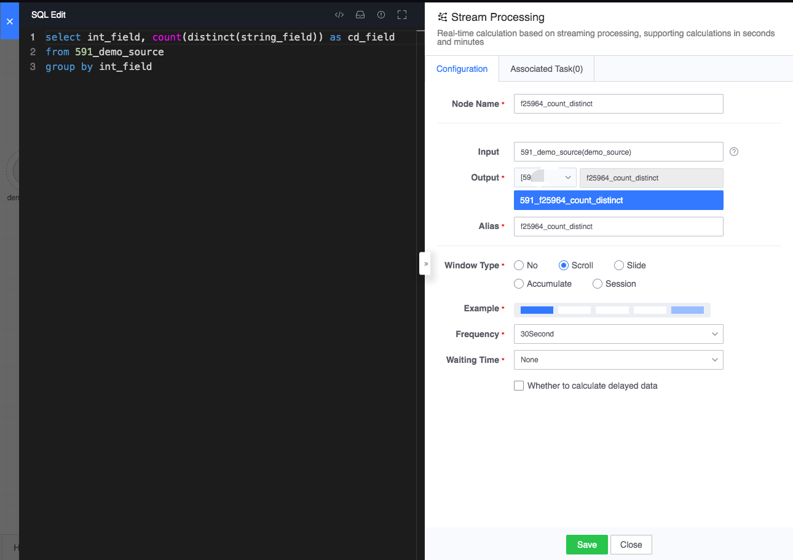
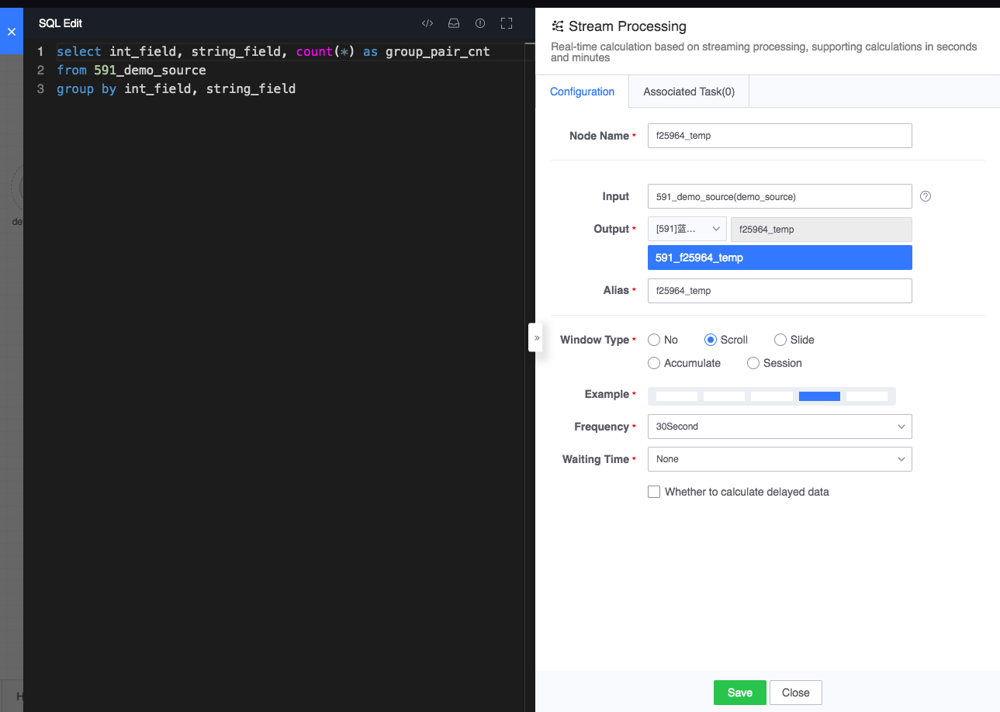
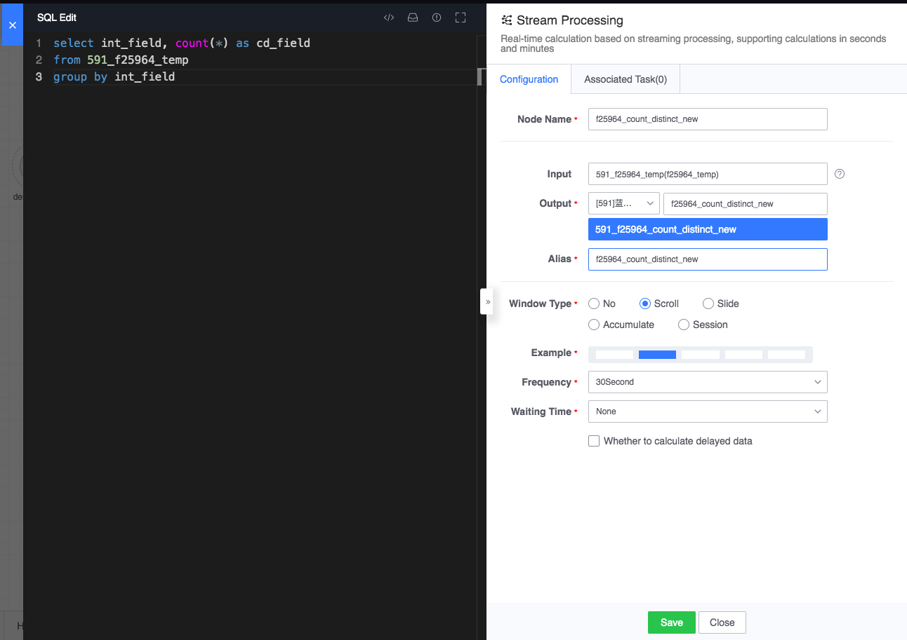

## Count Distinct

## Typical Case

Real-time calculation SQL supports group aggregation and `count(distinct(xxx))` for the results, for example:

As shown in the figure above, for each 30-second window, for the batch data of each dimension of `int_field`, the value of the field `string_field` is deduplicated and counted. It can be expressed vividly with the following table:

Input table:

| data time | int_field | string_field |
| :------------------: | :-------: | :----------: |
| 2020-01-01 00:00:00 | 1 | a |
| 2020-01-01 00:00:02 | 1 | a |
| 2020-01-01 00:00:04 | 1 | b |
| 2020-01-01 00:00:10 | 2 | a |
| 2020-01-01 00:00:15 | 3 | b |
| 2020-01-01 00:00:20 | 4 | c |
| 2020-01-01 00:00:31 | ... | ... |
| 2020-01-01 00:00:35 | ... | ... |
| 2020-01-01 00:00:36 | ... | ... |

Output result:

| data time | int_field | cn_field |
| :------------------: | :-------: | :------: |
| 2020-01-01 00:00:00 | 1 | 2 |
| 2020-01-01 00:00:00 | 2 | 1 |
| 2020-01-01 00:00:00 | 3 | 1 |
| 2020-01-01 00:00:00 | 4 | 1 |
| ... | ... | ... |
| ... | ... | ... |

## optimization

The current real-time computing performance of Count Distinct is poor and can be optimized for specific SQL usage. As shown in the figure above, the following two real-time computing nodes can be constructed to achieve the same computing effect.

