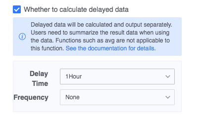

# Scroll window


The rolling window allocates each piece of data into fixed-size windows that do not overlap based on the data time. For example: if you configure a rolling window with a statistical frequency of 1 minute, the data source will be divided into [0:00 ~ 0:01), [0:01 ~ 0:02), [0:02 ~ 0:03), etc. according to time window. The figure below shows a rolling window with a fixed window size of 1 minute.


## Data output description

  - Data time: event time, usually the time when the event occurs.
  - Waiting time: It is used to deal with the situation where data time is out of order. For example, if the waiting time is set to 60 seconds, window calculation can be entered when the data source data arrives within 60 seconds of delay. At this time, the calculation results will be output with a delay of 60 seconds.
  - Window output time: the starting time of the window.

## Delay data calculation

In practical applications, due to various reasons, data arriving in real-time calculations will be out of order to varying degrees. By default, after the calculation results of the current window are output, when data before this window arrives (including this window), these data will be discarded and no calculation will be performed.

In order to allow these data to be calculated normally, the platform has launched a delayed data calculation function, which reopens the window for calculation of delayed data, and then outputs the calculation results of the delayed data, because the normal data has already output the calculation results. <font color="#dd0000">**After turning on this function, there may be multiple data for the same data time and the same dimension**</font>, which requires aggregation again when using the result data.

Example: The current real-time calculation (1_example_table) configures the rolling window, the statistical frequency is 1 minute, and the sql is as follows:
```sql
SELECT count(1) as cnt FROM table
```
The data source data is as follows:

| Wall Time | Data Time |
| ------------------ | ------------------ |
| 2020-01-01 09:01:01 | 2020-01-01 09:01:01 |
| 2020-01-01 09:02:02 | 2020-01-01 09:02:02 |
| 2020-01-01 09:02:03 | 2020-01-01 09:02:03 |
| 2020-01-01 09:03:03 | 2020-01-01 09:03:03 |
| 2020-01-01 09:03:04 | 2020-01-01 09:01:11 |
| 2020-01-01 09:03:05 | 2020-01-01 09:03:05 |


- Without turning on the delayed data calculation function, the output results are as follows:

| data time | cnt |
| ------------------ | --- |
| 2020-01-01 09:01:00 | 1 |
| 2020-01-01 09:02:00 | 2 |

The data whose delayed arrival time is "2020-01-01 09:01:11" is discarded.

- Turn on the delay data calculation function, the output results are as follows:

| data time | cnt |
| ------------------ | --- |
| 2020-01-01 09:01:00 | 1 |
| 2020-01-01 09:02:00 | 2 |
| 2020-01-01 09:01:00 | 1 |

Data that arrives late are individually windowed for calculation and the results are output, which requires aggregation when using the resulting data. Use the resulting data as follows:
```sql
SELECT sum(cnt) as cnt FROM table
```



- Function Description
1. The "calculate delay data" function is not enabled by default.
2. The "delay time" in the above figure refers to how long delayed data is allowed to enter the window calculation. Delayed data that is not within the delay time range will be discarded.
3. The "statistical frequency" in the above figure refers to the statistical period of delayed data. Due to the particularity of the session window, there is no statistical frequency in the session window, and each piece of delay data is calculated and output separately.
4. After turning on the "calculate delay data" function, when using the result data of the corresponding table, it needs to be summarized
5. This function only applies to functions that can perform secondary summarization. For example, the avg function is not applicable to this function.