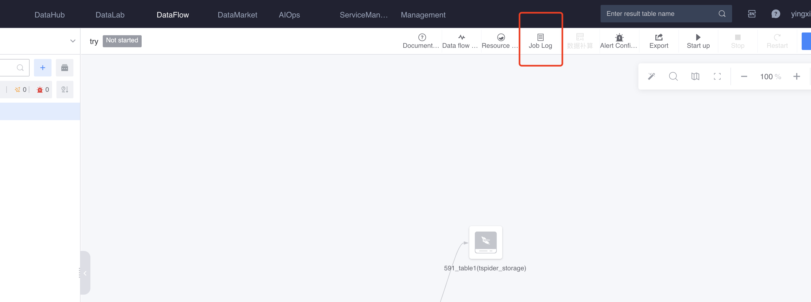
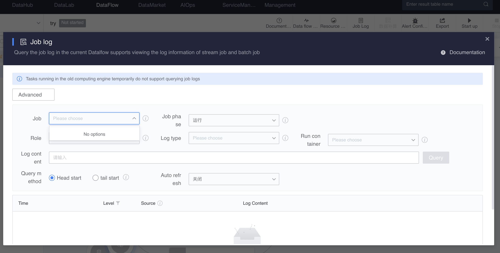
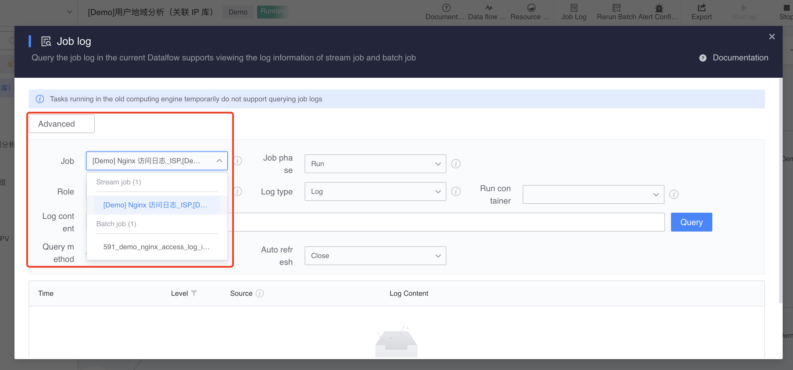
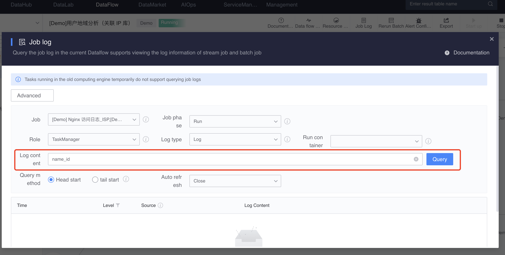

# View task log
The log data of tasks in Flow helps task developers find and locate problems. In the Flow interface, log data can be viewed and retrieved through the log interface.

Log data is output by the computing tasks in Flow running on the computing platform. The log data is classified according to the following different dimensions.

## Task log classification

- Classification by mission stage:
   - Submission log - log of the task submission phase
     - For offline tasks (Spark tasks), it is the Driver side log
     - For real-time tasks (Flink tasks), it is the log of tasks started for task scheduling
   - Run log - Log of the task running phase
     - For offline tasks (Spark tasks), it is the Executor side log
     - For real-time tasks (Flink tasks), it is the JobManger / TaskManager side log
- Classified by task type:
   - Offline task log - Spark task log
     - Calculation role - Executor
   - Real-time task log - Flink task log
     - Computing roles - JobManager/TaskManager
- Classification by log file type:
   - Log - log file, corresponding to the log file with .log suffix in the computing platform [only exists in real-time tasks]
   - Stdout - stdout file, corresponding to the stdout log file in the computing platform
   - Stderr - stderr file, corresponding to the stderr log file in the computing platform
   - Exception - exception log, corresponding to exception information in the computing platform [only exists in real-time tasks]

## Other concepts in logs

- Execution record:
   - Offline tasks: Offline tasks are regularly scheduled in the computing platform according to configured time rules, and each task execution will generate an execution record.
   - Real-time tasks: Since real-time tasks run for a long time, they usually only correspond to one execution record (that is, the most recent one) without user selection.
- Run the container:
   - When tasks are run in the platform, they are distributed and run in certain "containers" (containers). Each container runs specific computing logic, and the log data of each container exists independently.
   - Viewing and retrieving run logs requires selecting a specific container.

### Log View

- Log viewing entrance
   

- Log viewing interface

   

- Calculation task selection

   "Computing tasks" - Lists the computing tasks in the corresponding flow. You can select the corresponding task to view the log.

   Usually there is one real-time task and multiple offline tasks in a flow (if there are none, it will not be displayed).

   The calculation task name is named after the **output Chinese name** of the calculation node in the flow.

   

- other options

   - Task phase: Run/Submit
   - Computing role: Executor for offline tasks; TaskManger / JobManager for real-time tasks
   - Log type: Log/Stdout/Stderr/Exception
   - Run containers: worker001, worker002...

- Log content list

   - Time: time information in the log content (the log time format of different tasks is slightly different)
  
   - Level: INFO / WARN / ERROR and other levels. Users can click the button next to the level to filter certain specific log levels.
  
   - Source: information such as the class name that generates log data (log source formats for different tasks are slightly different)
  
   - Log content: specific log content information. If there is a lot of log content in a single line, it will be automatically collapsed. The user can click the button on the right (or double-click the log content) to expand/collapse.
  
    
  
### Log retrieval

   - Enter the log content you want to find in the input box after "Log content"
     - Logs containing corresponding content will be highlighted in the log content list displayed below in real time;
     - After clicking the "Query" button on the right, you can re-retrieve the log lines containing the entered keywords;
   - You can enter multiple keywords, separated by spaces. There is a ** or ** relationship between multiple keywords; if you enter "A B C", the log lines "containing A or B or C" will be retrieved;
   - If you do not enter a keyword, there will be no search and the log content will be viewed directly;
     