# User-defined function (UDF)
Platform data development provides SQL-based data development. During the user development process, there is often a need for custom functions.
In order to provide users with the ability to develop custom functions by themselves, the differences between calculation engines are shielded from users, and user-defined functions (UDF) are introduced.
It supports users to develop once and use it in multiple places (real-time computing, offline computing), and supports multi-language development (Java, Python).

## basic concept

UDF (User-Defined Scalar Functions): User-defined scalar function that converts zero, one or more quantities of values into a new value.

UDTF (User-Defined Table Functions): User-defined table function, which takes zero, one or more scalar values as input parameters, and the data it returns can contain one or more columns, one or more rows.

UDAF (User-Defined Aggregate Functions): User-defined aggregation function that aggregates a table (one or more columns, one or more rows) into a scalar value.

## manual

### Develop, debug, and publish custom functions

- Enter the custom function development interface and choose one of the ways below to enter.

   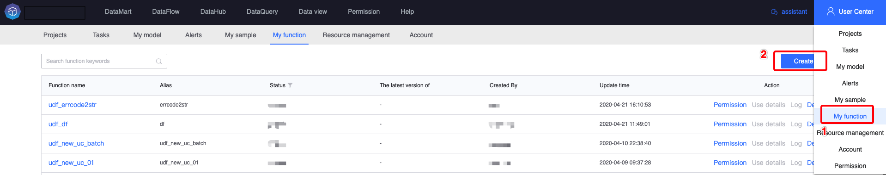

   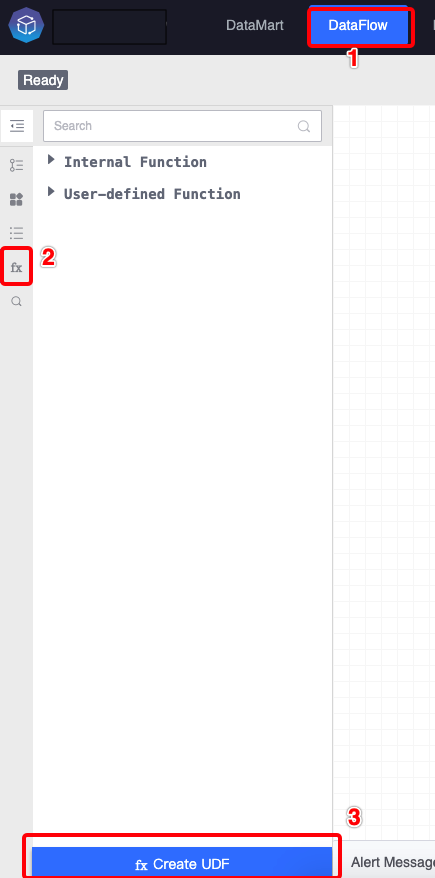

- To develop a custom function, you first need to select the development language and function type, fill in the function name, the Chinese name of the function and the input and output type.
   Then the code framework will be automatically generated

   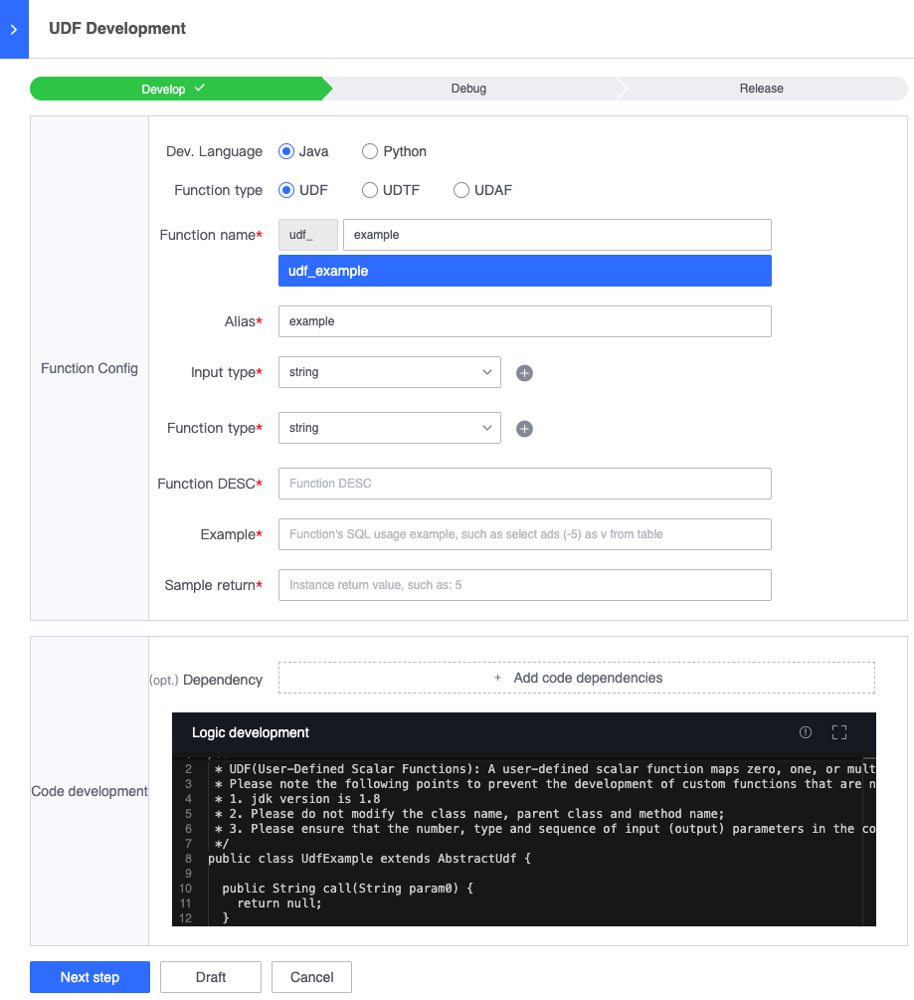

- The function you develop can be used by all users, so please fill in the function description and usage examples carefully. The picture below is a Java and UDF example. The function is to add a fixed string in front of the input parameters.
   If you need to introduce other packages, you can configure dependency configuration

   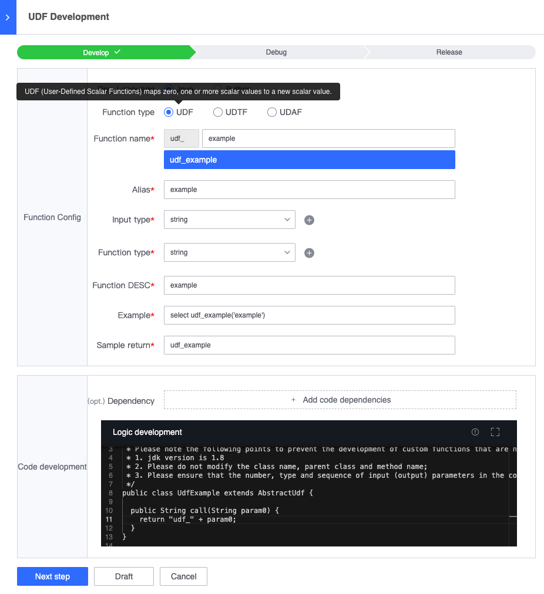

- After the function is developed, it needs to be debugged before it can be released. If your function only needs to be used in real-time calculations, just select real-time as the calculation type. If you need to use it in real-time and offline at the same time, you need to select both real-time and offline, and then select the data source in the platform. You can modify the content in the red box to achieve your debugging purposes.

   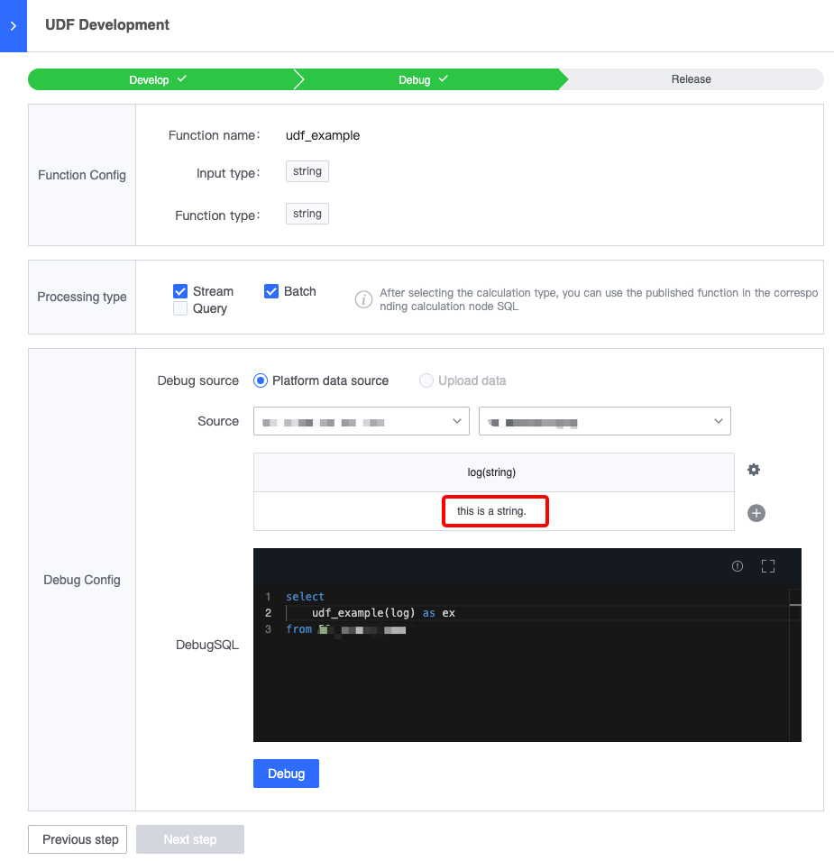

- After debugging, you can check whether the results are in line with expectations. If they are in line with expectations, you can publish them in the next step.

   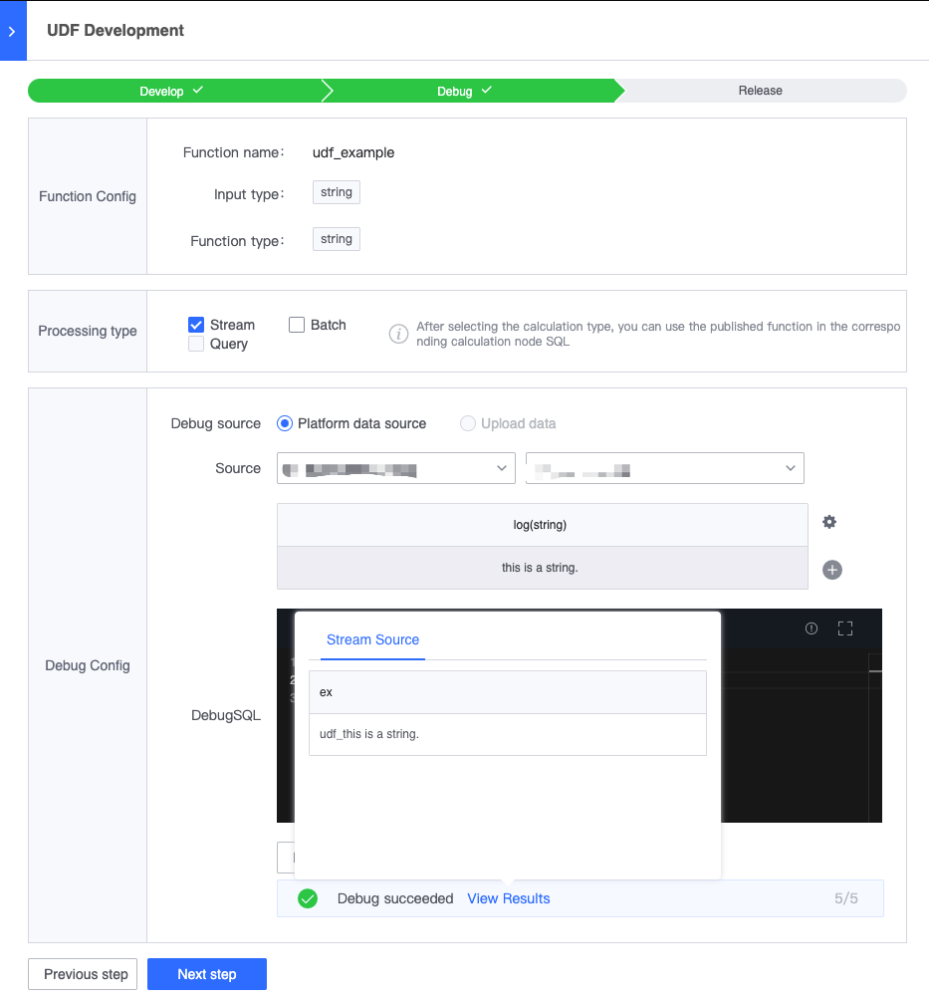

- On the publishing page, reconfirm the function information to be published and publish it.

   

- After publishing, you can see the usage details in the custom function list on the left, and you can also modify it again

   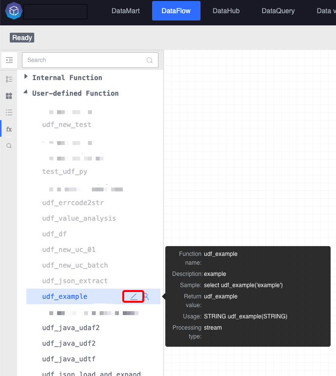

- After publishing, you can use the published custom functions in SQL in the corresponding computing node. By default, the functions published in the latest version are used.

### My function

My function reference User Center/[My Function](../user-center/udf.md)

## Development instructions

The syntax versions for custom function development are <font color="#dd0000">**Java 8**</font> and <font color="#dd0000">**Python 3.6.9**</font>

### UDF

- Java development needs to inherit the class AbstractUdf and implement the call method. The fields used in SQL are the input parameters of the call method. The following example is to implement string splicing.

```java
/**
  * UDF (User-Defined Scalar Functions): User-defined scalar function that converts zero, one or more quantities of values into a new value.
  */
public class UdfTestUdf extends AbstractUdf {
  
   /**
   * Data execution method
   *
   * @param a corresponds to the first parameter in sql
   * @param b corresponds to the second parameter in sql
   * @return The value returned after calculation
   */
   public String call(String a, String b) {
     return a + b;
   }
}
```

- Python needs to implement the call method. The fields used in SQL are the input parameters of the call method. The following example implements string splicing.

```python
# -*- coding: utf-8 -*-
"""
UDF (User-Defined Scalar Functions): User-defined scalar function that converts zero, one or more quantities of values into a new value.
"""
def call(a, b):
     """
     Data execution method
    
     :param a: corresponds to the first parameter in sql
     :param b: corresponds to the second parameter in sql
     :return: the value returned after calculation
     """
     return a + b
```

###UDTF

- Java, need to implement call method. The following example splits a string according to the specified delimiter and outputs two fields. The first field is the split string, and the second field is the length of the split string.

```java
/**
  * UDTF (User-Defined Table Functions): User-defined table function, which takes zero, one or more scalar values as input parameters, and the data it returns can contain one or more columns, one or more rows.
  */
public class UdfTestUdtf extends AbstractUdtf {

   /**
   * Data execution method, and finally use the collect method to collect the calculation result data
   *
   * @param str The string to be split
   * @param separator specified separator
   */
   public void call(String str, String separator) {
     for (String tmp : str.split(separator)) {
       Object[] objects = new Object[2];
       objects[0] = tmp;
       objects[1] = tmp.length();
       // Collect calculation result data
       collect(objects);
     }
   }
}


```

- Python, the call method is the data execution method, and the get_result method obtains the result. The following example splits a string according to the specified delimiter and outputs two fields. The first field is the split string, and the second field is the length of the split string.
```python
"""
UDTF (User-Defined Table Functions): User-defined table function, which takes zero, one or more scalar values as input parameters, and the data it returns can contain one or more columns, one or more rows.
"""
# -*- coding: utf-8 -*-

# Used to collect result data
result = []

def call(str, separator):
     """
     Data execution method and collect data to result
    
     :param str: the string to be split
     :param separator: specified separator
     """
     global result
     del result[:]
     for tmp in str.split(separator):
         object = [tmp, len(tmp)]
         collect(object)

def collect(object):
     """
     Collect calculation results into result
     """
     result.append(object)

def get_result():
     """
     :return: Get the result returned after calculation
     """
     return result

```

- SQL syntax

UDTF supports cross join and left join. When using UDTF, you need to add the lateral and table keywords. Taking the above UDTF as an example (assuming this UDTF function is named udf_test_udtf), the following are its two uses.

cross join: Each row of data in the left table will be associated with each row of data produced by UDTF. If UDTF does not produce any data, then this row will not be output.

```sql
-- The function udf_test_udtf acts on the sss field of the table, and the delimiter is '-'
select sss, a, b
from table_name, lateral table(udf_test_udtf(sss, '-')) as T(a, b)
```

left join: Each row of data in the left table will be associated with each row of data produced by UDTF. If UDTF does not produce any data, then the UDTF fields in this row will be filled with null values.

```sql
-- The function udf_test_udtf acts on the sss field of the table, and the delimiter is '-'
select sss, a, b
from table_name left join lateral table(udf_test_udtf(sss, '-')) as T(a, b) on true
```

<font color="#dd0000">Note: The left join UDTF syntax must be followed by the on true function. The left join syntax currently only supports offline calculation</font>


###UDAF

- Java, the function of the example below is to find the average

```java
import java.util.HashMap;
import java.util.Map;
/**
  * UDAF (User-Defined Aggregate Functions) aggregates a table (one or more columns, one or more rows) into a scalar value.
  */
public class UdfJavaUdaf extends AbstractUdaf<Map<String,Long>, Double> {

   /**
   * Create a calculation accumulator with two keys respectively. sum accumulates the total and count counts.
   *
   * @return returns a map accumulator
   */
   public Map<String,Long> createAccumulator() {
     return new HashMap<String, Long>() {
       {
         put("sum", 0L);
         put("count", 0L);
       }
     };
   }

   /**
   * Get calculation results, sum/count
   *
   * @param acc calculation accumulator
   * @return calculation result, that is, average value
   */
   public Double getValue(Map<String,Long> acc) {
     if (0 == acc.get("count")) {
         return null;
     } else {
         return (double) acc.get("sum") / acc.get("count");
     }
   }

   /**
   * When new data arrives, it needs to be calculated in the accumulator
   *
   * @param acc calculation accumulator
   * @param param0 The field that needs to be averaged, that is, the parameter of the function in sql
   */
   public void accumulate(Map<String,Long> acc, long param0) {
       acc.put("sum", acc.get("sum") + param0);
       acc.put("count", acc.get("count") + 1);
   }

   /**
   * Because it is a distributed computing framework, different accumulators need to be merged and calculated.
   *
   * @param acc a calculation accumulator
   * @param a another calculation accumulator
   */
   public void merge(Map<String,Long> acc, Map<String, Long> a) {
     acc.put("sum", acc.get("sum") + a.get("sum"));
     acc.put("count", acc.get("count") + a.get("count"));
   }

   /**
   * Reset the calculation accumulator. When a calculation cycle ends, it needs to be reset.
   *
   * @param acc Accumulator of the previous calculation cycle
   */
   public void resetAccumulator(Map<String,Long> acc) {
     acc.put("sum", 0L);
     acc.put("count", 0L);
   }
}
```

- Python, the function of the example below is to average

```python
# -*- coding: utf-8 -*-
"""
UDAF (User-Defined Aggregate Functions) aggregates a table (one or more columns, one or more rows) into a scalar value.
     1. The function of convert_dict is to convert the accumulator into dict. "from funciton_name_util import convert_dict" will be automatically generated according to the template.
"""
from udf_udaf_util import convert_dict

def init():
     """
     Create a calculation accumulator with two keys respectively. sum accumulates the total and count counts.
     Please ensure that all keys in the dict have the same type, and all values have the same type.
     """
     return {"sum": 0, "count": 0}

@convert_dict
def get_value(accumulator):
     """
     Get the calculation result, sum/count
    
     :param accumulator: Calculate accumulator
     :return: The value returned after calculation, that is, the average value
     """
     if accumulator.get("count") == 0:
         return None
     return accumulator.get("sum") / accumulator.get("count")

@convert_dict
def accumulate(accumulator, value):
     """
     When new data arrives, it needs to be calculated in the accumulator
    
     :param accumulator: Calculate accumulator
     :param value: The field that needs to be averaged, that is, the parameter of the function in sql
     :return: Return the accumulator
     """
     accumulator["sum"] += value
     accumulator["count"] += 1
     return accumulator

@convert_dict
def merge(accumulator1, accumulator2):
     """
     Because it is a distributed computing framework, different accumulators need to be merged and calculated. The data in accumulator2 needs to be merged into accumulator1 and the accumulator is returned.
    
     :param accumulator1: a calculation accumulator
     :param accumulator2: Another calculation accumulator
     :return: Return the accumulator
     """
     accumulator1["sum"] = accumulator1["sum"] + accumulator2["sum"]
     accumulator1["count"] = accumulator1["count"] + accumulator2["count"]
     return accumulator1

@convert_dict
def reset_accumulator(accumulator):
     """
     After resetting the calculation accumulator and returning, when a calculation cycle ends, it needs to be reset.
    
     :param accumulator: Accumulator of the previous calculation cycle
     """
     accumulator["sum"] = 0
     accumulator["count"] = 0
     return accumulator
```

## Performance Testing

Real-time calculations have certain timeliness. The performance indicators of the custom functions in the above examples are given below. Because the industry's computing framework is developed based on Java, the performance of custom functions implemented in Java is generally better than that implemented in Python.

The following task running resource allocation is 1 core 1G.

### UDF

According to the UDF implementation in the above example, the UDF processing performance implemented in Java is 2.4 million/minute, and the UDF processing performance implemented in Python is 160,000/minute. The performance chart is as follows:
- UDF processing performance of the Java implementation in the example

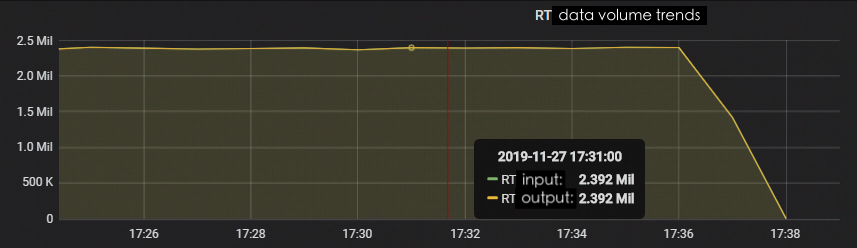

- UDF processing performance of Python implementation in the example

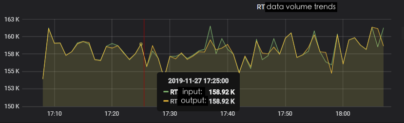

###UDTF

According to the UDTF implementation in the above example, the processing performance of UDTF implemented in Java is 1.55 million/minute, and the processing performance of UDTF implemented in Python is 860,000/minute.

- UDTF processing performance of the Java implementation in the example

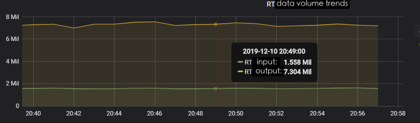

- UDTF processing performance of Python implementation in the example

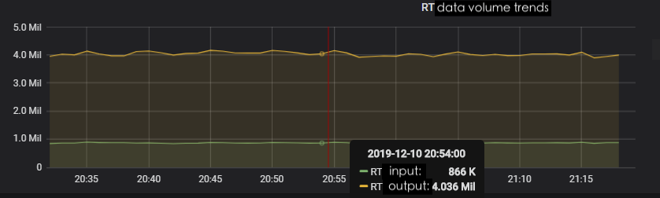

###UDAF

According to the UDAF implementation in the above example, the processing performance of UDAF implemented in Java is 2.5 million/minute, and the processing performance of UDAF implemented in Python is 120,000/minute.

- UDAF processing performance of the Java implementation in the example

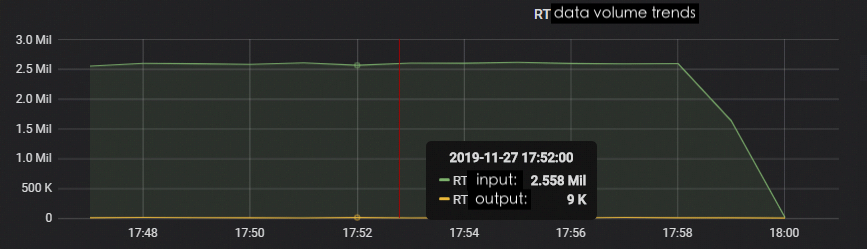

- UDAF processing performance of Python implementation in the example

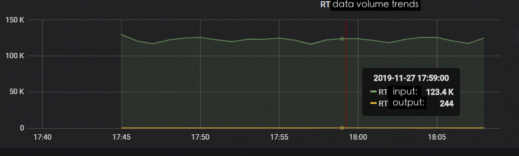


<font color="#dd0000">Note: The above performance indicators are for reference only. The specific UDF processing performance is related to its implementation logic. </font>

## Precautions

- After the custom function is republished, you need to resave the SQL node using this function and restart the task to take effect.
- After selecting the function type (UDF/UDTF/UDAF) and writing part of the code, in order to ensure that the code is not lost, if you switch the function type, the code frame will not be automatically refreshed again.
- If you need to add a third-party Python library, please contact the platform administrator
- The current development language versions are Java 8 and Python 3.6.9 respectively