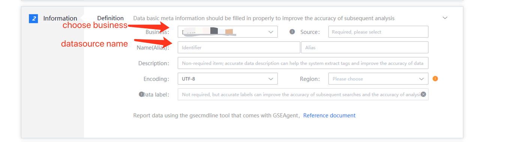

# Custom access

## Introduction

Users only apply for one dataid, and the reporting method is decided by the user. You can use gsecmdline to report, or you can configure it into a collector developed by the collection framework.

## Data access

### Data information

It defines the basic information of the source data, including business, source data name, etc. The data source name is defined by the user and cannot be repeated in the same business.

#### The access interface example is as follows

