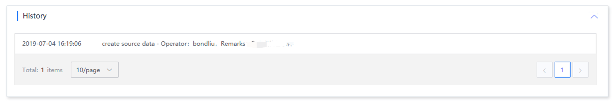

# Access details

The access details page shows the access status

## Access status

The statistical overview includes normal, abnormal, running and stopped status. The number is 1. Click the refresh button to query the latest status

## Run log

The operation log displays the operator and operation log of each deployment

### Operation history

Operation history displays the operation logs of source data. It includes source data access, stop, start, and start and stop operations of source data-related tasks.

