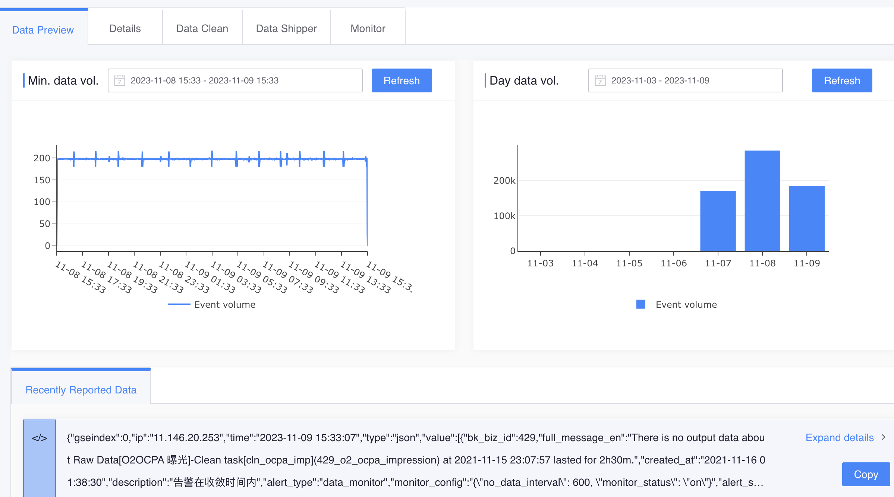

# Custom reporting usage

Report data through the GSE plug-in `bkmonitorbeat`.

Note: The reporting method of `gsecmdline` has been adjusted to `bkmonitorbeat`.

## Preconditions

### Get data ID
Enter the platform's Access Integration -> New Access Data Source -> Access Type (Customized), and obtain the data ID after submission.

> Note: The data ID will be specified in the `-report.bk_data_id` parameter of bkmonitorbeat.

### bkmonitorbeat plug-in has been installed

If it is not installed, go to Node Management to install the plug-in.

### Get bkmonitorbeat path
You can get the installation path of GSEAgent through `ps -ef | grep gse`, for example `/usr/local/gse_bkte/`, add `plugins/bin/bkmonitorbeat` to get the path of `bkmonitorbeat` `/usr/local/gse_bkte/plugins /bin/bkmonitorbeat`

```bash
$ ps -ef | grep gse
root 76989 1 0 Apr03 ? 00:00:00 ./gse_agent -f /usr/local/gse_bkte/agent/etc/agent.conf
root 76990 76989 0 Apr03 ? 00:03:15 ./gse_agent -f /usr/local/gse_bkte/agent/etc/agent.conf
```

### Get GSEAgent IPC path
From the results of the above command, you can get the `GSEAgent configuration` (for example `/usr/local/gse_bkte/agent/etc/agent.conf`), view the `dataipc` in the configuration, and you can get the IPC path (for example `/ usr/local/gse_bkte/agent/data/ipc.state.report`)

> NOTE: The IPC path will be specified in the `-report.agent.address` parameter of bkmonitorbeat.


## Main parameter description

```bash
./bkmonitorbeat \
-report \ ## fixed to report
-report.type agent \ ## Fixed to event
-report.message.kind event \ ## Fixed to event
-report.bk_data_id 546800 \ ## Data ID assigned by the computing platform
-report.event.target 10.0.0.1 \ ## Specify the target IP
-report.event.name "online_test" \ ## The name of the reported event
-report.event.content "dfdf|dfdf|dfdf" \ ## Reported custom content
-report.agent.address "" ## Specify IPC path
```

## Data reporting case
### Report custom data

```bash
./bkmonitorbeat -report \
-report.type agent \
-report.message.kind event \
-report.bk_data_id 546800 \
-report.event.target 10.0.0.1 \
-report.event.name "online_test" \
-report.event.content "dfdf|dfdf|dfdf" \
-report.agent.address /usr/local/gse_bkte/agent/data/ipc.state.report
```

> Note: Please change `bk_data_id`, `-report.agent.address` to your configuration.


Data received by the platform

```json
{
     "agent": { "type": "bkmonitorbeat.report", "version": "0.0.1" },
     "bizid": 0,
     "bk_info": {},
     "cloudid": 0,
     "data": [
         {
             "dimension": {},
             "event": { "content": "dfdf|dfdf|dfdf" },
             "event_name": "online_test",
             "metrics": {},
             "target": "10.0.0.1",
             "timestamp": 1681472452062
         }
     ],
     "dataid": 546800,
     "ip": "",
     "time": 1681472452,
     "timestamp": 1681472452,
     "version": ""
}
```


### Report JSON data

```bash
./bkmonitorbeat -report \
-report.type agent \
-report.message.kind event \
-report.bk_data_id 546800 \
-report.agent.address /usr/local/gse_bkte/agent/data/ipc.state.report \
-report.message.body '{
     "access_token":"",
     "data":[{
         "event_name":"input_your_event_name",
         "target":"10.0.0.1",
         "event":{
             "content":"user xxx login failed"
         },
         "dimension":{
             "amodule":"db",
             "aset":"guangdong"
         },
         "metrics":{
             "field1":1.1
         },
         "timestamp":1591067660370,
         "test": 202383883838
         }
     ]}'
```

> Note: Please change `bk_data_id`, `-report.agent.address` to your configuration.
    
    
Data received by the platform

```json
{
     "agent": { "type": "bkmonitorbeat.report", "version": "0.0.1" },
     "bizid": 0,
     "bk_info": {},
     "cloudid": 0,
     "data": [
         {
             "dimension": { "amodule": "db", "aset": "guangdong" },
             "event": { "content": "user xxx login failed" },
             "event_name": "input_your_event_name",
             "metrics": { "field1": 1.1 },
             "target": "10.0.0.1",
             "test": 202383883838,
             "timestamp": 1591067660370
         }
     ],
     "dataid": 546800,
     "ip": "",
     "time": 1681471090,
     "timestamp": 1681471090,
     "version": ""
}
```


## View data reporting results

After the data is reported successfully, you can view the data reporting status on the data source details page.



After confirming that it is correct, you can proceed to [Data Cleaning](../../data-clean/detail.md) to clean the original data into a [Result Table](../../../../Introduction/Terms.md).