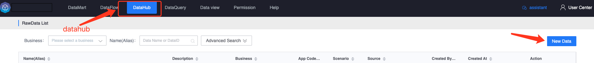
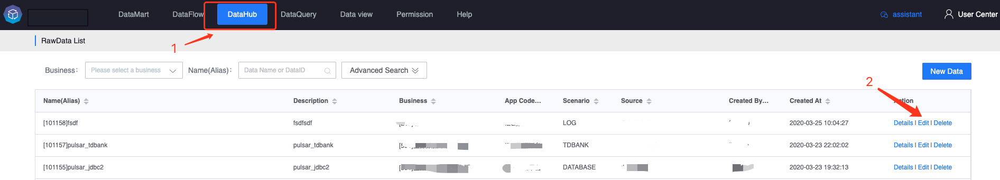
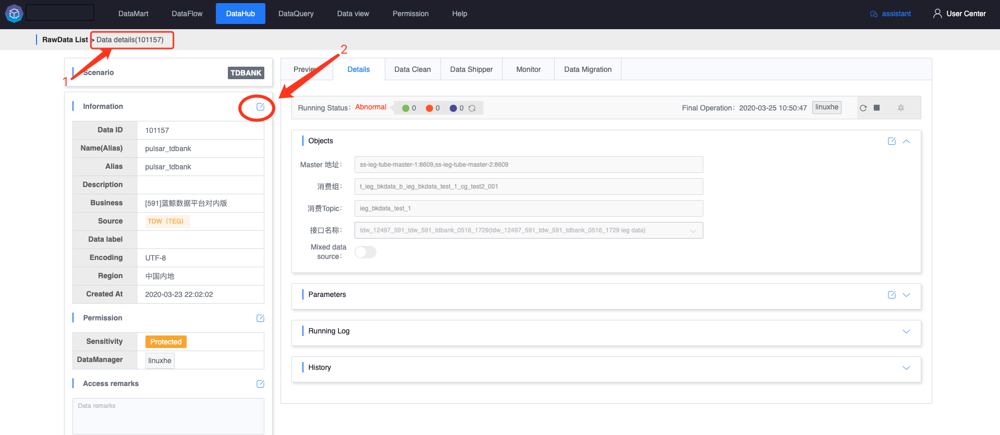

# Data source access

The function of this module is to realize self-service data source access based on the GSE unified data pipeline.

Currently supported data sources include: [Log file collection] (./log/concepts.md), [MySQL database collection] (./database/concepts.md), [File upload] (./file-upload/concepts.md ), [Script reporting](./shell-script/concepts.md), etc.

Supports data access management, data source trends and original data content preview.

## Related concepts

Data source: The original data of the business can be reported to the platform through logs, databases, message queues, etc.

## Access new data sources

## Modify data source

### method one

### Method 2

Enter the data details page

