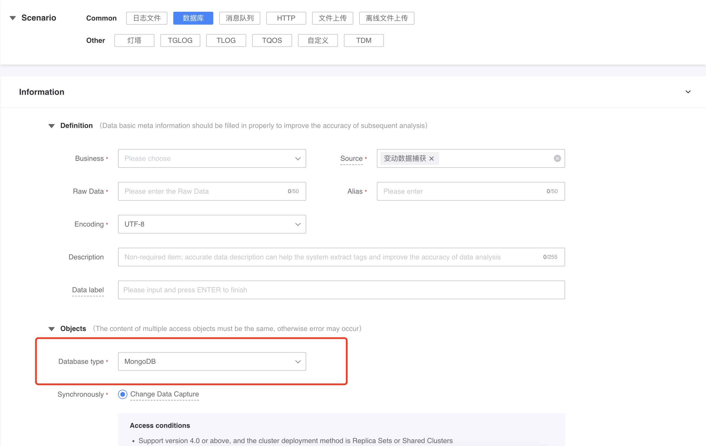
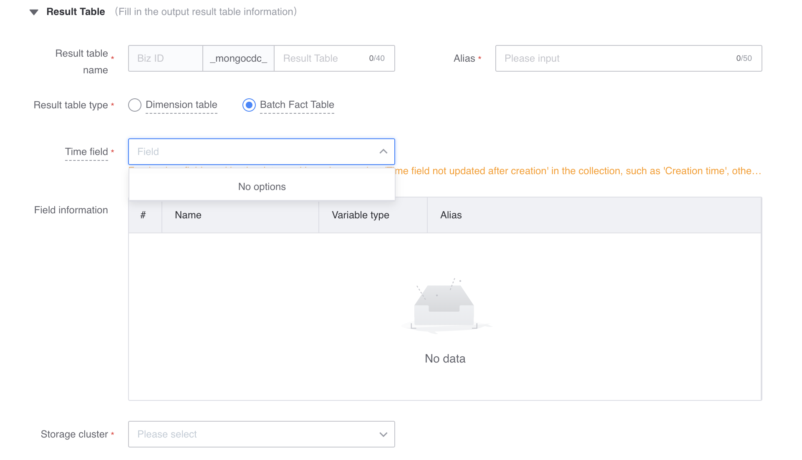
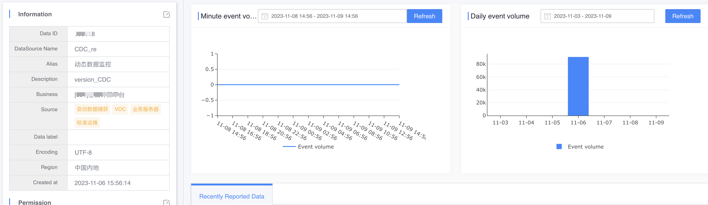
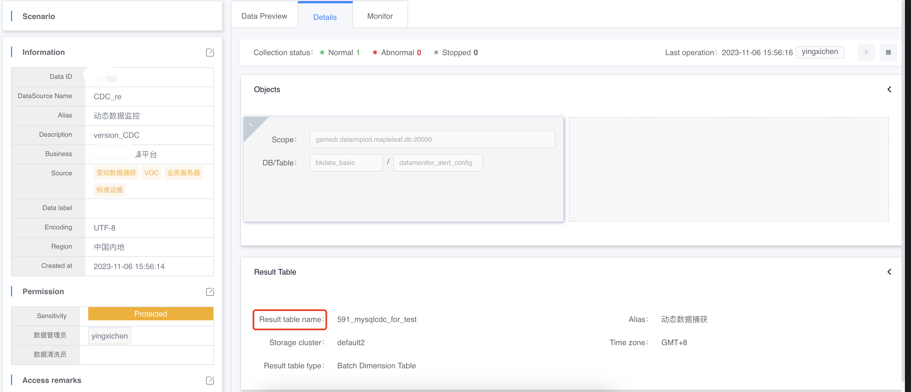
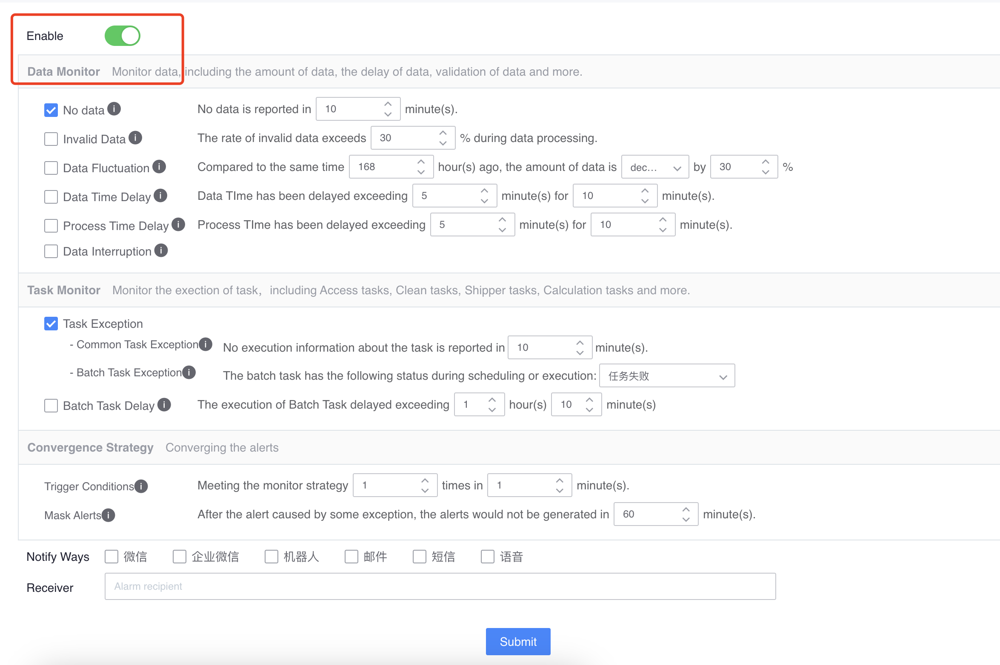
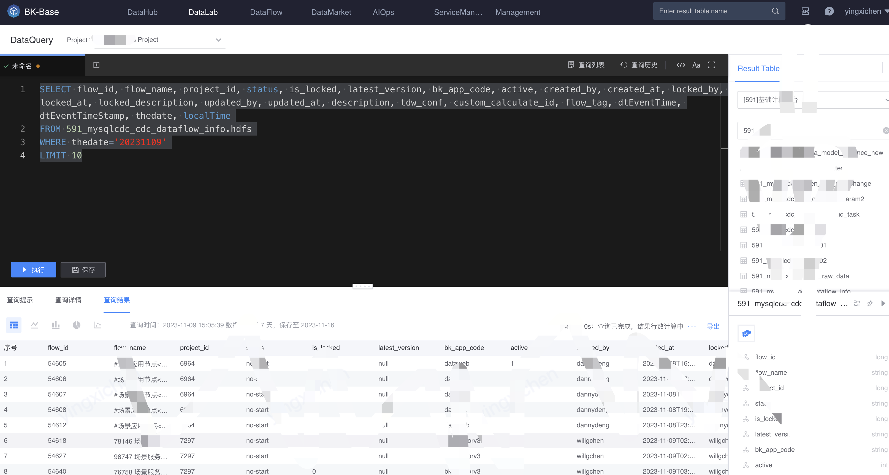
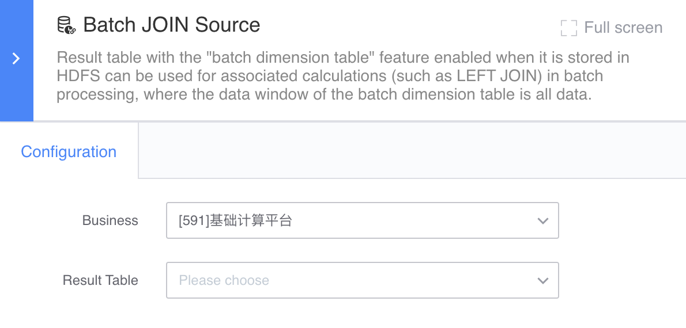
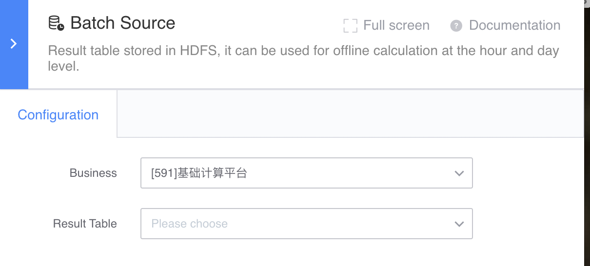

# MongoDB access

Synchronize the collections in MongoDB to bkbase and use them as offline pipeline tables, offline dimension tables for offline calculations, and data exploration.

## Features
### Synchronization principle
> Change Data Capture (CDC for short) is a technology used to capture data changes in the database. MongoDB synchronizes change data based on Change Streams.

The figure below shows the logical architecture diagram of change data capture.

### Applicable scene
Consistent with the original DB, used for offline dimension tables, offline pipeline tables and data exploration
Directly into the data lake (HDFS), currently only supports offline calculation and cannot be stored in other storage
Can capture data updates/deletions

### Access conditions
Supports version 4.0 or above, the cluster deployment method is Replica Sets or Shared Clusters
The storage engine is WiredTiger
Provide an account with read and readAnyDatabase role permissions
It is recommended that Oplog can save logs for at least 24h to facilitate CDC task failure recovery.

## Submit data access task
In the "Data Integration" menu, click "New Access Data Source", select "Database" in the access type, and select "mongodb" as the database type.

In the access object, fill in the connection information of the cluster.

> Click the preview icon on the right side of the collection drop-down box to view one piece of data.

Fill in the information of the output result table, including HDFS storage cluster, and result table type:

- Offline dimension table: It can be used for related calculations (such as LEFT JOIN) in offline calculations, where the data window of the offline dimension table is all data.
- Offline flow sheet: can be used for hourly and day-level offline calculations

Note: When selecting an offline pipeline table, please select the "time field that is not updated after creation" in the collection as the time field, such as "creation time", otherwise the accessed data will be inconsistent with the source table.

After confirming that the information is correct, submit the access task.

Wait 2~10 minutes for the connection to be completed.

## View data preview

- View data preview

- View access details

The output table name can be found.

> The result table type of this example is dimension table

- Depending on the data source, you can configure the data source no data and data fluctuation alarm policies.

## Consumption result table
After data access is completed, data can be consumed in [Data Exploration](../../../datalab/queryengine/sql-query/concepts.md) or Data Development.

### Data exploration
Query this results table in data exploration.

### Data development
Apply for permission to the result table in data development. Depending on the configuration when accessing, it can be used for [offline flow table] (../../../dataflow/components/source/batch-source.md) or [offline dimension table] ](../../../dataflow/components/source/batch-dim.md).

- Offline dimension table

- Offline flow meter

