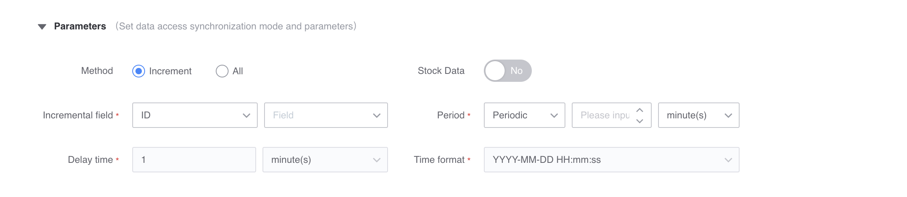
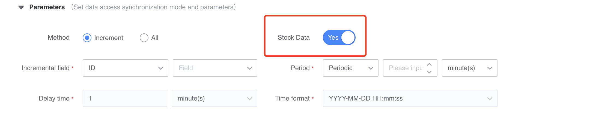
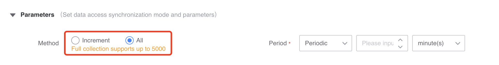
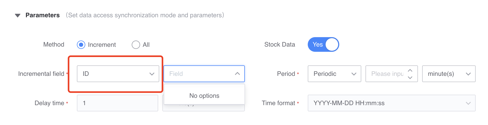

# MySQL access (based on SQL query)

## Introduction

Database collection uses remote methods to collect database data. Data query supports querying by time field or auto-incremented id field.

### Collection principle

The collector is deployed on the server of the platform and collects data by remotely accessing the db.

Periodically transfer data to the computing platform via SQL queries

Incremental: Query data incrementally through time field or auto-increment ID

Full volume: supports up to 5,000 items

### Applicable scene
It can be stored in all storages and supports real-time calculation and offline calculation.

NOTE: Data deletion cannot be captured

### Access conditions

- The original table must have a time field or an auto-increment ID field
- Grant computing platform IP (see product interaction for details) SELECT permissions

## Data access
### Data information

It defines the basic information of the source data, including business, source data name, etc. The data source name is defined by the user and cannot be repeated in the same business.

### Access object

Database type: Currently only supports msql collection

Each access object defines the configuration that needs to be collected from the db

* Collection range, including db domain name, user name and password
* Database/table name

Each data source supports configuring multiple access objects.

After configuring the correct db domain name and account information, the database name and table name can be automatically pulled. Users can directly choose

### Access method

1. Incremental pull (no access to existing data)

Starting from the access time, periodic tasks will be started, all data after the access time will be synchronized to the platform, and reported in json format.

2. Incremental pull (access to existing data)

All existing data in the database will be synchronized to the platform first;

Then starting from the access time, start the periodic task, synchronize all data after the access time to the platform, and report it in json format.

3. Pull in full amount

Full collection supports a maximum of 5,000 items. Data is pulled starting from the first item in the database, with a maximum of 5,000 items. The excess will be discarded and is a one-time task.

### Filter conditions

Optional: Support filtering by fields

#### The access interface example is as follows

## Instructions for use

### 1. Incremental pull
Incremental pull is divided into:
*Does not access existing data
* Access to two types of existing data

#### a. Access according to the id field

When choosing to access by ID field, the column [increment field] of the specified database should be of integer type, preferably an auto-increment primary key index.
This access method will be judged according to the given incremental field [If the database table structure supports it, please give priority to ID access]

For example:

The following two pieces of data were synchronized in the previous synchronization cycle:

     id: 1, name: zhangsan, age: 30
     id: 2, name: lisi, age: 29

The next synchronization cycle will monitor all records with id greater than 2, and set the incremental field monitoring value to id greater than 3.

     id: 3, name:wangwu, age 31

When selecting this type of access method, you need to fill in the following four parameters

* Increment field: Select the ID type and select the corresponding database list in the drop-down box behind
* Collection cycle: Synchronization tasks will be started periodically to pull the latest added data
* Data delay time: not optional in ID scenario
* Time format: not selectable in ID scenario

#### b. Access according to time field

When choosing to access by time field, the column [increment field] of the specified database should be the time type specified by the data format column.
This access method will be judged according to the given time field.

For example:
The following two pieces of data were synchronized in the previous synchronization cycle, and time was specified as the time field, and the data delay time was 0

     id: 1, name: zhangsan, age: 30, time: 2020-01-01 01:01:01
     id: 2, name: lisi, age: 29, time: 2020-01-01 01:01:02

The next synchronization cycle will monitor all records whose time field is greater than 2020-01-01 01:01:02 and less than the current time (not equal, please refer to the data delay time solution later), and the incremental field monitoring value will be set to the time field 2020-01-01 01:01:03

     id: 3, name:wangwu, age 31, time: 2020-01-01 01:01:03

##### Delay data time

If the data is out of order or there is too much data at the same time, it will be pulled after a delay period.

For example:

The following two pieces of data were synchronized in the previous synchronization cycle, and time was specified as the time field, and the data delay time was 10 minutes.

     id: 1, name: zhangsan, age: 30, time: 2020-01-01 01:01:01
     id: 2, name: lisi, age: 29, time: 2020-01-01 01:01:02

The next synchronization cycle will monitor all records whose time field is greater than [2020-01-01 01:01:02] and less than [current time (2020-01-01 01:11:05) - 10min], and the increment will be The field monitoring value is set to the time field greater than 2020-01-01 01:01:03

     id: 3, name:wangwu, age 31, time: 2020-01-01 01:01:03
     id: 4, name: chenliu, age 34, time: 2020-01-01 01:11:10 [Not pulled in the current cycle, it needs to be pulled in the next cycle]
