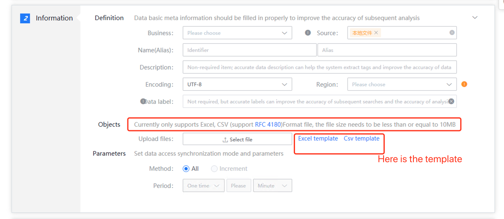

# File upload access

## Introduction

Access data by uploading static files. Currently, only Excel and CSV\(RFC4180\) format files are supported. The file must be less than or equal to 10MB.

## Collection principle

By uploading files that meet the standards, the files are parsed and the data in the files are connected to the platform.

## Access preparation

Download file template and prepare file data

## Data access

### Data information

It defines the basic information of the source data, including business, source data name, etc. The data source name is defined by the user and cannot be repeated in the same business.

### Access object

Upload specified file

### Access method

The collection method only supports full quantity

The collection cycle only supports one-time

### Access example

