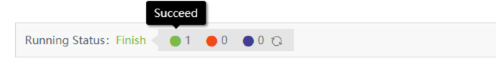
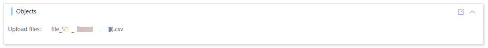
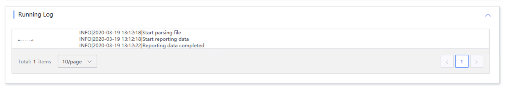
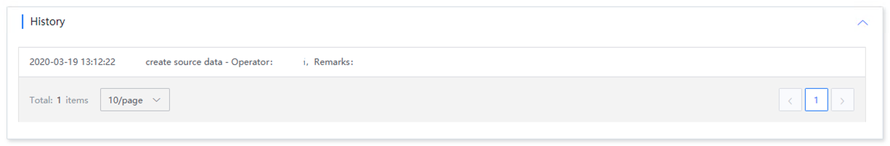

# Access details

The access details page shows the access status, and there is no task start or stop operation for file upload.

## Access status

File upload is a one-time access data, so the status after successful access in the status overview is completed.

## Start and stop tasks

There is no start or stop task for file upload. It is a one-time access data. Therefore, the start and stop task is grayed out.

## Access object

The access object displays the uploaded file name information

## Access method

Here is the configured access method

## Run log

The operation log displays the operator and operation log of each deployment

## Operation history

Operation history displays the operation log of source data. It includes source data access, data source update, etc.

