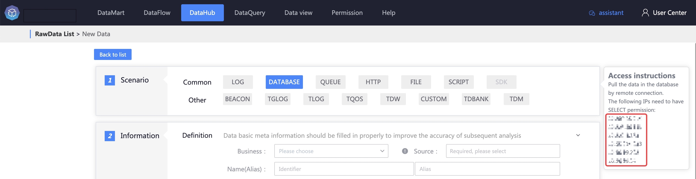
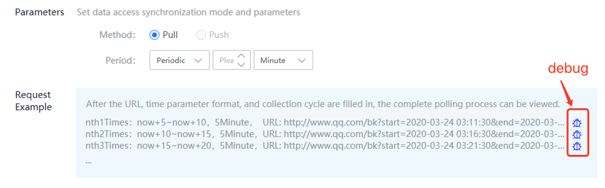
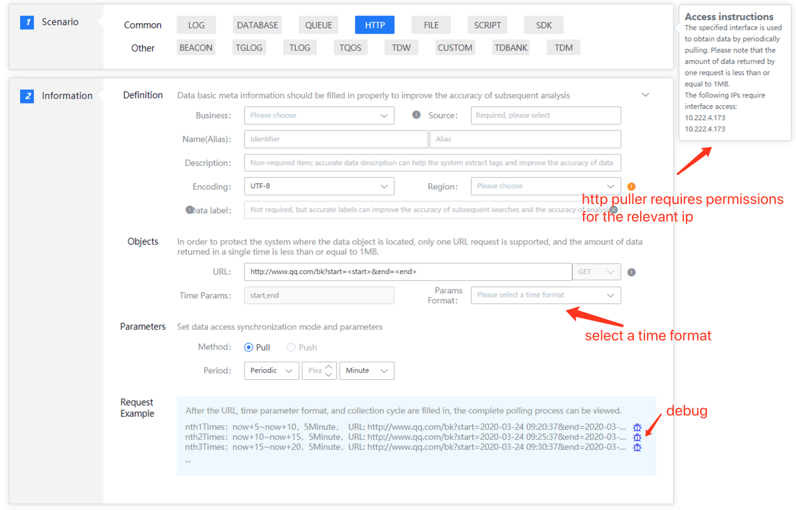

# HTTP access

## Introduction

HTTP collection uses the HTTP protocol to collect data.

## Collection principle

The collector is deployed on the server of the platform and remotely accesses data collected through HTTP.

Each fixed period\(user configuration\), the data can be queried according to time query conditions, and then the data can be reported.

## Access preparation

Because remote pulling is used, the user needs to authorize the pulling machine.

The following IPs require HTTP access:

## Data access

### Data information

It defines the basic information of the source data, including business, source data name, etc. The data source name is defined by the user and cannot be repeated in the same business.

### Access object

Currently only GET access method is supported.

Supports querying by time field. The time field can be configured with start time and end time.

Field names can be customized, defaults are start and end

Each access object defines the HTTP configuration that needs to be collected

*URL
* Time parameter. Fill in the url
* Time format

Each data source supports configuring multiple access objects.

### Access method

The collection method only supports pulling

The collection period can be configured in minutes, hours, and days

### Filter conditions

Optional. Support filtering by fields

### Request example

Examples of three queries are shown. Click the test button to test the data collection.

Debugging successful return result

Example of return result for debugging failure

#### The access interface example is as follows

## 