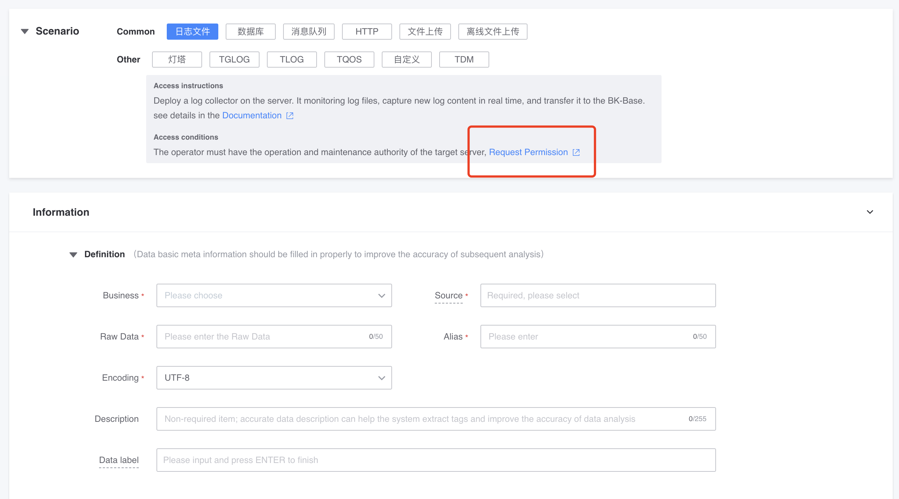
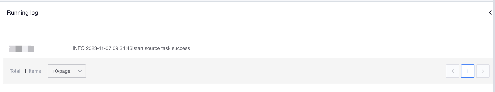
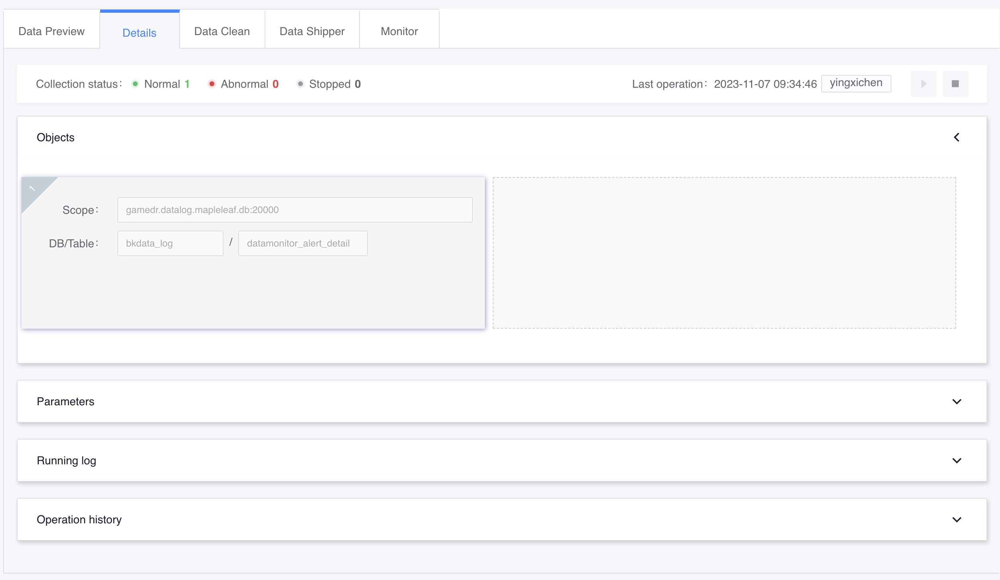
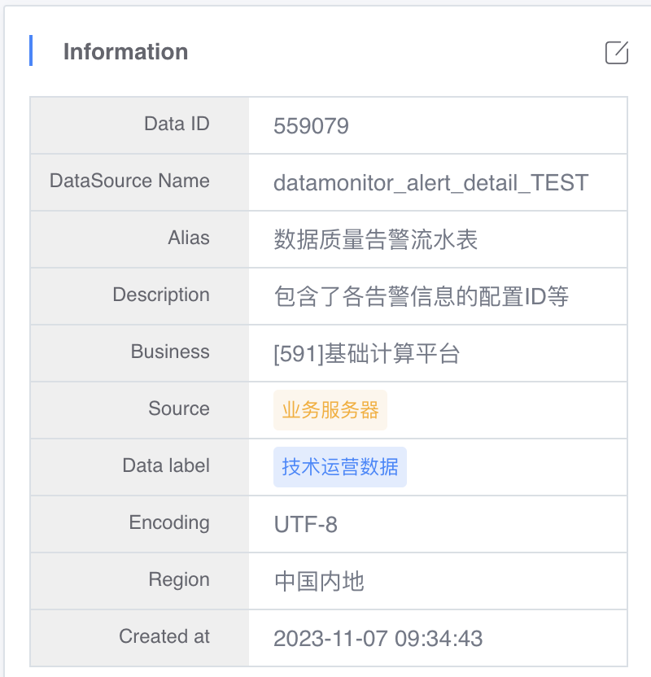

# Log Self-service troubleshooting and FAQs for access failures

### Prompt for permission exception when creating access

Business-related roles have access and query permissions by default on the platform. Logs require access permissions such as business operation and maintenance personnel and business directors. Permission related details: [My Permissions](../../../auth-management/permission.md)

You can apply in the TEA system through the following channels:

*Business Director: Can access business data in any scenario and has all authority over business data, including approval authorization
* Business operation and maintenance personnel (including operation planning): can access business data in any scenario and have all permissions for business data, including approval authorization
* Business developers: can access business data in scenarios other than "Log Files", "Script Reporting", and "TLOG", and can query business data
*Business product personnel: can access business data in scenarios other than "Log Files", "Script Reporting", and "TLOG", and can query business data
*Business testers: can access business data in scenarios other than "Log Files", "Script Reporting", and "TLOG", and can query business data
* Business roles cannot be applied for directly on the platform for the time being. The platform will synchronize role members from the BlueKing Configuration Platform at regular intervals. Currently, only operation and maintenance personnel, developers, product personnel, and testers are synchronized. The maximum synchronization delay is 10 minutes.

In addition, the distribution of the collector also requires the permissions of the Job platform. If the error shown in the figure is prompted, please go to the Job platform to complete the relevant permission application.

### Why is the collector in an abnormal state after creating the access?

If it shows failure after access, please follow the following self-check manual to conduct self-troubleshooting:

#### 1. First click the refresh button on the interface to obtain the latest collector status and initially troubleshoot collector problems.

The collector status is not refreshed in real time. Users need to manually refresh the interface button to obtain the latest status information.

If the status is abnormal, click the edit button to re-deliver the collector to the same machine and check the subsequent collector status.

#### 2. Check whether the collector configuration contains data_id, and check whether the directory of the collector corresponds

Subsequent troubleshooting operations need to be performed on the specific collection machine. First check whether the collector configuration contains data_id

     cat /data/MapleLeaf/bkdata/plugins/unifyTlogc/conf/unifyTlogc.json | python -m json.tool

Currently, the paths for different versions in different environments are not unified for the time being:

* IDC internal version: /data/MapleLeaf/bkdata/plugins/unifyTlogc/conf/unifyTlogc.json
* Enterprise version: /usr/local/gse/plugins/etc/unifyTlogc.json

And there are soft links to the relevant collector programs in the /usr/local/gse/plugins/bin directory.

#### 3. Check whether the collector process exists

3.1 View the collector process

Use the following command line operation to view the specific collector process

If it does not exist, you need to reconnect and try again. If reconnecting still does not work, there may be a problem with the script to restart the task. Go to the next step 3.2 troubleshooting.

If there are two agent processes with different paths, please contact the platform assistant to solve the problem.
  
     ps -ef|grep -i unifytlogc

3.2 Check startup script problems

     [/usr/local/gse/plugins/bin]# cat restart.sh
     cd ${BASH_SOURCE%/*} 2>/dev/null
     ./stop.sh $@ && ./start.sh $@

If as shown in the above code: stop.sh and start.sh are on the same line, please separate the two scripts. The return value of stop.sh will not be 0, which will cause start.sh to not be executed. Modify as follows:
    
     cd ${BASH_SOURCE%/*} 2>/dev/null
     ./stop.sh $@
     ./start.sh $@
    
3.4 Test whether the agent is normal

Use the following command to test whether the GSE function is normal. If the function is normal, the information shown in the figure will be displayed. If Failed is displayed, please contact the platform assistant or GSE related team.

     gsecmdline -D -d 0 -s test

#### 4. If `Call job timeout` appears during the deployment process, check the job execution history of the BlueKing operating platform and find jobs related to transferring files.

For example, if the access record is as follows, search for the job with the following name: API GSE PUSH FILE15******20667, determine whether there is a timeout in job execution, and contact the platform assistant or GSE related team

     INFO|2020-07-03 17:05:34|Start accessing log data
     INFO|2020-07-03 17:05:34|Check whether the process exists
     INFO|2020-07-03 17:05:55|Delivery configuration
     ERROR|2020-07-03 17:06:57|Unexpected exception occurred during deployment process, Call job timeout
     Therefore, there should be a job on the job platform around 17:05:55

#### 5. If the above problems cannot be solved, or if you encounter difficulties in self-service troubleshooting, please contact: Platform Assistant