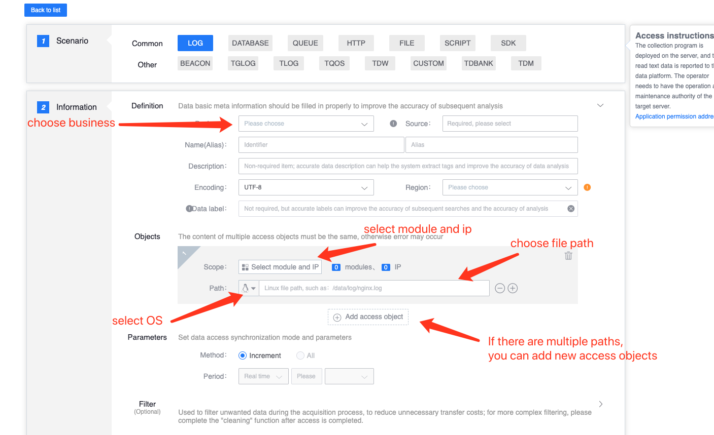

# Log access

## Introduction

Log access provides real-time log collection and reporting functions. It can dynamically sense events such as appending log file content, adding new log files, deleting log files, etc., and supports real-time collection of new data and reporting to the platform.

## Collection principle

The platform delivers the collector and collection configuration to the target machine and hosts them under gseAgent.

The collector will monitor the configured log path. The path supports wildcard characters. When new log data or new log files are generated, it can sense and collect and report in real time.

_Note: The rollback method of directly clearing the file content is not supported_

Log collection is by row by default and supports configuring filter conditions. Data reporting supports packaged reporting, so the data reported at one time may be one or more rows. The data reporting format defaults to json format, and the collector will append host IP and other ancillary information.

## Access preparation

* Execution authority of the operating platform. The delivery and restart of the collector rely on the operating platform for execution, so users need execution permissions on the operating platform.

## Data access

### Data information

Defines the basic information of source data, including business, source data name, etc. The data source name is defined by the user and cannot be repeated in the same business.

### Access object

Each access object defines the access scope, log path, and operating system.

* Collection range: access by module or IP;
* The log path supports wildcards; (The log file path uses the glob wildcard, which is a path matching character used by the shell, similar to regular expressions, but not exactly the same as regular expressions.)
* The operating system currently supports Linux and Windows;

Each data source supports configuring multiple access objects.

### Access method

The collector collects data in real time and cannot be configured temporarily.

### Filter conditions

Optionally, when the log volume is large, you can filter out specified log reports to reduce unnecessary transmission costs.

Filtering is based on line filtering. Each line of logs is divided by delimiter. When the specified field is equal to the keyword configured by \(=\), this line of logs will be reported.

Multiple filter conditions can be configured to support flexible assembly. Filtering requires local CPU resources, and it is not appropriate to have too many filtering conditions.

#### The access interface example is as follows

