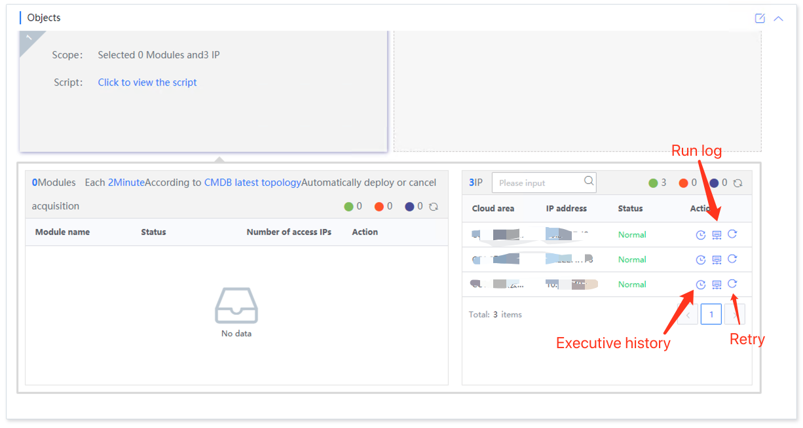
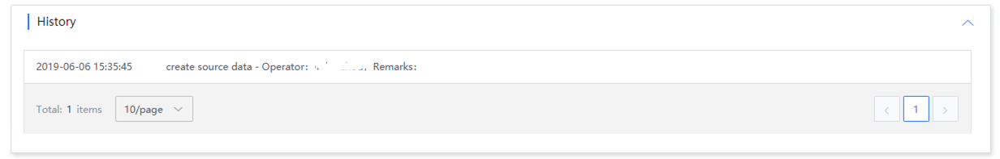
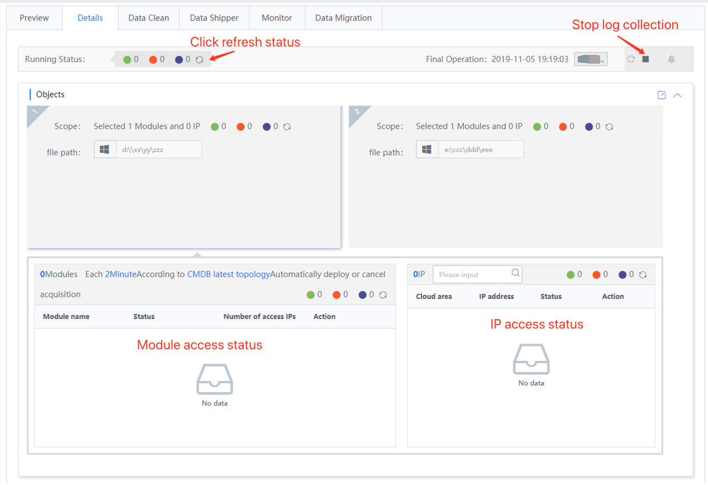
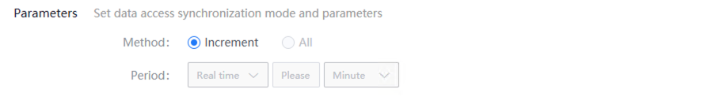
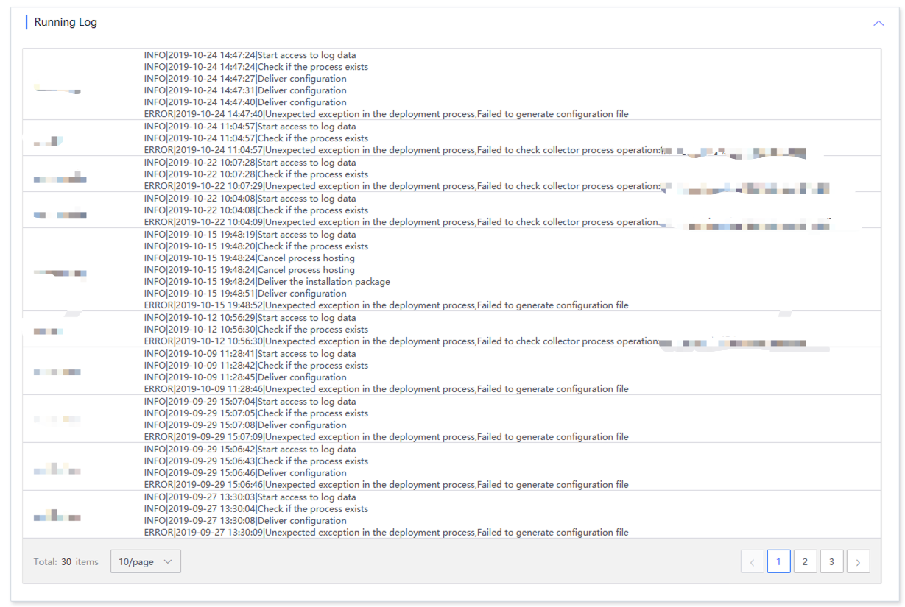
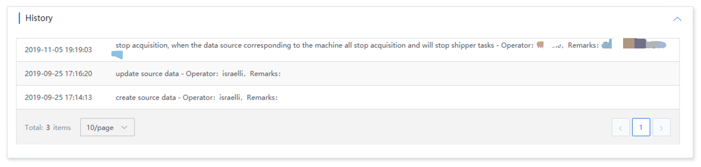

# Access details

The access details page displays the access status and provides stop and start operations for source data access.

## Access status

Access status includes statistical overview and access status of each access object.

The statistical overview includes normal, abnormal, running and stopped status, and the number of IPs in each status will be counted. Click the refresh button to query the latest status

Access objects are divided into module access status and IP access status, including viewing execution history, running logs and supporting retry operations.

Click Retry to re-deliver the IP collection task.

The execution history shows the execution history of the IP, arranged in reverse order by operation time.

If the access is abnormal, you can see the cause of the exception here.

### The access details interface example is as follows

## Access method

Shown here is temporarily fixed

## Run log

The operation log displays the operator and operation log of each deployment

## Operation history

Operation history displays the operation logs of source data. It includes source data access, stop, start, and start and stop operations of source data-related tasks.

