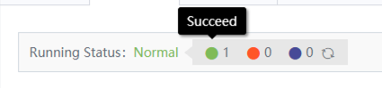
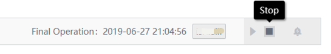

# Access details

The access details page displays the access status and provides stop and start operations for source data access.

## Access status

Access status includes statistical overview and access status of each access object.

The statistical overview includes normal, abnormal, running and stopped status. The number is 1. Click the refresh button to query the latest status

## Start and stop tasks

Here you can stop/start the collection task. After stopping the task, data will no longer be collected.

## Access object

The access object shows the collection range and script content

## Access method

Here is the configured access method

## Run log

The operation log displays the operator and operation log of each deployment

## Operation history

Operation history displays the operation logs of source data. It includes source data access, stop, start, and start and stop operations of source data-related tasks.

