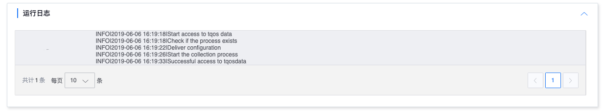

# Access details

The access details page displays the access status and provides stop and start operations for source data access.

## Access status

Access status includes statistical overview and access status of each access object.

The statistical overview includes normal, abnormal, running and stopped status, and the number of IPs in each status will be counted. Click the refresh button to query the latest status

### Access object

The access object displays the TQOS ID of the access

### Access method

Shown here is temporarily fixed

## Run log

The operation log displays the operator and operation log of each deployment

## Operation history

Operation history displays the operation logs of source data. It includes source data access, stop, start, and start and stop operations of source data-related tasks.

