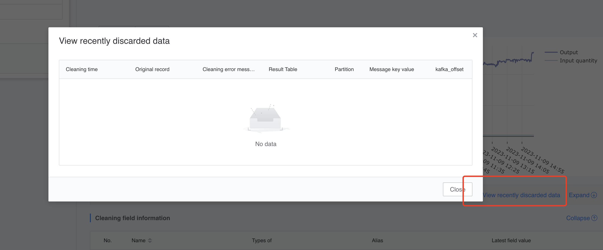
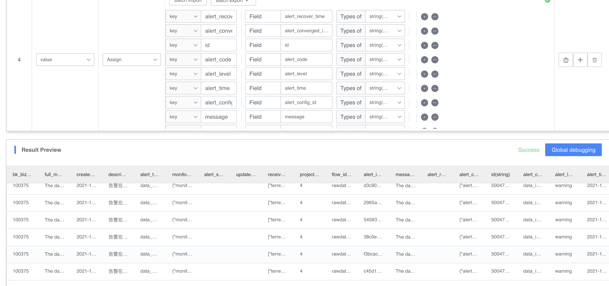

## Data Cleaning FAQ

### Is it possible to modify the field type that has been used? Can I delete and add fields?

Currently, the platform supports modification of old cleaning rules. You can click Edit in the platform to add and delete export fields, but modification of field types is not supported. (Deleting an old exported field and re-creating a new field of a different type with the same name is considered a modification operation and is not supported.)

Since there may be several kinds of data that have been stored in the database downstream, in order to avoid data type anomalies, data type modification is not supported. There are several alternative operations to consider:

* Export the same field twice and reassign a field of a different type. For example: [raw_use_age exports string type output_age], which can be modified to [raw_use_age exports string type output_age, raw_use_age exports `integer` type int_output_age]
* Use the `caseas` operator method for conversion in the subsequent calculation process

### The amount of data before cleaning is different from the amount of data after cleaning. How to check the discarded data and what causes the discarding?

After configuring the cleaning rules, the data will be cleaned strictly according to the cleaning rules. If the fields do not match or the field types cannot be parsed, the original data will be discarded.

The cleaning details provide an interface for viewing recently cleaned invalid data, as shown in the figure below.

### What is the role of the time field in cleaning? How to use time fields

The cleaning time field is used as a partition field for subsequent storage (such as HDFS, which supports partitioning). For example, if there is `2020-05-01`, there is a piece of data with the specified time field as `2020-01-01`.
If this data has a corresponding entry into the database, you need to specify the date as `2020-01-01` in the subsequent SQL before querying.

The platform provides several default cleaning formats, as shown below. If the reported field does not match the following format, please use regular matching to convert it to the following format:

* yyyy-MM-dd HH:mm:ss
* yyyy-MM-dd HH:mm:ss.SSSSSS
* yyyy-MM-dd'T'HH:mm:ssXXX
* yyyy-MM-dd+HH:mm:ss
*yyyy-MM-dd
* yy-MM-dd HH:mm:ss
*yyyyMMddHH:mm:ss
* yyyyMMdd HH:mm:ss.SSSSSS
*yyyyMMddHHmm
*yyyyMMddHHmmss
*yyyyMMdd
* dd/MMM/yyyy:HH:mm:ss
* MM/dd/yyyy HH:mm:ss
* Unix Time Stamp(seconds)
* Unix Time Stamp(milliseconds)
* Unix Time Stamp(mins)
* yyyy-MM-dd'T'HH:mm:ss
*yyyyMMddHH
* yyyy-MM-ddTHH:mm:ss.SSSZZZ
* yyyy-MM-ddTHH:mm:ss.SSSSSXXX
* yyyy-MM-ddTHH:mm:ss.SSSSSSXXX
* yyyy-MM-dd'T'HH:mm:ss.SSSSSSXXX

### Why does the large integer become a negative number after cleaning?

This problem will occur when setting a number type that exceeds the range of integers (java Integer -2147483648 ~ 2147483648) to an integer

The type should be set to type Long

### What are the reserved fields that cannot be used during cleaning?

There are keywords reserved by the platform, such as: '__time', 'dteventtimestamp', 'dteventtime', 'localtime', 'thedate', 'now', 'offset'

There are also keywords in various subsequent stores, such as:

* MySQL keywords: ADD ALL ALTER ANALYZE WHERE AND AS int8 int16, etc.,
* Elasticsearch keyword: abstract enum int short boolean export interface static byte extends long super char final native synchronized
* HDFS Druid and other keywords

To avoid problems in subsequent use, please avoid using various reserved keywords.