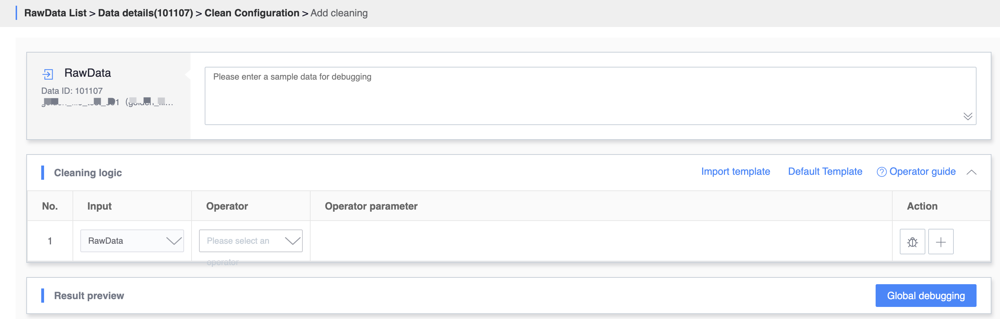
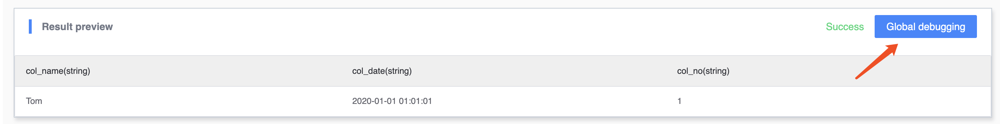
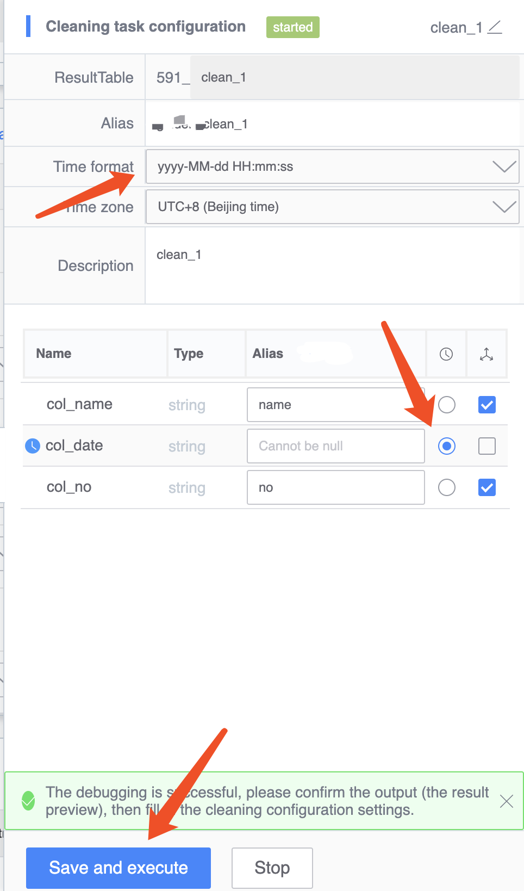
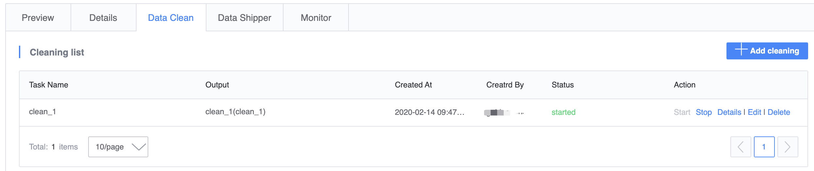
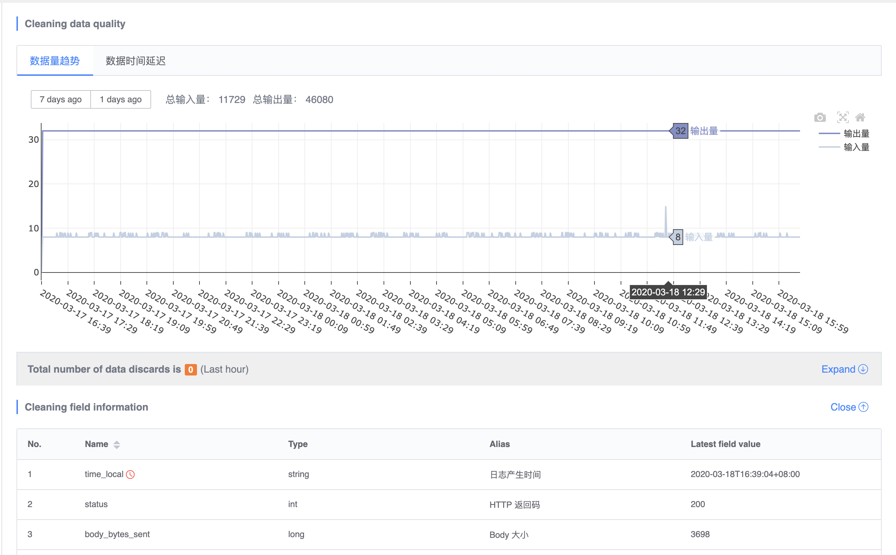
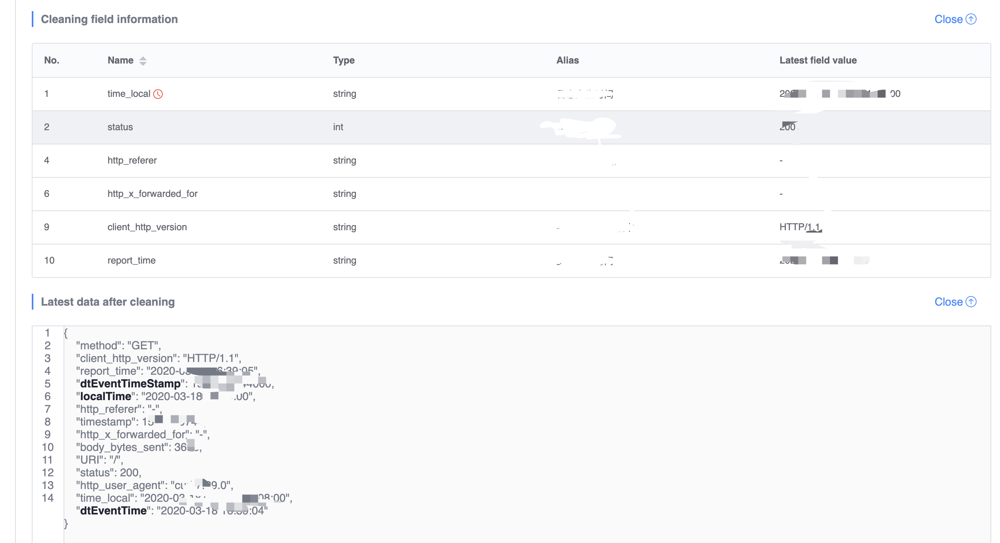

## Data cleaning

## Why data needs to be cleaned

The data reported by users may be in a variety of formats, such as vertical bar-delimited data, json format data, ordinary line log data, etc. If you need to use the reported data in the platform, you first need to standardize the data and convert it into rows of records in a unified schema.

## Preconditions
- Completed [Data Source Access](../data-access/concepts.md)

The following takes file access as an example, [File data source access](../data-access/file-upload/detail.md)

### How to configure cleaning

First, enter the "Data Details" -> "Data Cleaning" page and click the "Add Cleaning" button in the upper right corner to add cleaning configuration. Normally, users only need to configure one cleaning rule, and users can also configure multiple cleaning rules for the same data source.

* After entering the cleaning configuration page, a piece of reported data will be loaded first.



* Select the appropriate cleaning operator based on the format of the reported data


* Click the "Global Debugging" button to test whether the cleaning configuration is working properly



* After successful debugging, set the name of the cleaning configuration, configure the time field, etc. in the input box that appears on the right, and then click "Save and Execute"



* After the cleaning configuration is successful, you will jump to the cleaning list page



* Click the "Details" link corresponding to the cleaning task to enter the data cleaning details page. On the page, you can see the input and output data trend charts, the amount and reason of data discarded by cleaning, the list of cleaned fields, and the latest cleaning results. Data, task list associated with this cleaning data





```plain
Note: Some field names are reserved by the system or are keywords in SQL d and cannot be used as field names for cleaning output.
```


### Cleaning operator list

| Operator name | Operator description | Output type | Example |
| --- | --- | --- | --- |
| JSON deserialization | Deserialize JSON string into object | Object | If the input string "{\"a\":1}" passes the parsing, the object will be obtained; if {a:1} fails to parse, an error will be reported |
| JSON list deserialization | Deserialize JSON string into a list | List | If the input string "[1,2,3]" is parsed, a list will be obtained; if {"a":1} fails to parse, an error will be reported |
| CSV deserialization | Deserialize CSV data into a list | List | If the input string "a,b,c" is parsed, a list will be obtained; ["a","b","c"] If parsing fails, an error will be reported |
| URL deserialization | Deserialization URL ENCODING string into object | List | Input string "a=1&b=2" and after parsing, you will get object {a:1, b:2} |
| Traversal | Traverse the list through "iterator" and pass the elements to subsequent operators in sequence | Any | Input list [1,2,3] The downstream operators will be passed in 1, 2, 3 in sequence, one at a time Elements |
| Split | Split the string according to the separator | List | Input the string "1&#124;2&#124;3", fill in the separator parameter as "&#124;" After parsing, you will get the list [1,2, 3] |
| Replace | Replace the substring `a` in the string with the given string `b` | String | Enter the string "hello world", fill in the parameters and replace "world" with "china". After parsing, you will get the string " hello china" |
| Value | Extract data according to numeric index or key | Any | Input object {a:1}, fill in the "a" field according to key, and you will get data 1; Input list [1,2,3], fill in the "a" field and click on index 1 index, you will get data 2 |
| Regular extraction | Use named grouping of regular expressions to extract data | dict| <div>Input the string `a123b`, the regular expression is `a(?P<name1>\d+)b`, and you will get the data dictionary` {"name1":"123"}`</div><div>Please note:</div><div>1. There can only be one named group in each regular expression. If there are multiple ones that need to be extracted, Please use two regular expressions to extract separately. </div><div>2. When naming the named group, please do not appear `_` in the name. </div>|
| Assignment | Assign data to the output field according to numeric index or key | None |<div>Input object {a:1}, fill in the "a" field according to key, field f1, data 1 will be assigned to field f1;</div> div><div>Input list [1,2,3], fill in the index according to index and take 1 index, field f2, data 2 will be assigned to field f2;</div><div>Enter a number or string, select direct, field f3, will assign numbers or strings directly to field f3</div>|