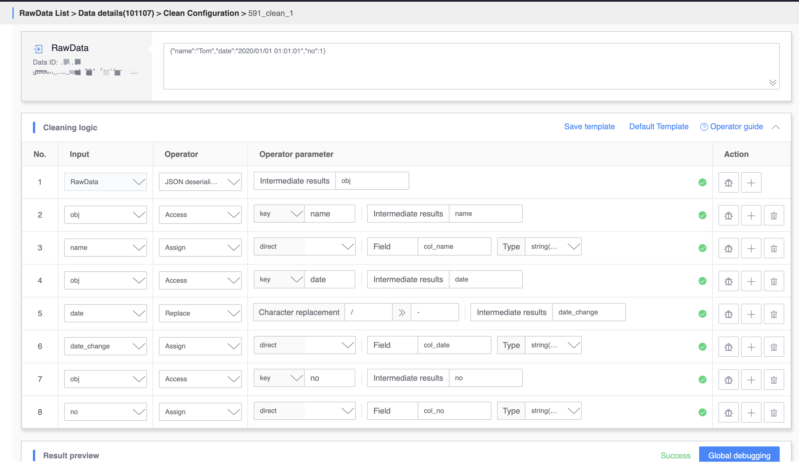
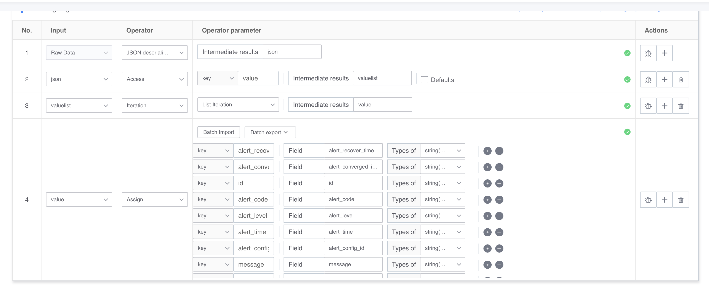

## Data cleaning example

### Demo1: json type data cleaning
If the input is in standard json format, you can use the json deserialization algorithm for cleaning and configuration.

     {
          "code": "200",
          "message": "Not Found",
          "result": false,
          "data": {
               "co1": "val2-1",
               "co2": "val2-2",
               "time": "2020-07-27 12:00:00"
          },
          "errors": null
     }

The cleaning configuration and output results are shown in the figure:

### Demo2: String type data cleaning
If the input is in standard string format, you can flexibly use operators such as value acquisition, assignment, and division.

     China|Hebei Province|test|http://x.x.x.:9999/pulsar/tail/?dataId=101448&topic=persistent%3a%2f%2fpublic%2fdata%2f0720_pulsar_db55ddd5591-partition-0&serviceUrl=http%3a%2f%2f9.*. *.*%3a80%2f

If you want to extract the key information contained in the URL in the example, you can refer to the cleaning configuration as shown in the figure:

