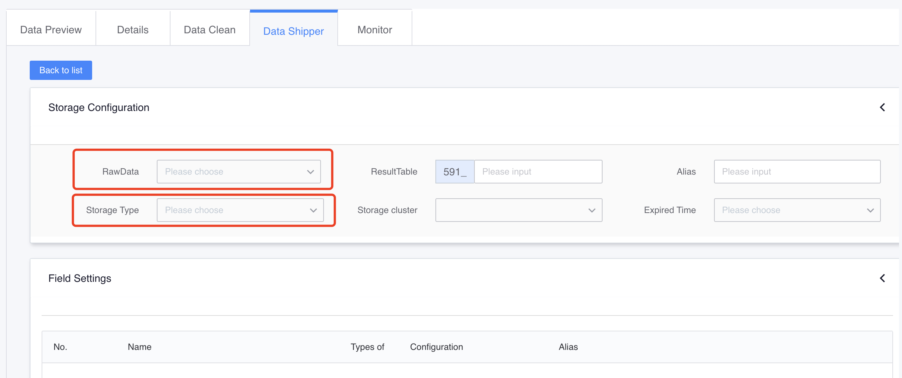
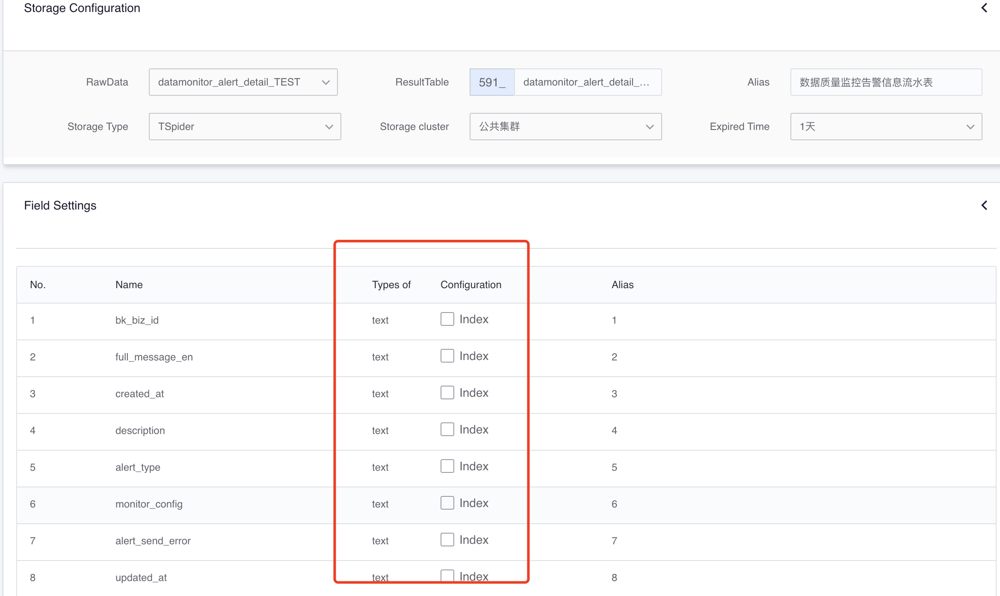
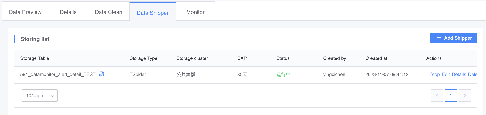
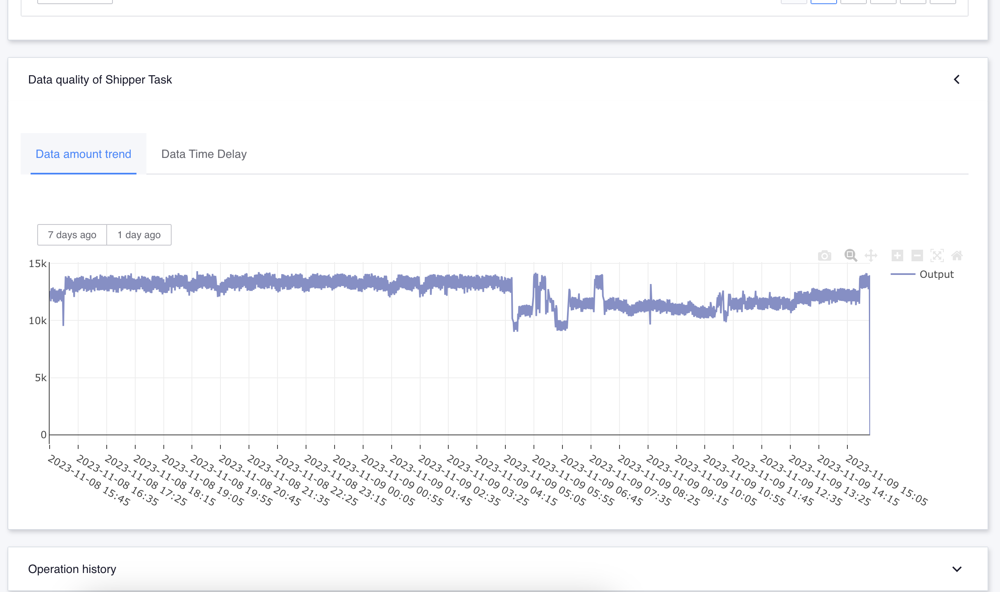

# Data storage

### Function introduction

Data warehousing is a function that facilitates users to distribute cleaned data directly to storage. It supports multiple storage types, such as ElasticSearch, Queue, etc. Users can start the data distribution task through simple configuration on the page, and directly query the stored data in the details page of the data warehousing task.

## Preconditions
- Completed [Data Source Access](./data-access/concepts.md)
- Completed [Data Source Cleaning](data-clean/detail.md)

* Take the table in [Data Source Cleaning](data-clean/detail.md) as an example


### How to configure cleaning

First, enter the "Data Details" -> "Data Storage" page and click the "Add Storage" button in the upper right corner to add a storage task.

* After entering the add warehousing interface, first select the cleaning data that needs to be warehousing as the data source, and then select the storage type that needs to be warehousing.



* Taking ElasticSearch storage as an example, you need to select word segmentation fields, aggregation fields and other information, and then save



* At this time, you will return to the data storage list page, and you can see the storage task you just added.



* Click the "Details" link corresponding to the warehousing task to enter the details page, where you can directly query the warehousing data.



```plain
Notice:
1. For storage that cannot automatically add fields, such as MySQL and Tspider, if the user modifies the cleaning task and adds, deletes or changes fields, the changed schema cannot be synchronized to the storage when the data is entered into the database. At this time, the user needs to reconfigure a new cleaning rule and then create a new warehousing task.
2. For storage such as ElasticSearch and Queue, configuration changes of cleaning tasks will be reflected in the incoming data in real time.
```


### The warehousing methods currently supported by the platform


| Storage method | Type | Description | Recommended usage scenarios | Recommended daily data volume (single table) | Query mode |
| :--- | ---- | ---- | ---- | ---- | ---- |
| HDFS | Distributed file system | | Massive data offline analysis, low query latency requirements | TB/PB | Can be connected to offline analysis/ad hoc query/data analysis and other methods |
| MySQL | Relational database | | Relational database | GB/within tens of millions | Point query/association query/aggregation query |
| Elasticsearch | Analysis database, Log Search | | Full-text search and data analysis | GB/TB level | Search query (supports word segmentation) |
| Queue | Message Queue | Kafka Message Queue | Data Subscription | GB/TB Level | Client Connection Consumption |