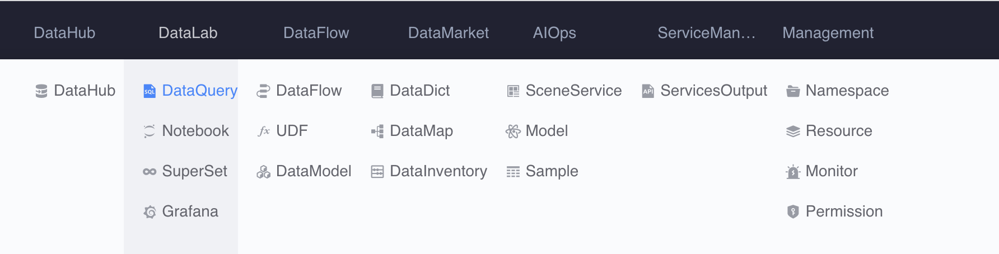

# note task

## Function entry



## Features

The note-taking task provides interactive documents. Its core is "what you see is what you get". It supports writing and running codes in web documents. The execution results of the code will be saved together with the related codes, which facilitates the display of code results and rapid iteration. We can think of notes as a piece of scratch paper, on which we can think and explore. Each step of exploration will have instant results output, allowing us to adjust our decisions based on the results and proceed to the next step of exploration.

The functions currently provided by the note task:

- Interactive programming, read while writing, read while writing
- Instant results output and save, execute once and read multiple times
- Support code and result reuse between code blocks
- Supports multi-language kernel, can write Python, Java, SQL and other codes

## BKSQL query syntax

The platform-specific bksql syntax is used in the notes to provide query services. The usage method is as follows

### Multi-line SQL

Example:

```sql
%%bksql
select
col, col2, col3
from table1
where thedate = '20200101'
limit 10
```


### Single line SQL

Example:

```python
%bksql select col, col2, col3 from table1 where thedate = '20200101' limit 10
```

##Query result reference

After executing the query statement, the query result set supports assignment to custom variables as follows:

```sql
%%bksql
select
col, col2, col3
from table1
where thedate = '20200101'
limit 10
```

```python
result = _
```

The custom variable result contains dicts, DataFrame and other methods to facilitate secondary processing of the result set.

```python
for line in result.dicts():
   print(line)
```


```python
df = result.DataFrame()
```


## Query results chart display

The query result set supports chart display. Currently, it provides support for bar charts and pie charts as follows.

```python
%matplotlib inline
result.bar();
```


```python
result.pie();
```


## Reuse query task result set

Notes support reusing the result sets of query tasks in the following ways:

```python
result = datasets('query_1')
```


## Tips

#### 1. Set global variables in notes, and use SQL reference variables to organize query statements

```python
today = '20200101'
```

```sql
%bksql select col, col2, col3 from table1 where thedate = {today} limit 10
```

```sql
%%bksql
select
col, col2, col3
from table1
where thedate = {today}
limit 10
```