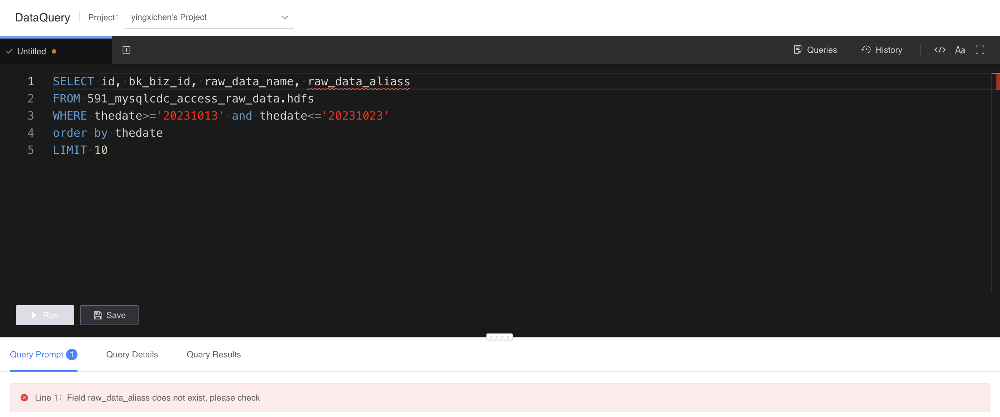
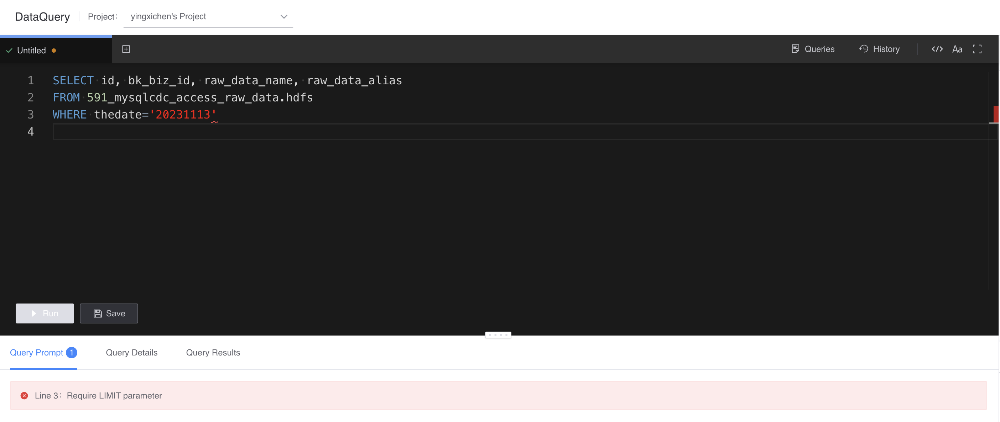
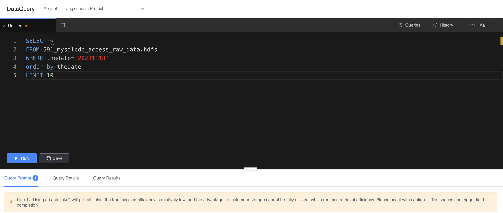
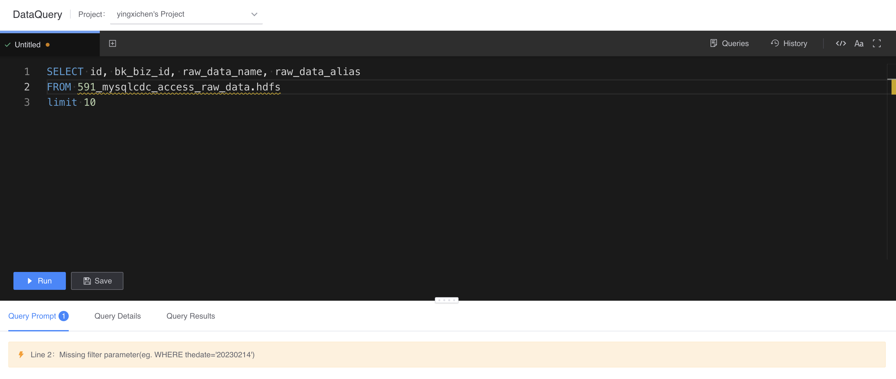
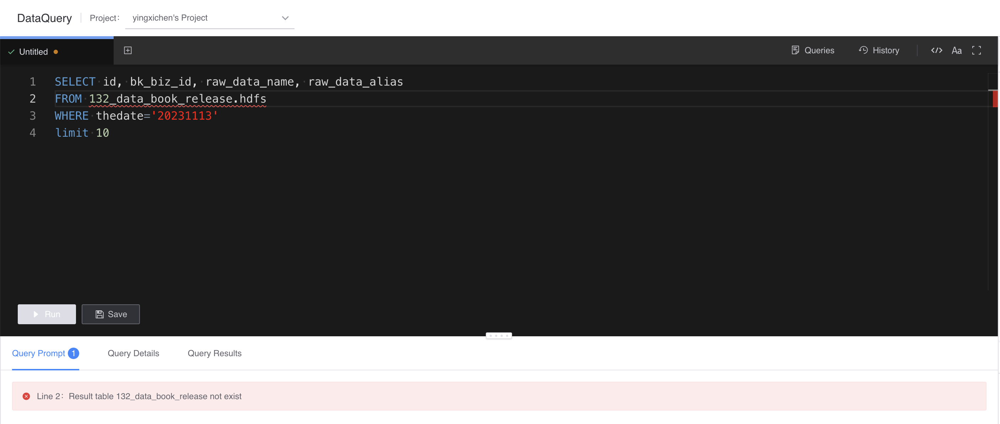

# Query prompt

Displays SQL syntax prompts in real time to assist users in writing correct and efficient SQL.

The following are some examples of query prompts:

- Field does not exist

     

- Missing LIMIT

     

- Be cautious and only use SELECT *

     

- Missing filter

     

- Insufficient permissions

     