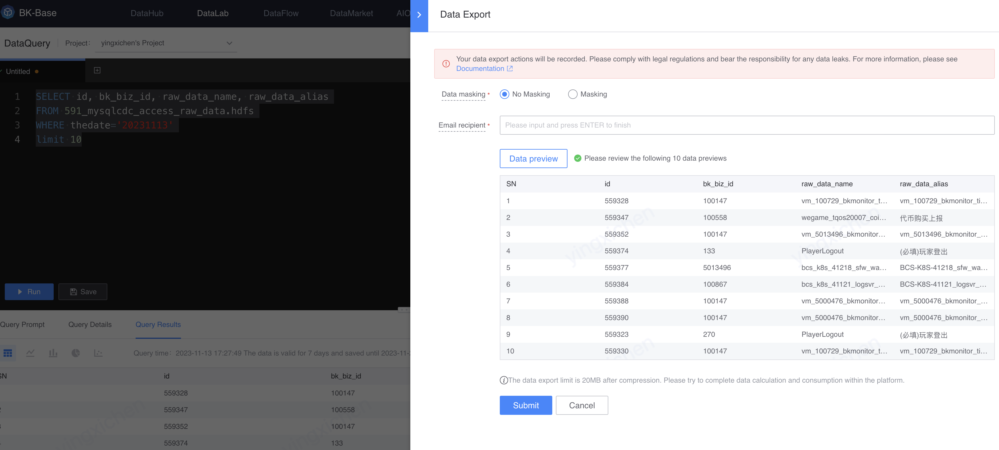

# Data output
Export the query results of the data query.

The upper limit of data export is 20MB after compression. Please try to complete data calculation and consumption within the platform.

> [Computing tasks](../../dataflow/ide/concepts.md): Data processing (including real-time computing, offline computing), arrangement and application of machine learning nodes
>
> [Notebook](../notebook/concepts.md): Interactive exploration and analysis using SQL and Python

## Information security tips
Data export behavior will be recorded. Please comply with laws and regulations and bear responsibility for data leakage.

## manual
### Entrance
On the right side of the data query results, click Export, and the Data Export Slider will pop up.

### Data desensitization
> Data desensitization refers to the data processing process that eliminates the sensitivity of the data in the original environment through certain methods when exchanging sensitive data from the original environment to the target environment, and retains the data characteristics or content required for the business of the target environment, while avoiding Protect sensitive data from leakage and abuse while retaining the statistical value of the data.

The computing platform provides common desensitization operators for data desensitization:

| Desensitization operator | Function | Example | Remarks |
|---|---|---|---|
| Mask shielding | Replace original characters with * | Keep the first 3 and last 2: 13234345678 -> 132******78 | Generally speaking, it is recommended to cover more than 60% of the characters |
| Set to blank | Numeric type is set to 0, string is set to blank | 13234345678 -> 0   abc -> | |
| Reduce precision | Reduce data precision | 12345.67 --> 12300 (retain 3 significant figures, rounded)   3.1415926 --> 3.14 (retain 2 decimal places, rounded) | Input field type restriction: Numeric |
| Regular replacement | Replace characters after regular matching, suitable for content desensitization of unstructured fields | zhangsan@example.com -> **@example.com | Compatible with PCRE-style regular expressions  One field supports Use multiple regular replacement rules to replace them in order |

## Push the email to the mailbox
After clicking Submit, the data export file will be sent to the designated email address.

> The upper limit of data export is 20MB after compression. Please try to complete data calculation and consumption within the platform.

## FAQ

### It shows that the email was sent successfully, but the email cannot be received.
1. Check whether mail filtering is enabled. If so, you can search it in the trash or deleted files.
2. Check whether email unsubscription is enabled. You can contact your email administrator to confirm.
3. Check whether an email blacklist has been set up. If you use a corporate WeChat email, remove the blacklist in [Email Settings] -> [More] -> [Blacklist].
4. The mail server is delayed in sending, and it may take about 5 minutes to receive the mail during peak periods.