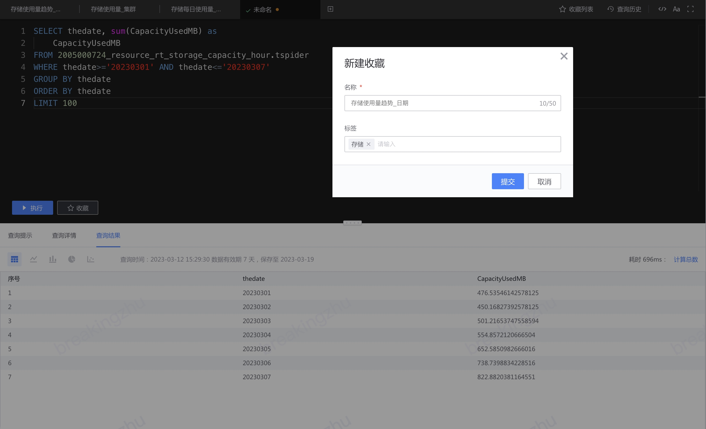

# Collection query
When the query results meet expectations, you can save the query for subsequent use.

The saved query can be found in the upper right corner of the SQL editor.

You can search by querying name, tag, and updater. You can click the tag column for quick search.

In the last column of the collection list, you can perform collection query operations: edit basic information, view query history, clone and delete.

## Share SQL
After collecting the query, you can share the URL with members of the data project and quickly view the corresponding query SQL and query results.