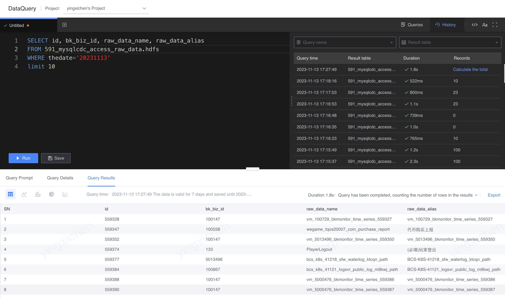

# Query history
Record each query record, including SQL, query details, and query results.

Query results can be quickly loaded through query history without repeated queries.

The query history is located in the SQL edit box and is shared globally by the entire project. Query records can be filtered by collection name, query result table, and queryer.

Note: Query records are retained for 1 year, and query results are retained for 7 days.

