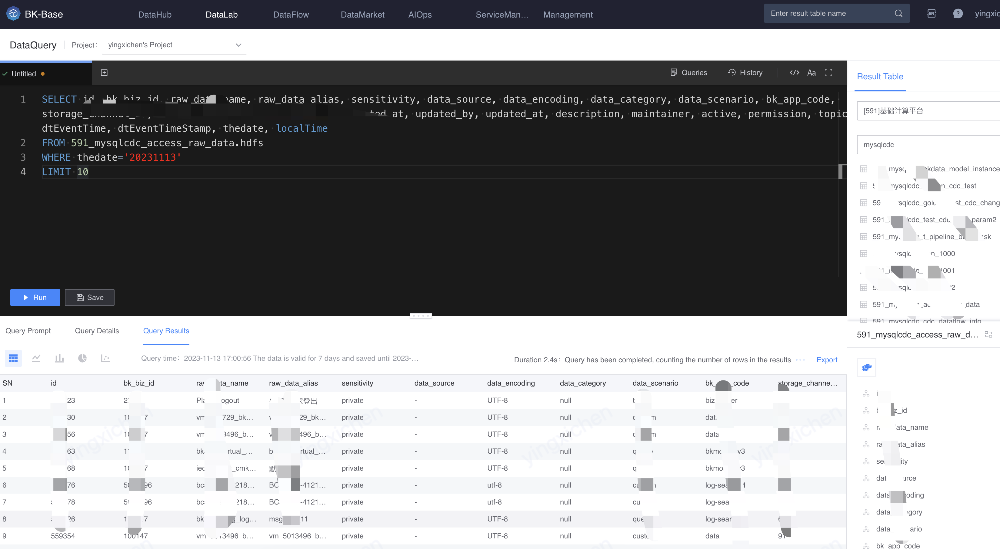

# Introduction to data query

Complete data analysis needs with a low threshold through standard SQL query syntax.

The data sources connected to the platform are cleaned and become result tables, and stored in different storage types (HDFS, MySQL, etc.) according to usage scenarios. The data in these result tables can be analyzed through SQL during data query.

<video src="media/dataquery.mp4" controls></video>

The following are several key concepts in the data query function:

- Projects: divided into data projects and personal projects named after user names
A data project can query the result table for which the project has permission, and a personal project can query the result table for which the individual has permission.
- SQL edit box: You can write SQL in the SQL edit box. [Query prompt](./codecheck.md) and [Autocomplete](./autocomplete.md) will improve the accuracy and efficiency of SQL writing.
- [Query List](./favorites.md): When the query results meet expectations, you can save the query for subsequent use.
- [Query History](./history.md): Record each query record, including SQL, query details, and query results.
- Formatting: Improve the readability of SQL
- [Query result visualization](./query_result_visual.md): The results of data query can be presented through tables, line charts, bar charts, pie charts, and scatter charts to meet the visualization needs in data analysis scenarios.
- Result table search area: Search the result table with permission under the project, and you can view the table structure of the result table
- Function list: Lists the SQL functions supported by the platform

## Appendix
### SQL query syntax
SQL query syntax is mainly divided into 3 types:
- The specified storage type displayed (such as result_table_id.hdfs), the dialect SQL syntax of the storage type can be used
- Specify the storage type without displaying it, and use the unified [BKSQL syntax](../bksql/dql.md) to complete the data analysis operation
- Joint query of multi-source result tables, using query engine [Trino SQL syntax](https://trino.io/docs/current/sql/select.html)