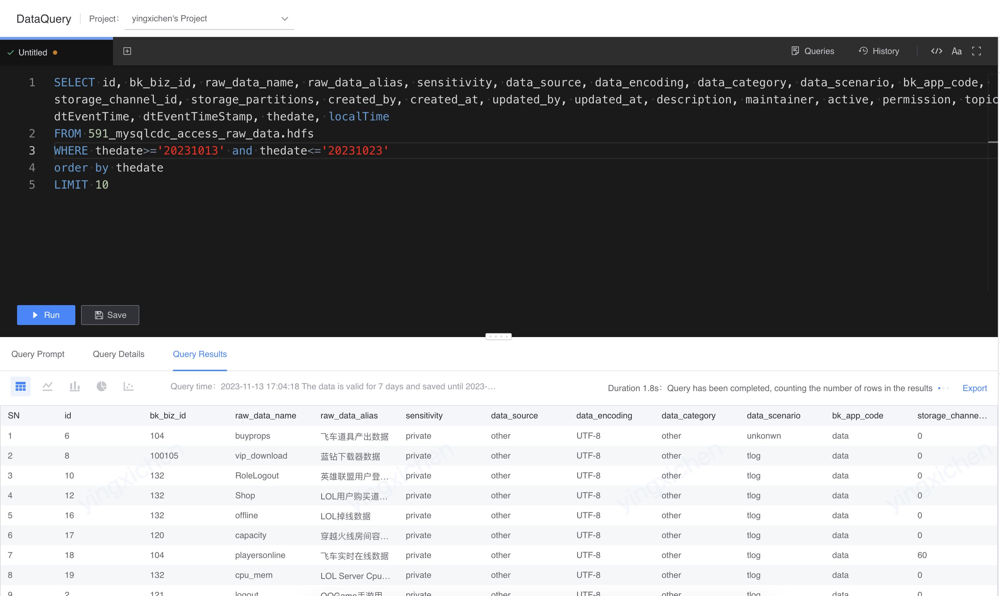
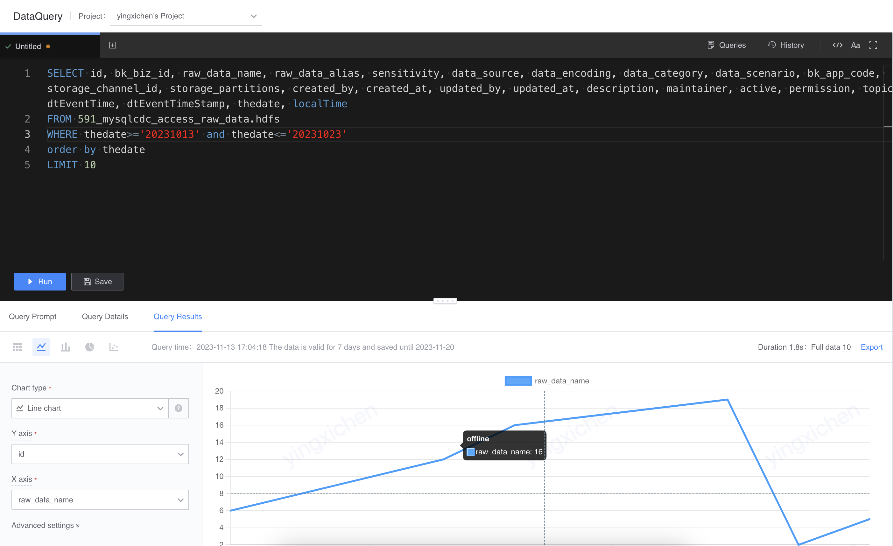
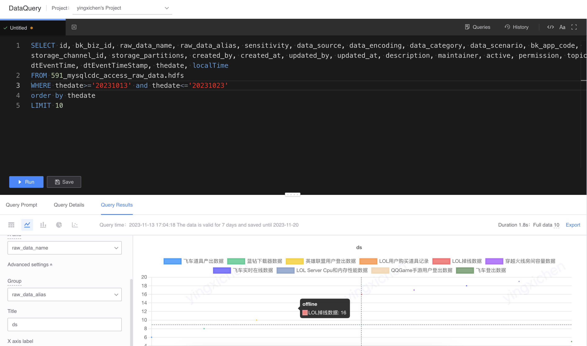
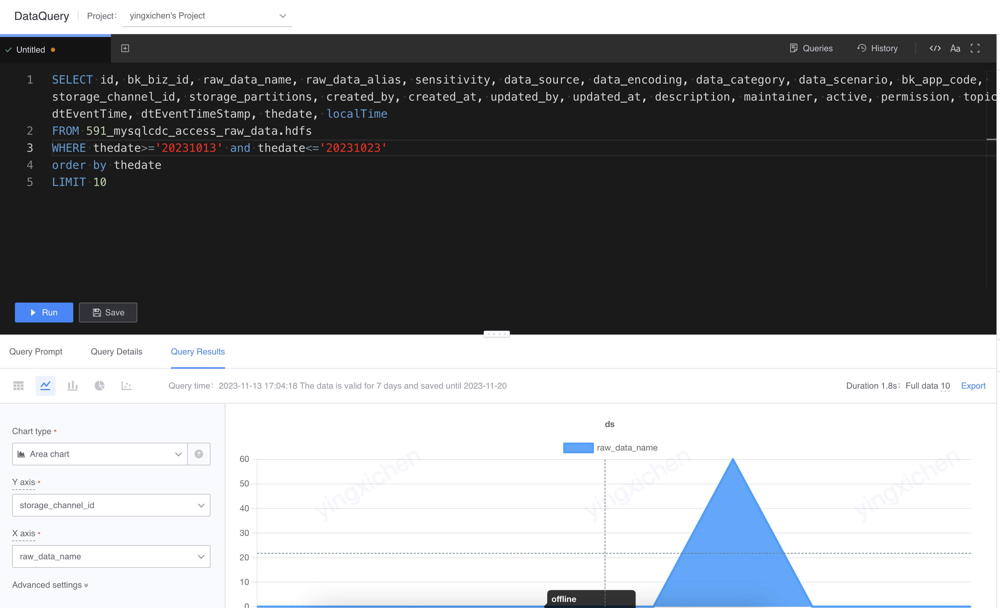
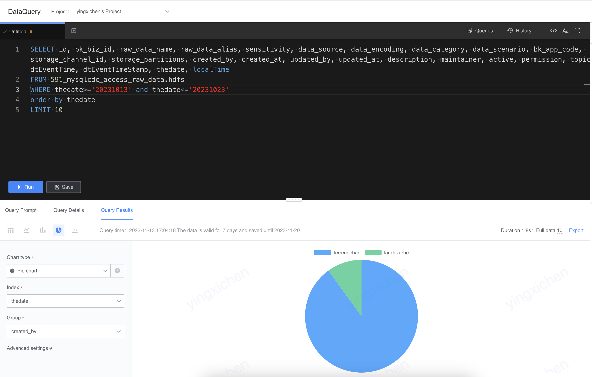
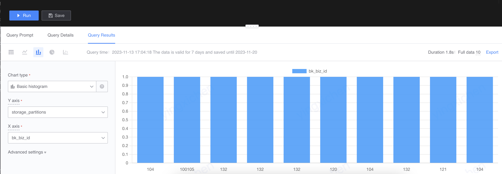

# Visualize query results
The results of data query can be presented through tables, line charts, bar charts, pie charts, and scatter charts to meet the visualization needs in data analysis scenarios.

## sheet

## line chart
- line chart

- Line chart by group
Select the grouping of the line chart in the advanced settings to create a line chart by grouping.

- Area chart

## Pie chart
- Pie chart

- Donut chart

## Bar chart

