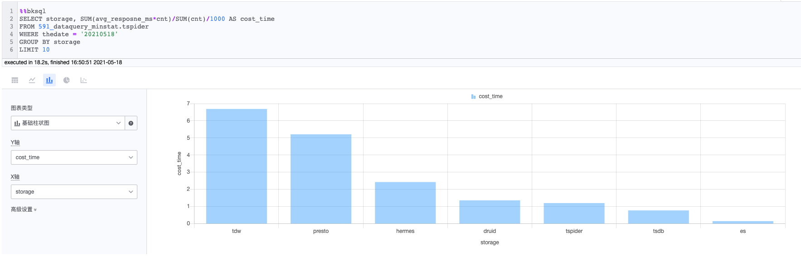
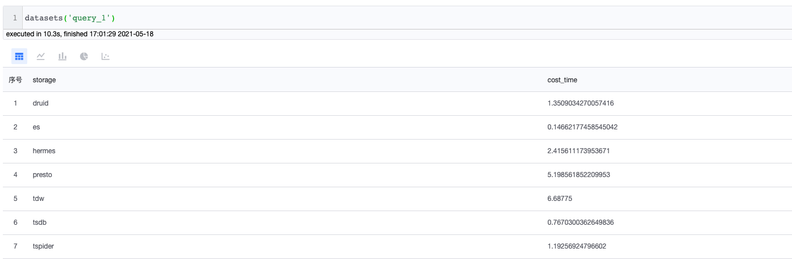

## BKSQL syntax

Notebook uses platform-specific bksql syntax to provide query services. The usage method is as follows

### Multi-line SQL

Example:

```sql
%%bksql
select
col, col2, col3
from table1
where thedate = '20200101'
limit 10
```




### Single line SQL

Example:

```python
%bksql select col, col2, col3 from table1 where thedate = '20200101' limit 10
```

##Query result reference

After executing the query statement, the query result set supports assignment to custom variables as follows:

```sql
%%bksql
select
col, col2, col3
from table1
where thedate = '20200101'
limit 10
```

```python
result = _
```

The custom variable result contains dicts, DataFrame and other methods to facilitate secondary processing of the result set.

```python
for line in result.dicts():
   print(line)
```


```python
df = result.DataFrame()
```


## Reuse query task result set

Notebook supports reusing the result set of query tasks in the following ways

```python
result = datasets('query_1')
```



## Tips

#### 1. Set global variables in Notebook, and use SQL reference variables to organize query statements.

```python
today = '20200101'
```

```sql
%bksql select col, col2, col3 from table1 where thedate = {today} limit 10
```

```sql
%%bksql
select
col, col2, col3
from table1
where thedate = {today}
limit 10
```