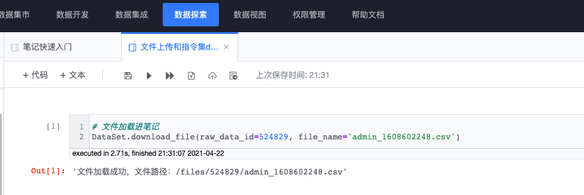
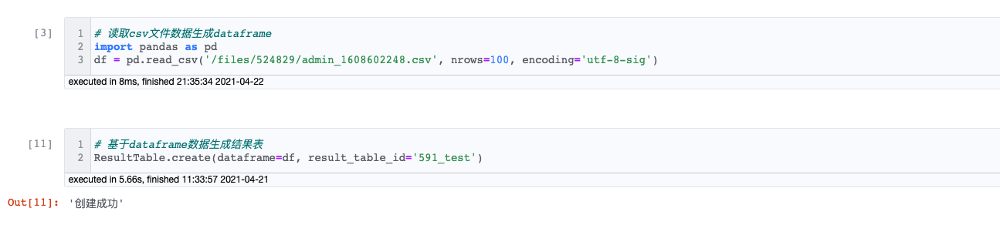
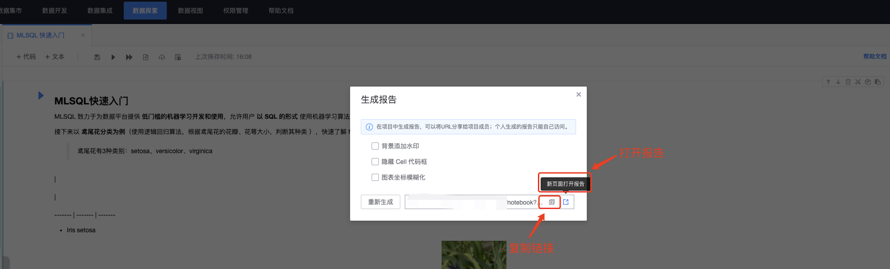

## Feature Guide

### Offline file upload

#### Features

Notebook provides an offline file upload function, supports uploading CSV files to the platform, and conveniently reads the contents of CSV files in Notebook to generate Pandas DataFrame for data analysis operations, and can generate result tables based on DataFrame data.

#### Tutorial

##### Perform file upload


##### View data source id and file name


##### Load the file into Notebook (the CSV file after successful upload is stored in the HDFS cluster. If you need to use it in Notebook, you need to load the file into Notebook first)

```python
DataSet.download_file(raw_data_id, file_name)
"""
:param raw_data_id: data source id
:param file_name: file name

:return: execution result, success or failure, with file usage examples
"""
```




##### Display the list of files loaded into Notebook

```python
DataSet.show_notebook_file()
"""
:param raw_data_id: data source id (optional)

:return: File list table display
"""
```


##### Read CSV file to generate Pandas DataFrame

```python
import pandas as pd
df = pd.read_csv('/files/524829/admin_1608602248.csv', encoding='utf-8-sig')
```


##### Generate temporary result table based on DataFrame data

```python
ResultTable.create(dataframe, result_table_id)
"""
:param dataframe: pandas dataframe
:param result_table_id: the name of the created result table

:return: execution result, success or failure
"""
```




##### Subsequent processing

After the temporary result table is created, the user can process the result table accordingly according to the instructions provided by the platform. For data query, refer to [BKSQL syntax] (./bksql.md), and for data update, refer to [Notebook command set] (./command. md).


### Notebook generates reports

#### Features

Notebook supports report generation, and users can generate shareable reports based on Notebook content. For reports generated under a project, the URL can be shared with project members for browsing; reports generated under an individual can only be accessed by yourself.

#### Tutorial

##### Click to generate report





##### Browse report content


##### Tips: How to write an outline


