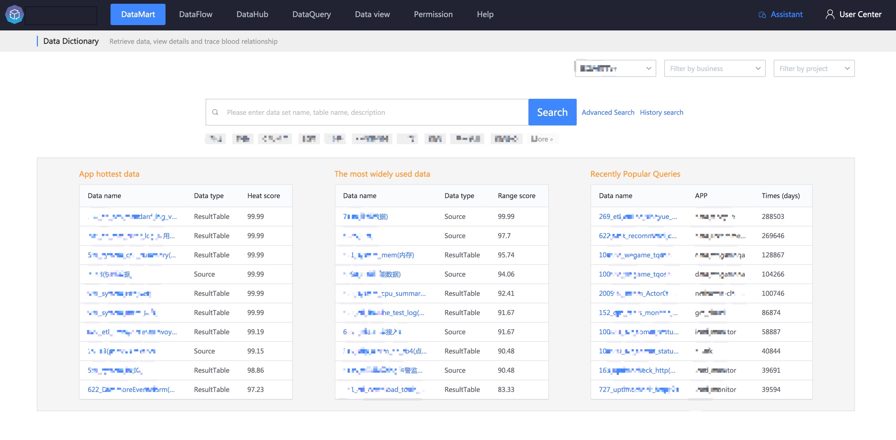

## Introduce

The data mart is a platform that helps data users **conveniently query** and **share data**, including data maps, data inventories, data dictionaries, and data standards.

## The role of data mart

- Data map: What data topics and data are there in the platform?
- Data assets: Data is also an **asset**. Understand the operating status of assets from various dimensions.
- Data Dictionary: Retrieve data, view details and trace blood relationships
- Data standards: Standardize data, unify data caliber, and achieve data standardization and user sharing

