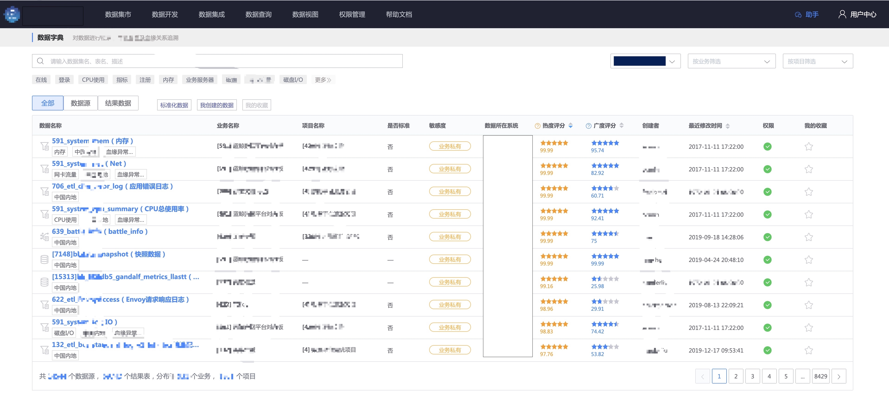
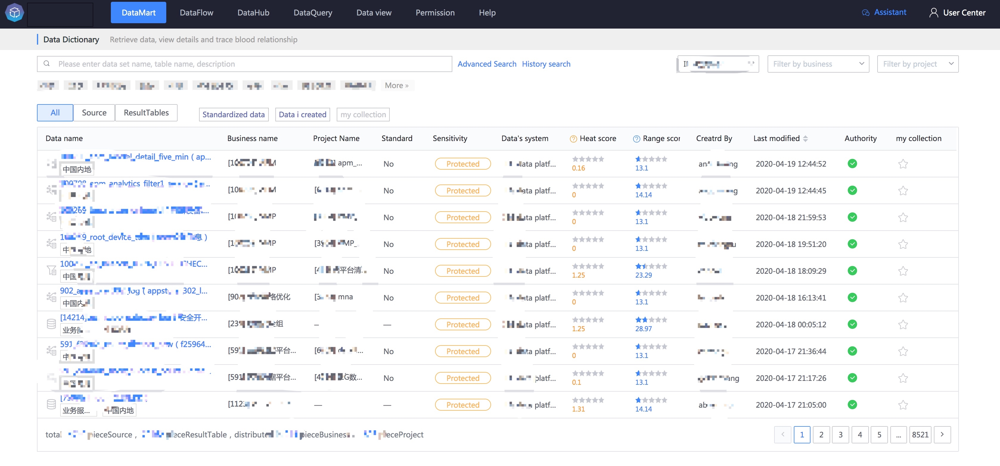
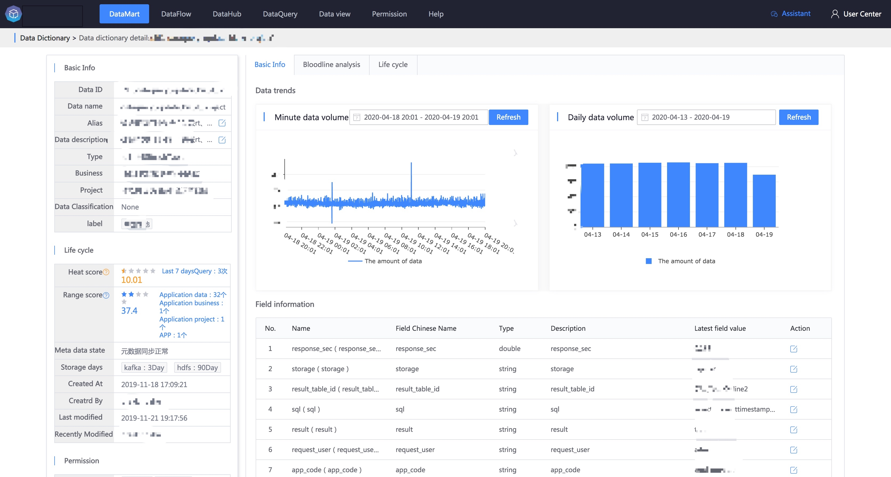
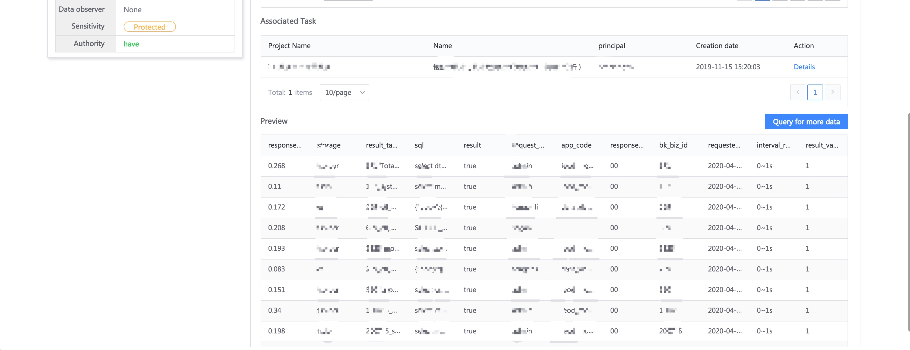
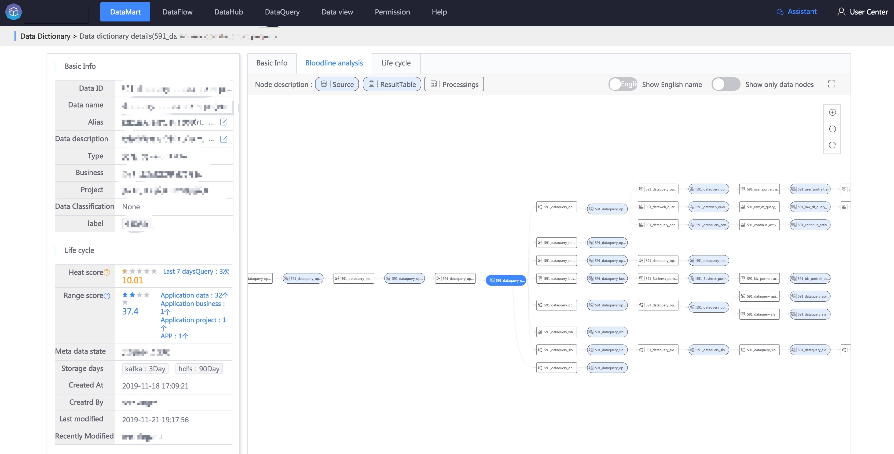
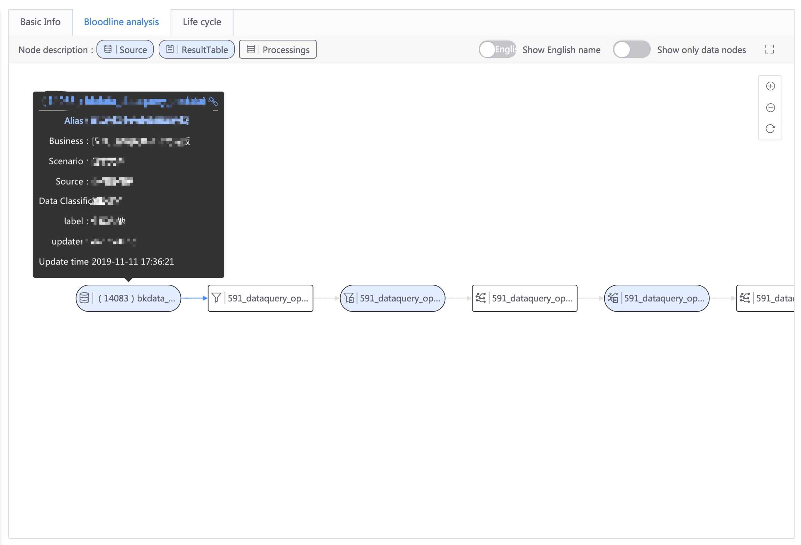
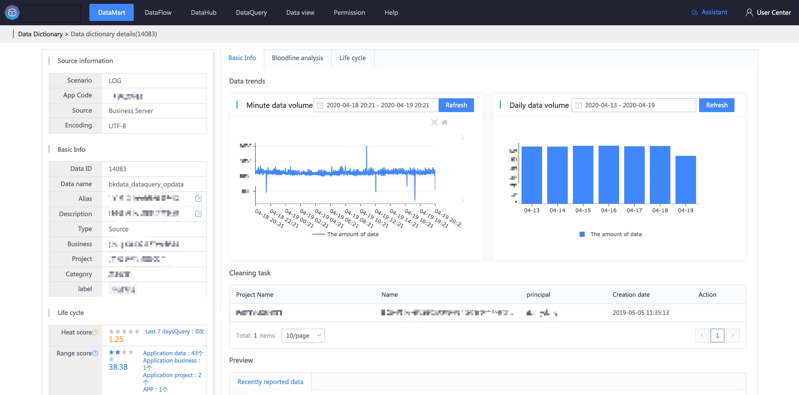
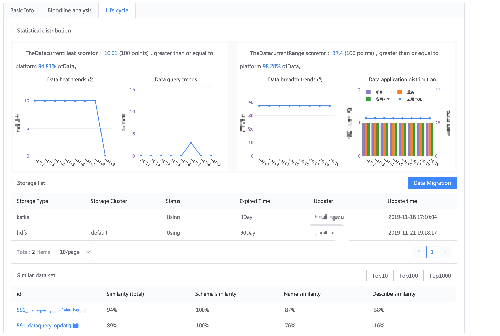

## Introduce
Data Dictionary: Retrieve data, view details and trace blood relationships.

## Data retrieval
Data can be retrieved through the name of the data source and result data table, as well as description and tags.

## Data dictionary details

### Basic Information

You can view basic information such as the name, type, storage period, and creation time of the data. It also displays data traffic trends, associated tasks, and the latest data preview.

If you want to view or adjust the task that generated the data, you can quickly jump to this page.

### Bloodline analysis
The metadata-based lineage analysis function allows you to query **which task** a piece of data was generated by, and **what data** was generated by it.

On the far left side of the lineage analysis, you can see that all the data in the figure comes from a log file data source.

In addition, clicking the link can also jump to the data dictionary details page of the data source.

### life cycle
On the life cycle page, you can check the **heat and breadth** of the data and understand the **value of the data**.

- **Hotness**
Indicates the frequency of data application. The higher the score (100-point scale), the more frequent the application.
Mainly measured by the number of times the current data has been queried (queries in the last 7 days),
For example, if the number of queries is higher, the popularity score will be higher, and vice versa.

- **Breadth**
Indicates how widely the data is used. The higher the score (100-point scale), the more widely used it is.
It is mainly measured by factors such as the business, project, and calculation-generated data in which the current data is used.
For example, the more businesses and projects are used, and the more result tables generated by data development, the breadth score will be higher, and vice versa.

In addition, you can also see the **similar data sets** and the **change records** of the data in the platform.