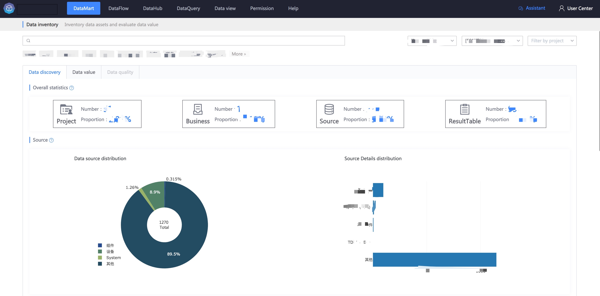
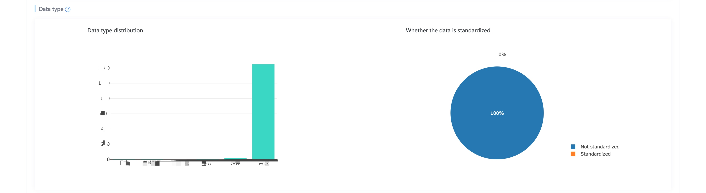
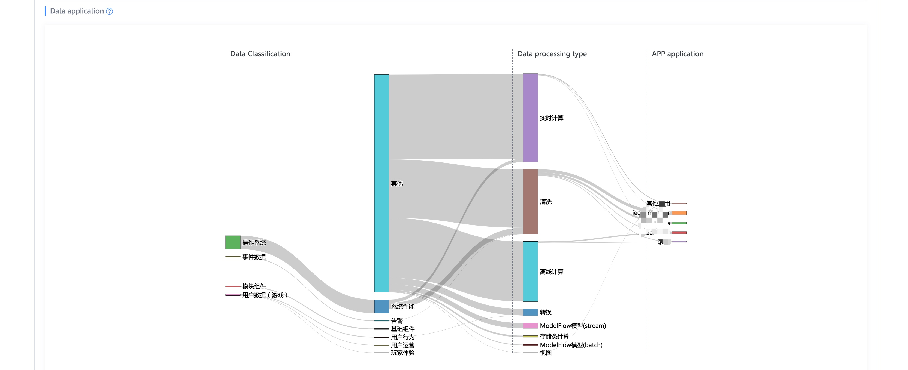
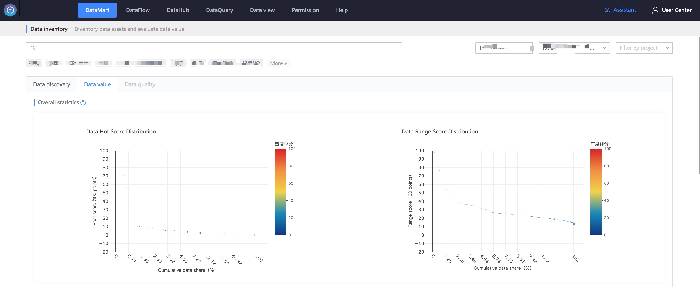
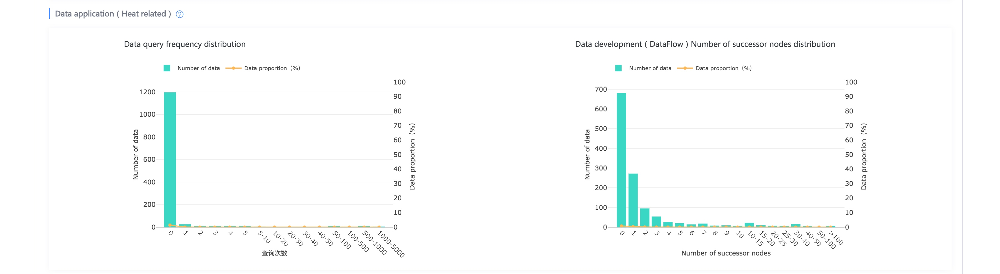
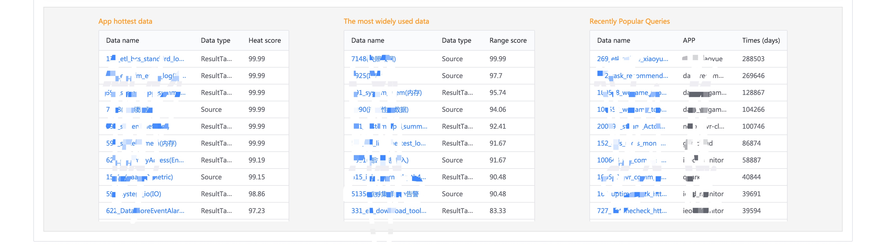

## Introduce

Inventory data assets and evaluate data value.

Data is a new type of asset for enterprises. Through data inventory, we can know where business data comes from, where it flows, and the popularity and breadth of circulation.

## Data Discovery

An overview of data can be retrieved by business, project, and tag, including source, type, and application distribution.

## Data value

Understand the value of data circulation through the overall distribution of two important indicators of data application (heat and breadth).

> Core indicators of data popularity: number of queries, distribution of number of DataFlow successor nodes

> Core indicators of data breadth: distribution of number of application businesses, projects, and APPs

