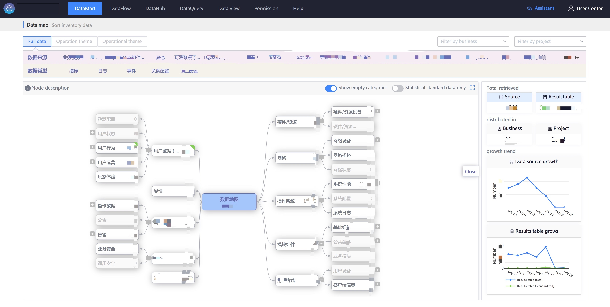

## Introduce

All data topics in the platform are presented in a tree structure, guiding the business to find and improve data under each data topic.

## Purpose

- The data themes in the platform are clearly presented in a tree structure, which facilitates businesses to improve the dimensions of their own data and prepare a rich variety of data for big data exploration and analysis.
- Provide data retrieval for various subject categories

### Data subject classification

In the data map, you can see the subject classification (subject domain), themes and final detailed data of all data in the platform.

### Retrieve data
Click on the data topic in the picture above to know the distribution of data on that topic.

You can also easily jump to the data list of the corresponding topic.

