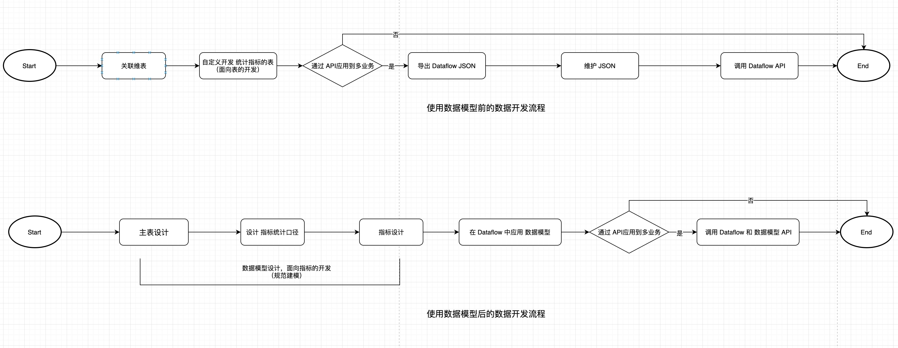

## What is the data model?
Referring to the dimensional modeling methodology, a step-by-step data warehouse construction tool is provided, which can output standardized and unambiguous detailed data tables, indicator statistical calibers, and indicators without understanding the methodology itself. Through one-stop service of data model design and application, it is convenient for businesses to quickly and cost-effectively build standardized data warehouses.

> The following are the definitions of data modeling and data models in DMBOK 2.0.
> - Data modeling: The process of discovering, analyzing and determining data requirements, and then expressing and delivering these data requirements in the precise form of a data model;
> - Data model: describes the data that the organization already understands or needs in the future, and quickly understands its content through standardized symbols;

- Data model design process: design standardized detailed data tables, indicator statistical calibers, and indicators in a step-by-step manner.

- Data model application process: After the data model is instantiated, detailed data tables and indicators are output.

> Note: The data model is in [Platform Architecture Diagram](../../../README.md), which belongs to the full-link asset management of the intermediate service layer.

## Who is the user?
- Data development for platform projects: Build a common data model that can be applied to multiple businesses of the same type
- Data development for individual businesses
     - Scenario 1: Build a business indicator system through data models and standardize the data development process through tools
     - Scenario 2: Directly apply the data model exposed in the platform

## Why is there a data model design?
Businesses are prone to the following pain points when building data warehouses:
- The fields have the same meaning, but the field names vary from person to person and are called differently.
- The indicator names are the same, but the indicator statistical caliber is inconsistent.
- Without a unified and standardized dimension table, it is difficult to integrate consistent dimensions
- There is no unified hierarchical construction of data warehouse, and repeated construction of underlying data such as ODS (data access layer) and DWD (detailed data layer)
- Data development specifications strongly depend on the personal habits of development students, such as indicator naming specifications and SQL code specifications.

This leads to the following problems encountered during data development or application:
- There is a lot of communication and troubleshooting costs involved in consuming a certain table.
- When a general algorithm model is applied to multiple businesses, it cannot be applied in batches due to the different habits of data developers for each business.
- Data models and data standards in areas where it is difficult to precipitate

## Terminology explanation
- Fact table: describes the details of business activities, such as: login flow, prop flow table, recharge flow table, product sales table, etc.
- Dimension table: describes entities in the objective world and reflects the perspective from which things are observed. In dimensional modeling, it is used to expand the dimensions in the fact table data model, such as: extending the user field in the login flow table to (user's gender, age and other fields), IP address database, user table, merchant table, The channel table and Apple hardware information table are both dimension tables.
- Indicator statistical caliber: The calculation caliber of the indicator. For example, the amount of each order is the price field, then the indicator statistical caliber of sales is: `sum(price)`
- Indicators: Statistical indicators calculated based on indicator statistical caliber, combined with aggregation fields (such as channels), filter conditions (such as domestic), and statistical periods (daily), such as `domestic daily sales of props by channel`

## Differences before and after using the data model
- Before use: Use Dataflow to customize the development of statistical indicator tables, which is table-oriented development.
- After use: Use the data model steps to complete the data modeling process, and complete the data model application in Dataflow, which is an indicator-oriented development.

Refer to [Data Model Quick Start](./quickstart.md) to start data model design.