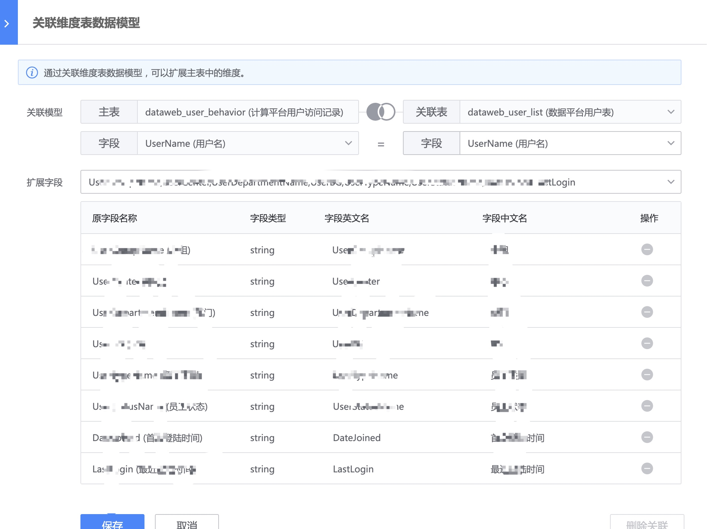

Main table design
----

Before creating the main table, first create the data model.

- Fact table data model
Describe the details of business activities, such as: login flow, game flow, user access records, etc.

- Dimension table data model
Describe the dimensions in the fact table data model, such as the user table, and define the user dimensions (fields such as gender, age, etc.) in the login flow table.
By relating dimensions in the dimension table data model in the fact table data model, you can extend more readable dimensions, such as extending the user ID to user name, user age, etc.

## Main table design
Define the main table structure of the model, which can be quickly filled through `Load result table structure`.

### Field role
- Dimension: describes the perspective of an event, such as the URI, module, etc. visited by the user. In indicator design, it will be used to design the aggregation dimensions of indicators.
- Metrics: measure the result of an event, such as request time, generally numerical. In indicator design, it will be used to design `indicator statistical caliber`.

### Field processing logic
New fields can be generated based on existing fields, for example, request time-consuming intervals are generated by request time-consuming.

Existing fields can also be processed, so that when the data model is subsequently applied, the field content can be standardized.

### Primary key settings
The dimension table data model is required and is used to associate dimensions with the fact table data model.

### Related dimension table data model
Enrich main table fields by associating dimension table data models.

For example, through the user name, associate the user table to expand the user's organizational structure, last login time and other fields.

Main table design
----

Before creating the main table, first create the data model.

- Fact table data model
Describe the details of business activities, such as: login flow, game flow, user access records, etc.

- Dimension table data model
Describe the dimensions in the fact table data model, such as the user table, and define the user dimensions (fields such as gender, age, etc.) in the login flow table.
By relating dimensions in the dimension table data model in the fact table data model, you can extend more readable dimensions, such as extending the user ID to user name, user age, etc.

## Main table design
Define the main table structure of the model, which can be quickly filled through `Load result table structure`.

### Field role
- Dimension: describes the perspective of an event, such as the URI, module, etc. visited by the user. In indicator design, it will be used to design the aggregation dimensions of indicators.
- Metrics: measure the result of an event, such as request time, generally numerical. In indicator design, it will be used to design `indicator statistical caliber`.

### Field processing logic
New fields can be generated based on existing fields, for example, the request time interval is generated by the request time time.

Existing fields can also be processed, so that when the data model is subsequently applied, the field content can be standardized.

### Primary key settings
The dimension table data model is required and is used to associate dimensions with the fact table data model.

### Related dimension table data model
Enrich main table fields by associating dimension table data models.

For example, through the user name, associate the user table to expand the user's organizational structure, last login time and other fields.

