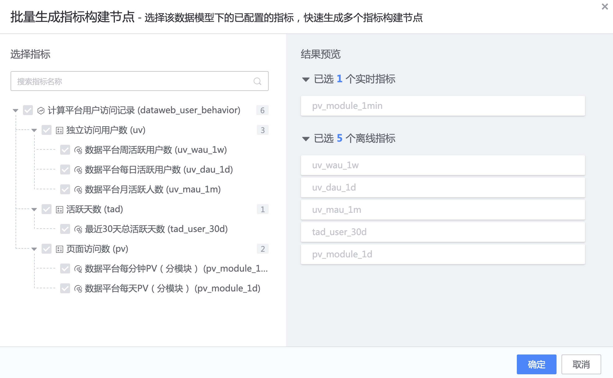

Data model application
----

After the model is published, the data model can be applied in data development tasks.

- Dimension table data model: The input table is limited to `real-time data source`. If you expect the instantiated dimension table to have full data, it is recommended that after the data development task is successfully started, report the full data of the input table and let the full data pass through the model application task.
   Of course, if the dimension table data model is completely consistent with the structure of the associated data source table that has been stored in ignite, there is no need to instantiate the dimension table data model. When applying the fact table data model, just select the associated data source directly.

- Fact table data model: The main table input is limited to `real-time data source`, and the associated dimension table is limited to `associated data source`. The table structure of the `associated data source` needs to be consistent with the table structure in the dimension table data model, and does not need to be the associated data source after instantiation of the dimension table data model.

Double-click the `Data Model Application Node` to complete the automatic mapping of the input fields.
> If the input field is consistent with the input field in the data model, it will be automatically mapped.

Next, generate `indicator nodes` in batches

Select the `indicator node` that needs to be built

Save the indicator node.

The result table name of the indicator node consists of 4 parts: business ID, indicator statistical caliber, customization, and data window. The customization part can be modified, and the other parts complete the standard definition of the result table on the tool.

After each indicator node is saved, storage nodes are added next. After completing the addition, start the data development task to complete the data model application.

