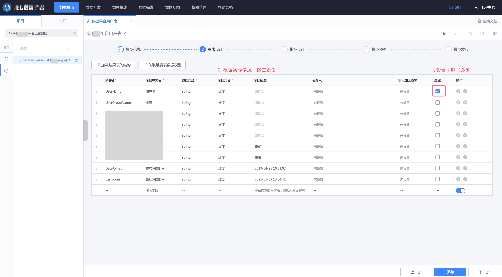
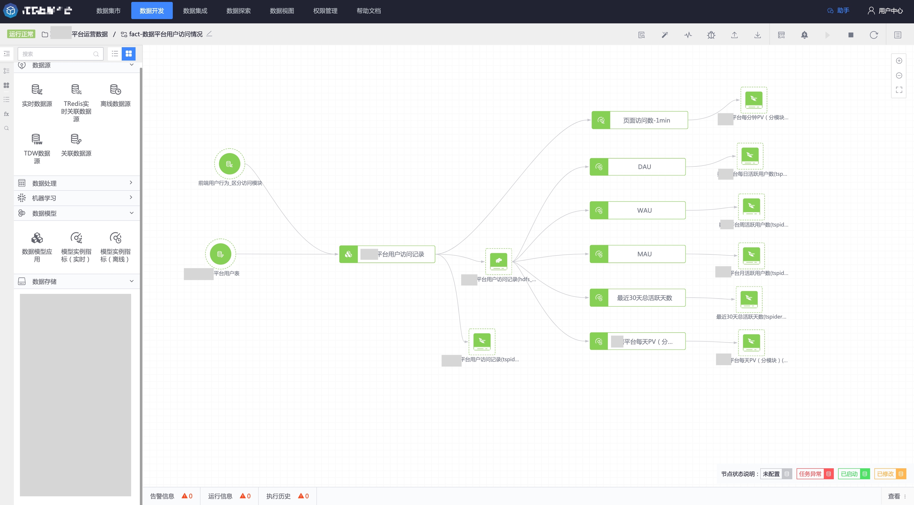
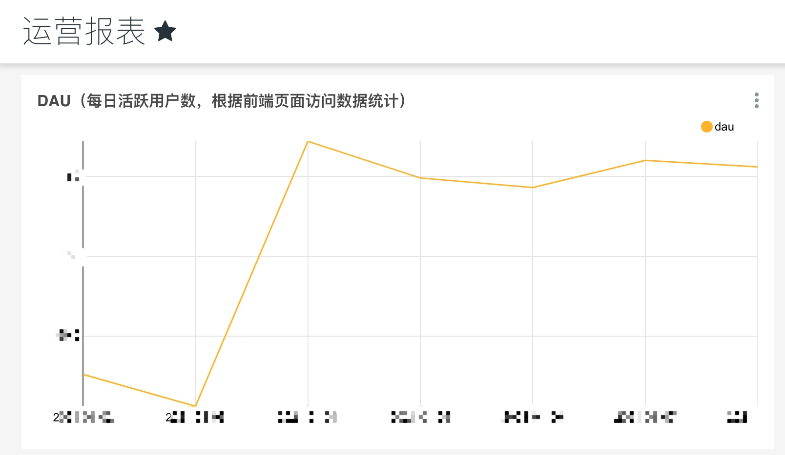

## Data model quick start
## Scenario

When the business goes online, user activity indicators (including DAU, WAU, MAU, total number of recent active days, PV per minute/day, etc.) are generally designed to facilitate operational activities after the business goes online.

## Sort out the logic
- Design [dimension table](./concepts.md): This is the user table, expand the user attributes in the fact table (user access record table), and observe users from more perspectives
- Design fact table: Design the user access record table, and expand the user's organizational structure and other dimensions in the user access record table by associating the user table.
- Based on the detailed data table, design indicator statistical caliber, such as uv (number of independent users), pv (number of page visits), etc.
- Design indicators based on indicator statistical caliber, such as DAU (daily active), MAU (monthly active), etc.

## 1. Dimension table data model design
First design the data model of the user table

### 1.1 Fill in the basic information of the model

Select the [Data Mart] -> [Data Model] menu, find the dimension table data model list, click New, and fill in the basic information;

### 1.2 Main table design
If the data of the user table has been accessed, you can directly reference the table structure of the user table;

In the main table design, click [Load existing result table] and select the corresponding result data table and its fields;

The dimension table must set a primary key for the related fields that are related to the fact table. In addition, according to the actual situation, modify the field name, field Chinese name, data type, field role, field description and other information;

If the dimension table data model only performs dimension association, you do not need to do indicator design and directly enter the model preview page.

Once you fill in the publishing description, you're ready to publish.

## 2. Dimension table data model application
After the data model is released, create a data development task and use the result data as the data input of the data model application node to complete the data model instantiation (i.e. application).

Create a data development task and drag in the real-time data source and data model application nodes.
> In Dataflow, the input table of the dimension table data model is limited to `live data source`. If you expect the instantiated dimension table to have full data, it is recommended that after the data development task is successfully started, report the full data of the input table and let the full data pass through the model application task.
> Of course, if the dimension table data model is completely consistent with the structure of the associated data source table that has been stored in ignite, there is no need to instantiate the dimension table data model. When applying the fact table data model, just select the associated data source directly.

Double-click the [Data Model Application Node], click on the data model just created, and complete the field mapping between the data model and the result table.
> If the model input and result table input fields are consistent, the fields will be automatically mapped.

Then drag an Ignite node in the canvas and set the index field and unique key (consistent with the primary key in the main table design of the data model).

Start data development tasks

In data exploration, you can query the result table just after applying the data model.

## 3. Fact table data model design
Then do the data model design of the fact table (user access record table).

The design process is similar to that of dimension tables (user tables).

### 3.1 Fill in the basic information of the model

### 3.2 Main table design
If the data in the user access record table has been accessed, you can directly reference its table structure;

In the main table design, click [Load existing result table] and select the corresponding result data table and its fields;

After clicking OK, the main table design interface is as follows:

Next, associate the dimension table data model to expand access to the user's organizational structure information.

After clicking Save, set field roles and other information;

> Metric: In the fact table, data that can measure the effect of a certain behavior is set as a metric, usually a data value field, such as order amount, access time, etc.;

### 3.3 Indicator design
First design the statistical caliber of indicators, and then design the indicators.

- First create an indicator statistical caliber: the number of independent visiting users (uv)

After clicking Add, create caliber-based indicators

Fill in the parameters for creating the indicator, including calculation type, statistical frequency, and window length. The figure below is to create a DAU indicator, which counts yesterday's number of unique visiting users every day.

Referring to this method, create indicators such as WAU, MAU, daily PV, active days in the last 30 days, etc.

After completing the indicator design, click Next to enter the model preview.

Click Next, fill in the release description, and complete the model release.

## 4. Fact table data model application
Next, apply the data model you just created.

Create a data development task, drag in 1 real-time data source node (the data source of the user access record table) and 1 associated data source (user table, the user table instantiated in step 2), and connect them to the data model application node.

> In the data development task, the main table input of the fact table data model is limited to `real-time data source`, and the dimension table is limited to `associated data source`. The table structure of the `associated data source` needs to be consistent with the table structure in the dimension table data model. It does not need to be the associated data source after instantiation of the dimension table data model.

Double-click the data model application node to open the node configuration page, select the newly created data model, and do field mapping (the same name will be automatically mapped by default).

After saving the data model application node, click `Batch generate indicator construction node`

Just select the desired indicator in the pop-up window.

Of course, you can also select the model instance indicator node in the left toolbox and create indicators in the canvas that belong only to this data development task.

Just start the task. Offline indicators can use the recalculation function in the top navigation bar to recalculate past data.

## 5. Consumption data
Data can be consumed in consumption scenarios such as [data exploration](../../datalab/queryengine/sql-query/concepts.md) or visualization.

For example, use the platform's data view module [SuperSet](../../dataview/concepts.md) to visualize the data for the above indicators. The following is a chart of DAU.

