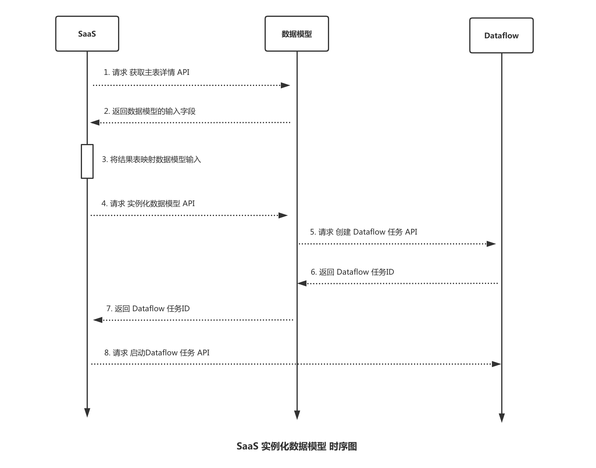

SaaS uses data models to build canonical metrics
----

After creating the data model on the data model page, SaaS calls the data model API to input the result data table, automatically create Dataflow tasks, and generate corresponding indicators.




## Get model list and get model input fields
If the upper-layer SaaS requires end users to map the result input table and corresponding fields, before actually instantiating the data model, it is generally necessary to obtain the data model list and obtain the input fields of the data model, so that users can input the business result table as a model.

### Get model list
Refer to the Get Model List API (v3_datamanage_datamodel_models_get) document to get the model list.

### Get model input fields
Refer to the Get model master table details API (v3_datamanage_datamodel_models__model_id__master_tables_get) document to obtain the model input fields.

## Instantiate the data model and generate Dataflow tasks
Refer to the model application instance to generate the complete dataflow task API (v3_datamanage_datamodel_model_instance_generate_dataflow) document.

### Instantiate dimension table data model
> [Dimension table data model](../concepts.md): Describes the dimensions in the fact table data model, such as the user table, and defines the user dimensions (gender, age, etc. fields) in the login flow table. By relating dimensions in the dimension table data model in the fact table data model, you can extend more readable dimensions, such as extending the user ID to user name, user age, etc.

Mainly the two parameters `input` and `main_table`.

- input
     - main_table: the result table corresponding to the main table
     - dimension_tables: If there are no other dimension tables associated with the dimension table data model, it will be empty;
- main_table
     - table_name: Optional, the default is the English name of the model. After final instantiation, the result table will have the business ID. If there are duplicate names, please specify this parameter (the business ID is not required).
     - storages[]: (After the dimension table data model is instantiated, there must be an ignite storage)
        - cluster_type: cluster type
        - cluster_name: storage cluster, for example, default is `ignite associated data public cluster`
        - expires": ignite stores the expiration time, `-1` is permanently saved and can only be this value.
        - indexed_fields: indexed fields
        - specific_params (ignite stores in addition to general parameters, the following parameters also need to be set)
            - storage_type: storage type, used for associated calculations
            - max_records: The maximum amount of data. Excessive data cannot be stored in the database.
            - storage_keys: form a unique key

The following is an example request

```json
{
     "model_id": 32,
     "project_id": 4716,
     "bk_biz_id": 591,
     "input": {
         "main_table": "591_dmm_model_info_xxx",
         "dimension_tables": []},
     "main_table": {
         "table_name": "dim_dmm_model_info_xx",
         "storages": [
             {
                 "cluster_type": "ignite",
                 "cluster_name": "default",
                 "expires": -1,
                 "indexed_fields": ["model_id"],
                 "specific_params": {
                 "storage_type": "join",
                 "max_records": 1000000,
                 "storage_keys":["model_id"]
                 }
             }
         ]
     }
}'
```

The following is an example of request return.

```json
{
   "errors": null,
   "message": "ok",
   "code": "1500200",
   "data": {
     "flow_id": "35870",
     "node_ids": [
       274295,
       274296,
       274297
     ]
   },
   "result": true
}
```

The effect of instantiation is as follows. You can see a Dataflow task named `[Business Name] Data Model (Model Name) Application Task`.


### Instantiate fact table data model
> [Fact table data model](../concepts.md): Describes the details of business activities, such as: login flow, game flow, user access records, etc.

Let’s focus on the differences from the above.

Since the name of the result table after instantiating the detailed table and indicator is automatically generated, you can just focus on the storage of these two types of tables during instantiation.

- input.dimension_tables: In this example, the fact table data model has associated dimension tables.
- main_table
     - storages: If there are offline indicators, you need to increase hdfs storage
- default_indicators_storages: Optional, [Public Configuration] Default indicator storage cluster

The following is an example request

```json
{
     "model_id": 16,
     "project_id": 4716,
     "bk_biz_id": 591,
     "input": {
         "main_table": "591_dataweb_user_browser_behavior_module",
         "dimension_tables": ["591_dim_dataweb_user_list"]

     },
     "main_table": {
         "storages": [
             {
                 "cluster_type": "tspider",
                 "cluster_name": "default4",
                 "expires": 30
             },
             {
                 "cluster_type": "hdfs",
                 "cluster_name": "hdfsOnline4",
                 "expires": 90
             }
         ]
     },
     "default_indicators_storages": [
         {
             "cluster_type": "tspider",
             "cluster_name": "default4",
             "expires": 30
}
     ]
}
```

After the request is successful, a data development task will be created under the project.


Next, just start the data development task, and then consume data normally through the data query interface.

## FAQ

### The result table already exists and repeated creation is not allowed.
If the automatically generated result table name already exists, you can customize the result table name.

The main table uses `main_table.table_name` to customize the English name of the result table (excluding business ID). For specific examples, see the dimension table instantiation example above.

Use `indicators[].table_custom_name` to customize indicators, or directly modify the English name of the indicator in the data model and apply it after publishing.

```json
{
   "errors": null,
   "code": "1500003",
   "message": "Failed to add node, details (node (computing platform error code) creation failed, [1500003] [1571033] result table already exists, repeated creation is not allowed)",
   "data": null,
   "result": false
}
```

### An unexpected exception occurred during task creation (list index out of range), please contact the administrator.

```json
{
   "errors": null,
   "code": "1500003",
   "message": "An unexpected exception occurred during task creation (list index out of range), please contact the administrator",
   "data": null,
   "result": false
}
```

There are many possibilities for this error, such as

- The storage cluster does not exist
For example, the `storages.cluster_name` of hdfs public cluster 4 is `hdfsOnline4`, not `default4`

- The model instance indicator result table ID (591_xxxxxx) has been used

Please refer to the documentation to rename the indicator’s table name `indicators.table_custom_name`

- The current node window length (31) should be less than the expiration time (7 days) of the result table (xxxx)
The expiration time of the indicator node exceeds the expiration time of the preceding data model application node.
For example, the HDFS storage expiration time of the data model node is 7 days, but the storage expiration time of the MAU indicator node is 30 days.


### There is a task with the same name under the project
Before the model is instantiated, it will check whether there is a task with the same name under the current project (Dataflow task of `[Business Name] Data Model (Model Name) Application Task`). If you want to run the test multiple times, you can manually modify the existing data development mission name.

In addition, you also need to modify the `table_name` of the main table and the `table_custom_name` of the indicator node, otherwise the generated result table will have the same name, causing the instantiation to fail.

```json
{
   "errors": null,
   "code": "1500400",
   "message": "There is a task with the same name under the project",
   "data": null,
   "result": false
}
```