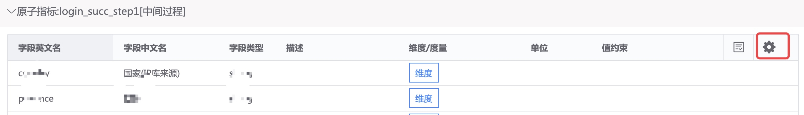

# Introduce

Data standards: Standardize data, unify data caliber, achieve data standardization, and lay the foundation for data sharing.

## Data standardization process

Data standardization covers every stage in data layering, including data access layer, detailed data layer, summary data layer, and data application layer.

Based on standard raw data, the platform will subsequently provide **standardized access** to achieve one-time access, automatically generate multi-layer standard data, and reduce data development costs.

For some standard data, the platform will subsequently provide data standardization atoms to implement data standards.

The following is the current process of data standardization operation.

## What data standards are there?

In the Data Standard submenu of the Data Mart, you can query the current data standard and the associated standard data list.

Click on a standard to view the details of the standard, which defines detailed data and atomic indicators (partial summary, such as the number of people logging in within 1 minute).

## How to do data standards

> For the time being, the Data Standards Committee is responsible for data standard configuration and will support user standardized access in the future.

In Standard, you can view standard calculation configurations.

