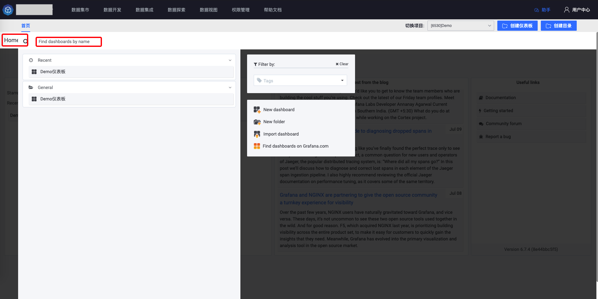
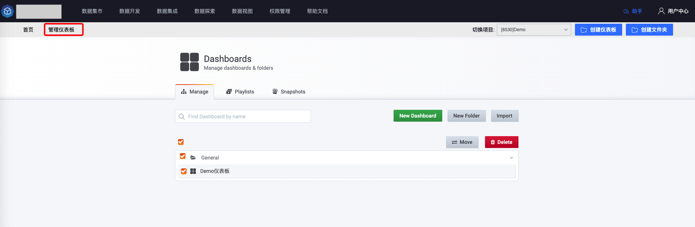

## Introduction
Grafana is an open source suite for metric analysis and visualization. It is becoming increasingly popular in the open source community, and more and more users are using Grafana in the company. Therefore, the IEG platform has also been deeply connected with the Grafana system, allowing users to directly use the platform's result table in Grafana. Build various dashboards to meet user monitoring, operation, and analysis scenarios.

## scenes to be used
The platform integrates Grafana mainly to meet the needs of users to build **monitoring dashboard** and **operational data** when using data.

## Introduction to main concepts
* **Dashboard**: refers to a dashboard that conforms to a specific theme. It is generally composed of **Row** and **Panel** that conforms to this theme. Users can **arrange the content of the dashboard based on specified rules. and layout**
* **Row**: Row, the basic unit of Dashboard. Its main function is to **divide areas**. A Dashboard can contain many Rows.
* **Panel**: Visual panel, which constitutes the main content of Dashboard. Users can use **SQL form** or **SQL editor** in the panel to build platform queries. The query results can be displayed in various visual ways. The currently supported visualization types are: **Line graph (Graph)**, **Numerical value (Stat)**, **Bar Gauge**, **Table**, **Text**, etc.
* **Folder**: Folder. When there are too many Dashboards and they appear messy, you can use **Folder** to classify Dashboards to facilitate users to manage Dashboards.
* **Variables**: Dashboard variables, applied to all Panels in a Dashboard. Panels can use variables as placeholders when building **Query SQL**, and will be replaced with actual ones when a data query request is actually initiated. value

## Introduction to permission system
Platform-integrated Grafana mainly uses platform projects to divide permissions. Users with **project view** permissions for a certain project can view the structure and panels of all Dashboards under the project, but do not include the data in the panels. Only users on the platform have this permission. Only with the **Data Query** permission of the result table can you see the data content in the panel. In addition, only **data development members** and **project managers** under the project have the permission to edit and save the Dashboard and Folder under the project.

When building the Dashboard, if the expected table does not appear in the `result table drop-down list`, you need to apply for the corresponding result table in the name of the project similar to "Data Development". For details, please refer to [Data development to create a project, why can't you see the data in the project] ( ../auth-management/data.md#Data development and creation project, why can’t I see the data in the project)

## Main page introduction
The entrance to Grafana is as shown in the figure

### front page
The entrance page of the Grafana system is the page that users enter after selecting a project through the **Switch Project** drop-down box in the upper right corner. The user's favorite dashboards (Starred dashboards) and recently viewed dashboards (Recently viewed dashboards) are displayed by default on the left side.

Users can click **Home** in the upper left corner to view all folders (Folders) and dashboards (Dashboard) under the current project. The drop-down box also has a search function to quickly find the dashboard that needs to be viewed.

If the user needs to create a new dashboard or folder, they can quickly jump to the creation page through the upper right corner, or click **New dashboard** and **New folder** in the Home drop-down menu to jump.

### Dashboard management page
Dashboards management page, users can **view**, **filter**, **folder** and other operations on the dashboard in the management page, users can also create* under the **Playlists** tag *Dashboard Playlist**

### Dashboard creation and editing page
After clicking **Create Dashboard**, you will enter an empty dashboard editing page, and an empty **Panel** will be created by default. The entire editing page can be divided into three areas, namely **Panel configuration and Arrangement Area**, **Management Toolbar** and **Time Toolbar**.

