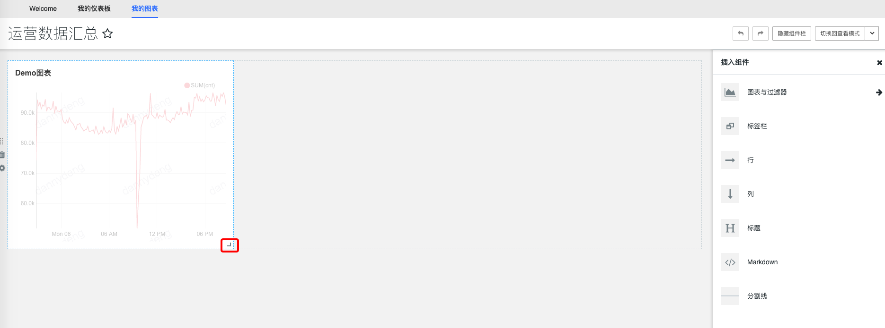

## How to quickly build a dashboard

### Dataset preparation
You can refer to the process of [10 Minutes to Play with Big Data Development](../../quick-start/dataflow.md) to create a **queryable** result table

### Create dashboard
In the `My Dashboard` tab, click the `+` button in the upper right corner to jump to the `Dashboard Creation Page`

To create a dashboard, you need to fill in the following form

After completing the form, click Save to create a blank dashboard and return to the management page of My Dashboard

### Create chart
In the `My Chart` tab, click the `+` button in the upper right corner to jump to the `Chart creation page`

To create a chart, you need to select the `project` where the chart is located ** (the project needs to be consistent with the dashboard on which the chart is ultimately displayed)**, the `dataset` and `visualization type` used (can be modified during the process of building the chart)
If the data set is not in the selected project, you need to apply for the permission of the data set used under the project on the platform. Refer to [Data development and creation project, why can’t I see the data in the project] (../auth-management/data.md)

Clicking `Create New Chart` will jump to the chart editing page.

### Edit chart
The editing pages of different chart types are basically different, but they basically include five functional areas: `data source & chart type selection`, `select time range`, `build query`, `visual property adjustment`, and `visualization panel` , some special charts will also include advanced functions such as `advanced analysis` and `annotation layer` for users to build more expressive charts.

The following uses line charts as an example to introduce how to edit charts:

#### Select time range
The first step in editing a chart is to select the **time range** of the chart. For the platform's result table, **`dtEventTime`** is generally used as the `time field`

`Time granularity` is generally used to describe intervals on the timeline. If **`minute`** is selected here, the line chart will have a point every minute.

`Time Range` provides multiple commonly used dynamic time ranges by default. Users can also customize the time range in the **`Custom`** panel.

#### Build query
The forms for constructing queries for different charts will be different. For line charts, `Indicator` is a required option, `Filter`, `Group`, `Sequence Limit`, `Sort` and `Row Limit` are all optional.

The `Indicator` edit box will generate **`count(*)`** indicators by default. If the user does not need it, he can click **`x`** to delete it.

Then select the field you are concerned about as an indicator. After selection, a detailed indicator edit box will appear.

In the indicator edit box, users can modify the name of the indicator. For simple expressions, they only need to select the required aggregation function.

For expressions that cannot be built through selection, users can switch to expressions for custom indicators in the **`Custom SQL`** tab

In the example, we choose to aggregate **`sum`** on the **`metric1`** indicator. After completing the selection, click **`Save`** to confirm.

During the query construction process, you can click **`Run Query`** at any time to view the visualization effect to confirm whether it is consistent with the information you expect to express.

For other optional functions, users can move the mouse to the corresponding area to view the function description. If there is still something unclear, they can contact the platform assistant or view [Superset official documentation] (https://superset.incubator.apache.org /usertutorial.html#line-chart)

#### Visual attribute adjustment
After building the query, the user can adjust the visual chart on the right in the `Visual Properties` panel. For line charts, the following functions are commonly used:
* Adjust the **color scheme** of the visualization chart
* Choose to show or hide the **legend** of the chart
* **Line style** in line drawings
* **Units** or **Format** of the X-axis
* **Label (title)** for the X-axis
* **Unit** or **Format** of Y-axis
* **Label (Title)** for Y-Axis

#### Save chart to dashboard
The last step is to save the edited chart. If you leave the page without saving the chart, the chart will remain in the state before editing. **Any changes in the middle will not take effect**. If it is the first time to edit the chart (the creation process ) is not saved, the chart will not be created.

When saving, in addition to configuring the title of the chart, the user can also select **Add the chart to an existing dashboard** in the save box, or
It can be **added to a new dashboard**. The automatically created dashboard will use the **project ID** of the current result table as the dashboard project. **Currently, the chart can only be saved to the same dashboard as its project. **

For the following two options, users can `Save and Go to Dashboard`. Clicking this will jump to the details page of the dashboard.

### View dashboard
On the dashboard details page, users can `favorite dashboards` and switch to `edit mode` to arrange and layout the dashboard. The charts in the dashboard will use cached data to display charts by default. If you need to use the latest data, Users can click the menu in the upper right corner of the chart to refresh, or click `Force Refresh Dashboard` in the function menu on the right side of `Edit Dashboard` to refresh all charts.

### Edit Dashboard
After clicking `Edit Dashboard` on the dashboard details page, you will switch to the edit mode of the dashboard. In edit mode, the main functions are: `Adjust the size of the chart`, `Insert other components` and `Adjust the layout of each component. and attributes`

#### Adjust the size of the chart
In the chart on the left, move the mouse to the lower right corner of the chart. An arrow will appear and the mouse will turn into an arrow. At this time, you can change the size of the chart by dragging it.

#### Insert other components
In the `component bar` on the right, users can **drag** the required dashboard components into the layout box of the dashboard

#### Adjust the layout and properties of each component
Charts and `Markdown` in the dashboard must be placed in `rows` and `columns`. Users can add `rows` and `columns` at will to layout the area of the dashboard, and then they can freely adjust each chart in the dashboard. When dragging new components and charts into the board, a blue alignment line must appear for them to take effect.

After clicking on each component, you can adjust its properties, such as `whether the background is transparent`, `font size`, etc. You can also click the `Delete` button to delete the component.

#### Save changes
After editing the dashboard, you can click Save Changes in the upper right corner. If you need to save the edited dashboard as, you can click the drop-down menu on the right side of Save Changes to get more other operations.

### Conclusion

Following the above process, a simple dashboard will be built. It is true that there are many more advanced functions, including `Edit Chart`, `Edit Dashboard` and other functions, to assist users to better describe what they want to express. **But remember one thing, we use Superset The ultimate goal is not to build a complex, rich, and powerful chart and dashboard, but to use this tool to help us solve problems in specific business scenarios in a more intuitive and insightful way* *

For more detailed functions, please refer to [Superset official documentation](https://superset.incubator.apache.org)