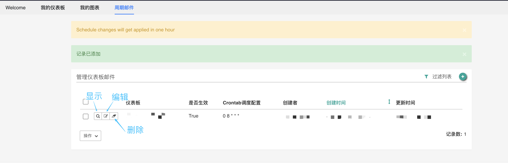

## How to configure sending report emails

### Introduction

In the Superset BI of the data view module, you can select the dashboard to create scheduled email rules to automatically send report emails to specified users.

### Create dashboard email configuration

In the main interface of the Superset module in the data view, enter the **Periodic Mail** tab and click the green + sign in the upper right corner.

You can enter the new scheduling configuration page as follows:

#### Instructions for filling in form fields

##### Dashboard

Select the dashboard to send. Currently, only one dashboard is supported in the current scheduled email configuration. Search using dashboard id or name.

##### Receiver

Use **username** to specify the email recipient. Multiple recipients can be specified.

##### Is it effective?

Whether to take effect this scheduled report email configuration.

##### crontab scheduling configuration

Configure the time period of scheduled scheduling through unix crontab format. An example can be seen in the common configuration, which is 5 columns separated by spaces, filled with numeric values or * sign placeholders.

- Column 1 minutes 0～59
- Column 2 hour 0~23 (0 means midnight)
- 3rd Liege 1～31
- The 4th column of months 1 to 12
- Column 5 day of the week 0~7 (0 and 7 represent Sunday)

For details, please refer to the crontab help documentation: https://linuxtools-rst.readthedocs.io/zh_CN/latest/tool/crontab.html

##### Send test email

It is recommended to check the box to send a test email after editing and saving to preview the effect of the email.

##### Test email recipient

Here you can specify individual test email recipients. After configuration, the test email will not be sent to all official recipients.

After the creation is successful, it will jump back to the configuration list, and the configuration will start to take effect within one hour.

### Management Dashboard Email Configuration

In the **Dashboard Mail Configuration List** page, you can manage existing configurations. You can click **Filter List** to search and filter by *dashboard name* and *whether it is valid*.

##### View configuration details

Click the display icon on the list page to enter the details page to view the current scheduled email configuration status.

##### Modify edit configuration

Click the **Edit** icon to enter the configuration editing page. The structure of this page is the same as the configuration creation page. Fill in and save in the same way.

##### Delete configuration

You can directly click the **Delete** icon in the list to delete a single configuration. You can also check multiple configurations and select Delete in the **Operation** drop-down list to delete them in batches.