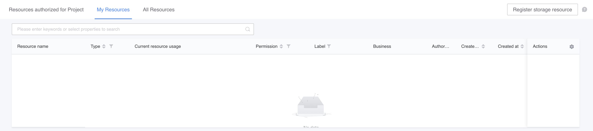
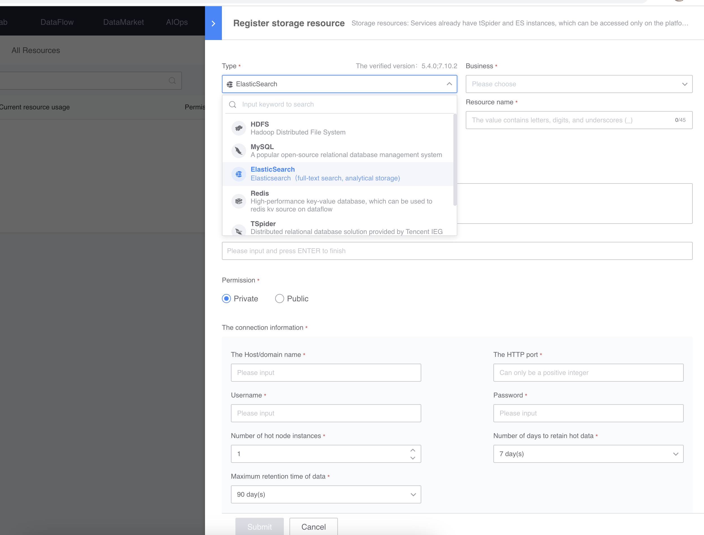
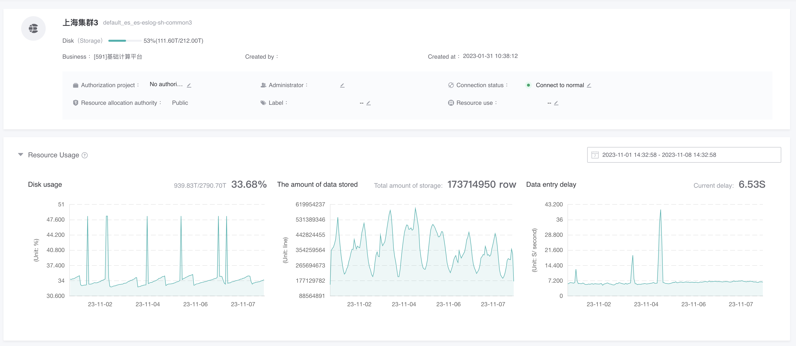

# Register storage resources

Register the storage resources prepared by the business into BKBase for data integration and data development.

> For the resource management user flow chart, please see [Resource Management Introduction Page](./readme.md)

## Preconditions
Have applied for storage resources (such as MySQL, ES, Redis, HDFS, etc.) from storage resource providers such as DBA

## registration process
On the right side of resource management, click Register Storage Resources.

In the interface for registering storage resources, fill in the storage resource information, where the connection information comes from the storage resource provider, such as DBA.

> After the business to which it belongs is determined, the storage resources of the business can be directly used in data integration.

After registration is completed, you can enter the resource details page to view resource information.

Next, you can [apply for resources and use](./useResource.md) for the projects you participate in.