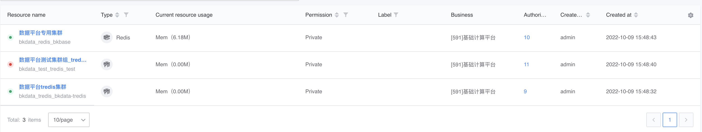
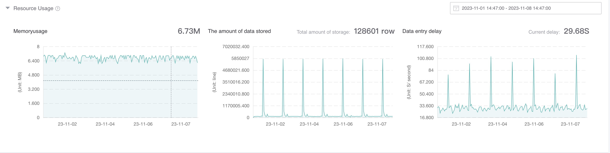
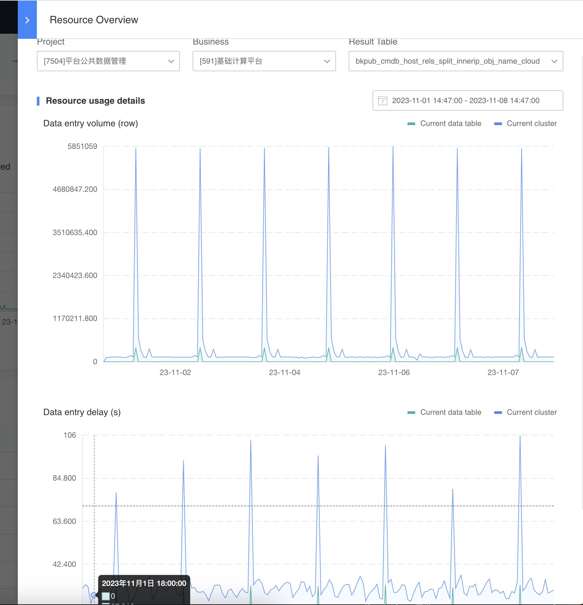

# Manage my resources

## List of resources I manage
Under the Resources I Manage TAB, you can manage resources for which you are a resource administrator.

The last column is the authorized projects. You can actively authorize which projects can use the resource.

Click the resource name to enter the resource details page.

## Resource details page
It mainly includes three areas: basic information, resource usage, and task list.

### basic information
In the basic information section, you can view and modify the basic information of the resource.

### Resource usage
If it is a storage resource, the following is the update logic for resource usage:
- Disk usage: 1 data point will be collected when creating a resource, and will be updated every hour.
- Data storage volume/data storage delay: When this resource is used in data development or data integration, and there is data storage, there may be a delay of several minutes before the data is reported. The data warehousing amount is the sum of all warehousing tasks under the resource, and the data warehousing delay is the average delay.

### task list
Displays the tasks that have used this resource in the last 60 days.

One column is the usage status, which is updated once a day:
- In use: The resource is in use
- Deactivated: The resource has been used in the last 60 days and is now deactivated. For example, the storage node has been deleted.

Click the first column of the task list to view the resource usage overview of the current task.

