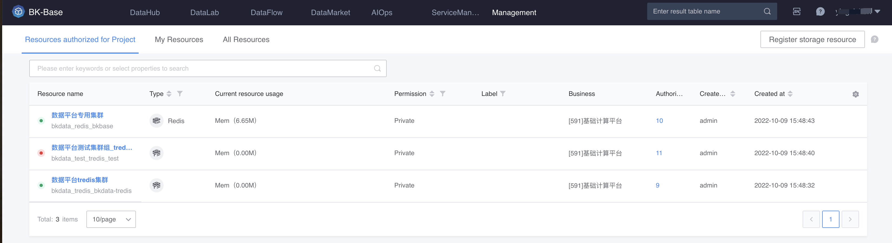

# Introduction to resource management

Implementing data integration, data development, and data exploration in BKBase requires resources, which mainly include computing and storage resources.

Taking storage resources as an example, the business party needs to [register storage resources](./addStorage.md) or [apply for registered resources](./useResource.md) in advance.

The following is a resource management user flow chart.

