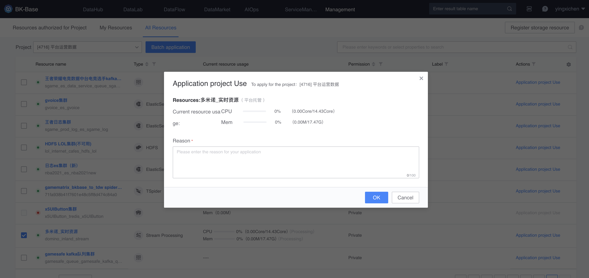

# Apply for and use resources

Except for public resources, resources must be applied for before they can be used in the project.

> For the resource management user flow chart, please see [Resource Management Introduction Page](./readme.md)

## Apply for resources
In the TAB of [Resources that can be applied for] in resource management, select **Projects that require resources**, then check the requested resources and submit the application.

> It is recommended to filter resources by resource type, business, creator, etc. before applying.

After submitting the application, the resource manager will approve it. In the last column, you can also enter the corresponding work order to communicate with the resource manager.

## Use resources
After approval, the resource can be used in the project.

After the resource is used, you can view the resource usage.

You can also enter the resource details page to view resource details.

