# My alert

My alarms display all the alarms I received from the platform. These alarms mainly come from the monitoring strategies configured by users in **`Data Integration`** and **`Data Development`**, which are used to discover data. Abnormalities in source and data development tasks; at the same time, My Alarm is also the entrance for users to centrally manage all personal alarm policies. Users can click `View Alarm Policy` to enter the `Alarm Policy List Page` to view all data sources and data Configure the alarm policy of the development task

## Alarm list

By default, My Alarms displays all alarms of the last day in reverse chronological order. Users can view the main information of the alarms in the list, or use the operation bar in the list to `View Alarm Details`, `Configure Alarm Policy` or `Block Alarms`

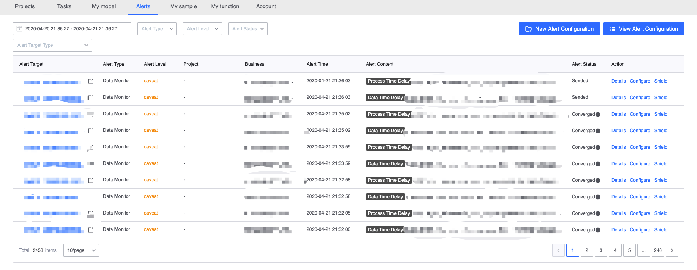

### Quickly filter alarms

Users can operate the filter bar at the top to filter the alarm list by `time range`, `alarm type`, `alarm level` and `alarm status`. Users can also filter the alarm list by `alarm object type`, `project` or `business `, `Data Development Task` or `Data Source` cascading filter box to view all alarms of a certain data development task or data source in a targeted manner

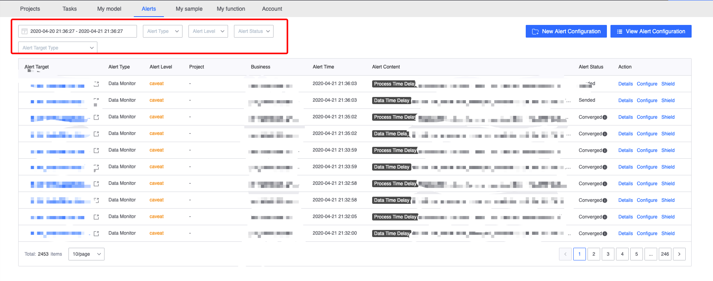

### Alarm list operations

- 1. View alarm details

     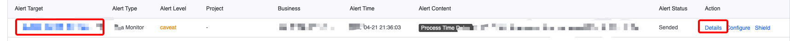

- 2. Jump to the alarm object details page

     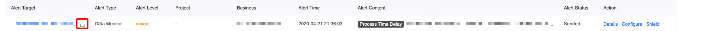

- 3. Jump to configure alarm policy

     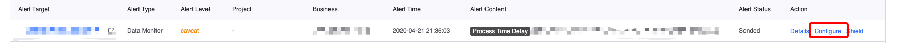

- 4. Block alarms

     Screened alarms will no longer be notified to the user, but can be viewed by selecting `Blocked` in the `Alarm Status` filter box on the current page.

     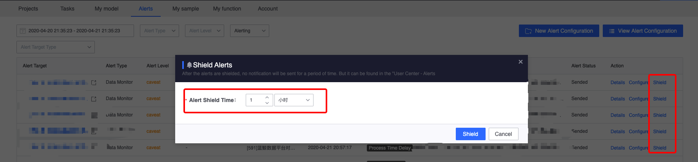
    
     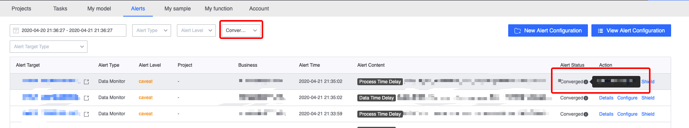

## Alarm details

Users can view the details of the alarm in the alarm details. They can also view the current 'alarm policy' and quickly jump to the 'alarm configuration page' for modification. On the right panel, you can view the 'data quality indicators' and 'impact' related to the alarm. Task`

### Basic alarm information

- Alarm object: the data source or data development task that triggered the alarm
- Alarm time: the time when the alarm is triggered
-Alarm type:
   - Data monitoring: Detect the flow of data flow, including `no data in data source`, `data fluctuation`, `data time delay`, `processing time delay`, `data interruption`
   - Task monitoring: detect the running status of tasks
- Alarm level:
   - Severe: A fault has occurred that will definitely affect user data and needs to be dealt with immediately.
   - Warning: The monitoring indicator has reached the alarm condition. A failure may have occurred or it may be due to business reasons, which requires user attention.
- Alarm status:
   - Sent: the alarm has been notified to the user
   - Ready to send: The user has not been notified after the alarm is generated (to prevent frequent alarm notifications from harassing users)
   - Blocked: The alarm is blocked due to user blocking, platform changes, etc.
   - Converged: The alarm has been converged because it did not reach the user-configured trigger threshold or the last alarm time was too close.
- Alarm notification status: Display the time when each user receives the alarm and the notification status of various notification methods according to different recipients

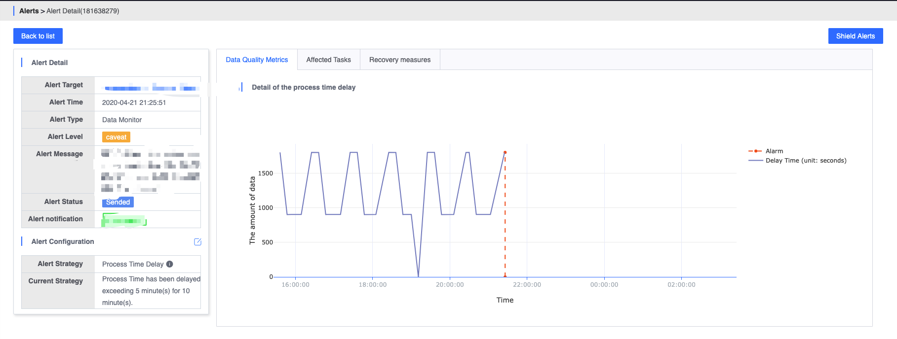

### Alarm configuration
Provide descriptions of the strategy and related strategies when the alarm is triggered, so that users can refer to the chart on the right to understand the situation when the alarm occurs.

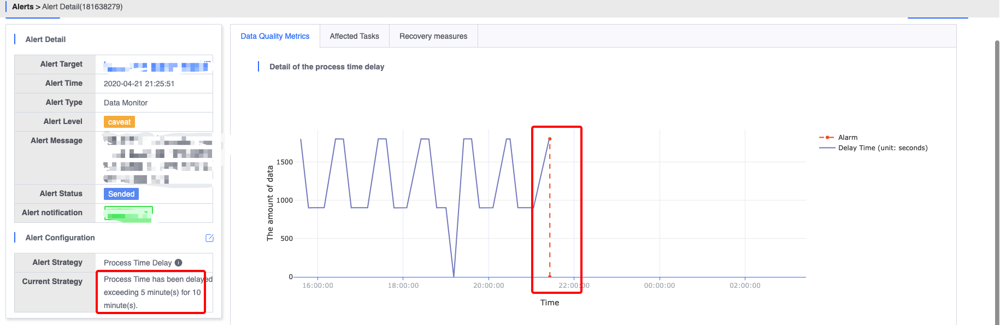

### Data quality indicators
Displays the data flow when the alarm is triggered. The displayed charts differ due to different alarm strategies. For example: for the `data source no data` alarm, the data volume for the 6 hours before and after the current alarm object triggers the alarm will be displayed.

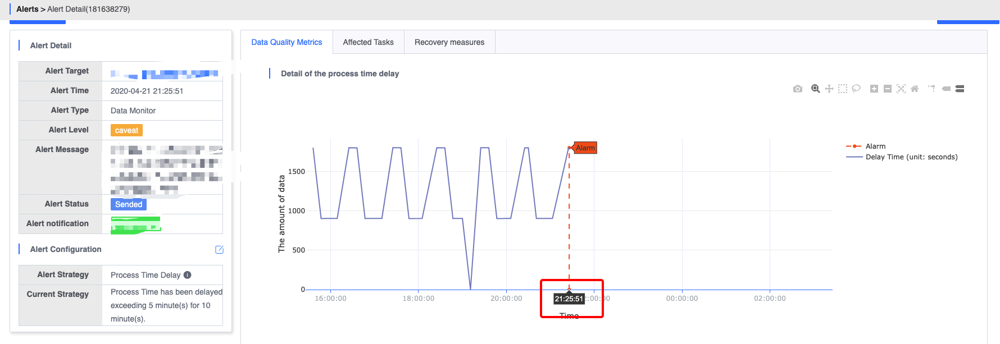

### Impact tasks
Displays other tasks associated with the current data source or data development task to help users determine which tasks will be affected by the exception of the current alarm object. The `project name`, `task name`, ` of the "affected" tasks will be displayed in the list. Responsible person`, `Creation date`, for users with permission, you can also click `Details` to jump to the details page of the task

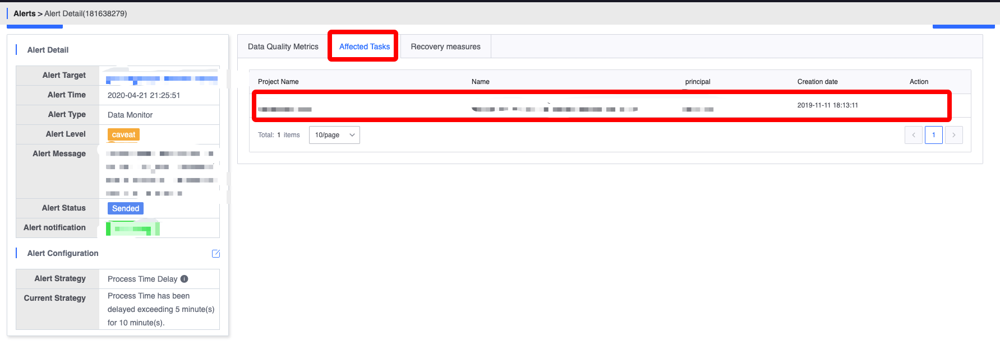

### Data flow recovery
For some alarms, the platform will provide possible causes and troubleshooting steps to help users quickly locate and solve abnormal problems.

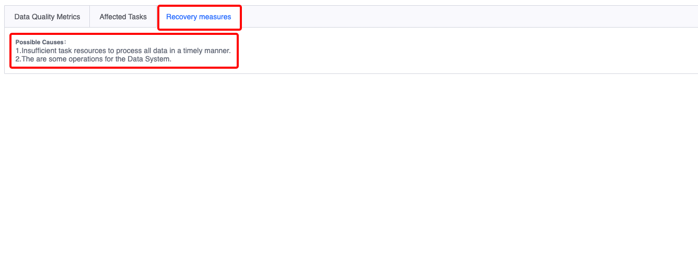

## Alarm configuration list

The alarm configuration list mainly displays the alarms configured by data sources and data development tasks in a list. By default, only the alarm configurations I receive are displayed. Users can also view all configured alarm policies with permissions. For unconfigured alarm objects , users can click `New Alarm Configuration` in the upper right corner to create a new alarm configuration.

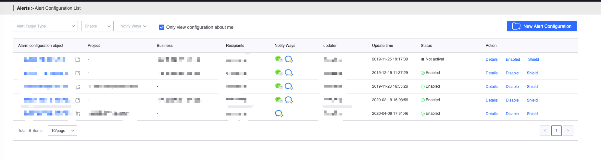

### Quick filter alarm configuration

Users can operate the filter bar at the top to view a certain data development task or data in a targeted manner through the cascading filter boxes of `Alarm Object Type`, `Project` or `Business`, `Data Development Task` or `Data Source`. Source alarm configuration, you can also filter the alarm configuration list by `Enabled or not` and `Notification method`. If the user unchecks `View only the ones I receive`, the user can view all configured and authorized alarm policies.

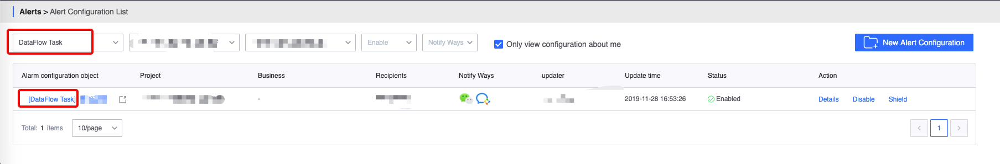

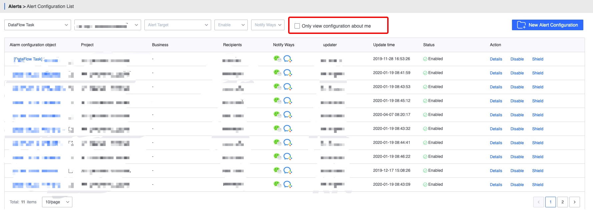

### Alarm configuration list operation

Users can use the operation bar on the right side of the list to perform operations such as 'enable', 'disable' and 'block' the alarm configuration.

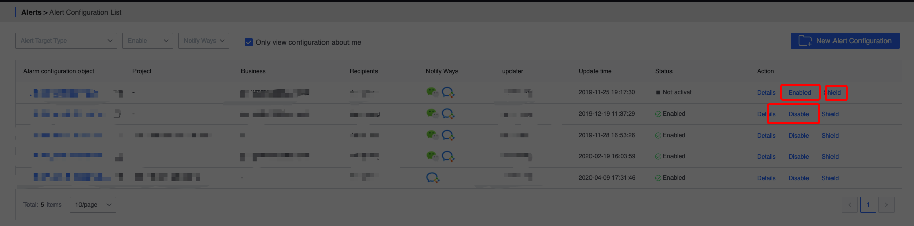

When blocking on the alarm configuration page, all policies configured for the current alarm will be blocked.

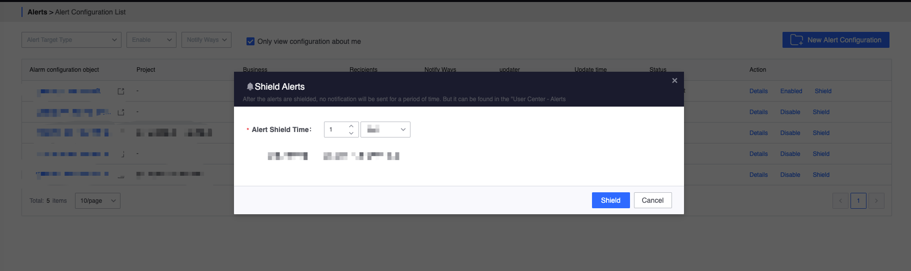

## Create (modify) alarm configuration

Users can create a new alarm configuration on the current page. Before creating an alarm configuration, the user needs to select the configuration through the cascading filter box of `Alarm Object Type`, `Project` or `Business`, `Data Development Task` or `Data Source` Alarm objects. For data sources or data development tasks that already have alarm configurations, only the original configuration can be modified.

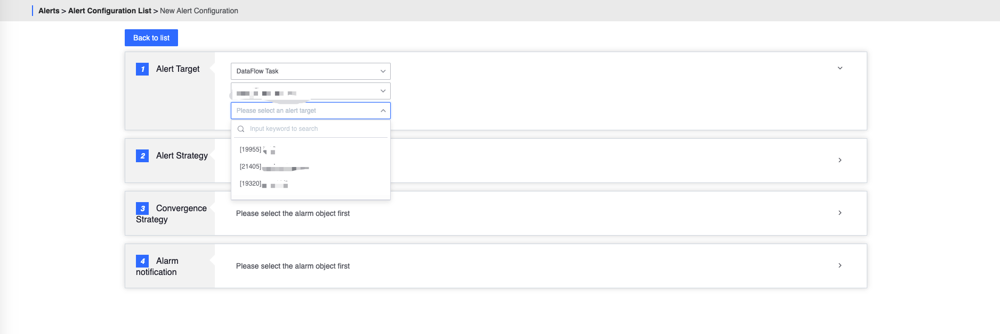

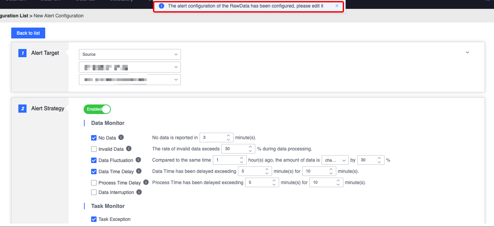

### Configure alarm policy

Users can enable alarm policies in the `Alarm Policy` column. After enabling, they can configure each specific policy.

- No data in the data source: For a period of time, the data source does not produce any data (the data source here includes the data source of "Data Integration" and the data source in the "Data Development" task)
- Data fluctuation: The amount of data fluctuates beyond the threshold compared to the same time in the previous cycle
- Data time delay: For a period of time, the data time delay relative to the local time exceeds the threshold
- Processing time delay: The processing time delay exceeds the threshold for a period of time
- Data interruption: The task is interrupted during execution or the task execution cannot be tracked
- Task execution exception: An exception occurs during task execution.

### Configure convergence strategy

Users can configure specific convergence rules in the `Convergence Strategy` column

- Trigger conditions: Solve the flooding of alarms caused by instantaneous jitter
- Alarm convergence: Solve the problem of alarm flooding caused by continuous fulfillment of trigger conditions

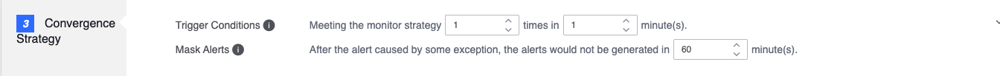

### Configure alarm notification

Users can configure the alarm notification method and recipients in the `Alarm Notification' column. The recipients are only allowed to select people who have permissions for the data source or data development task.

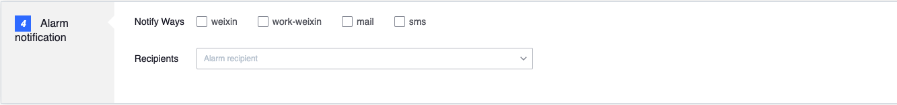