## My project

In the platform, a project is a collection of resources (business data, development tasks, ModelFlow models), and projects are isolated from each other.

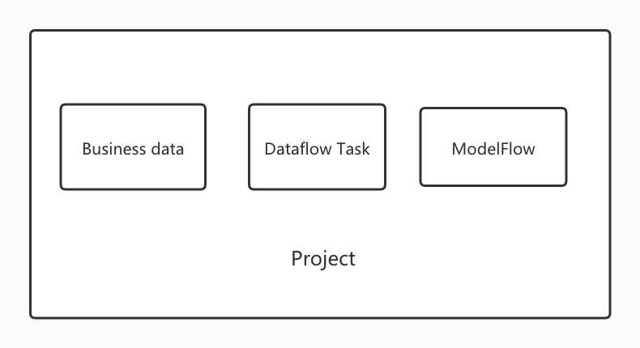

**A business team** can create **one or more projects** according to the purpose, such as user experience and operational data projects. At the same time, **multiple teams** can also jointly maintain **one project**, such as basic performance. Public projects.

## Project Overview

By default, My Projects pulls all the projects I participate in. Users can view, edit, delete the projects they participate in, and create new projects.

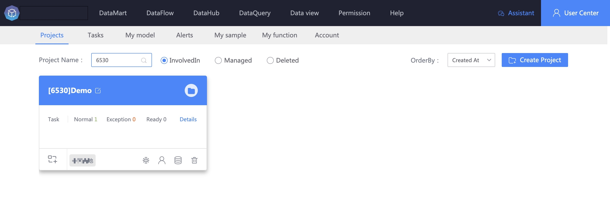

## Create project

In my project, you can see the Create Project button on the upper right side. Click the button to create the project.
 
  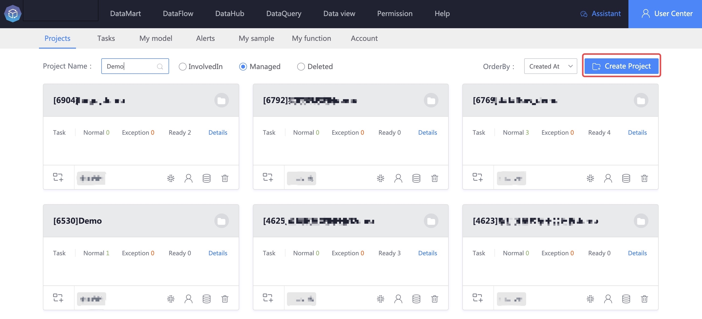

## Find items

Users can filter and search projects by project name, projects I participated in, projects I managed, and deleted projects to quickly locate the projects they need.

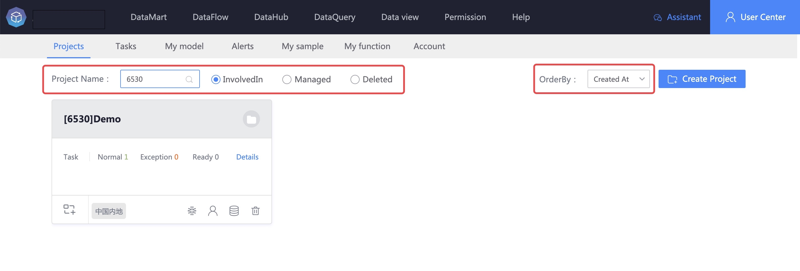

## Manage projects

**Projects I participated in** pulls the list of projects for which **the current user has permission** by default. The projects I created show the projects for which the current user is the creator.

The projects I participated in and the projects I created show the project ID, project name, task running statistics, and quick entry to task details. Each project also provides other quick management entries:

> Edit project: edit current project information

> Create task: Create a new task under the current project

> Management model: model management under the current project

> Member Management: Manage members of the current project

> Business data: Application for business data required for current projects

> Delete project: Mark the current project as deleted and the operation can be restored

### Edit project

  Select the item to be edited with the mouse and click the edit button.

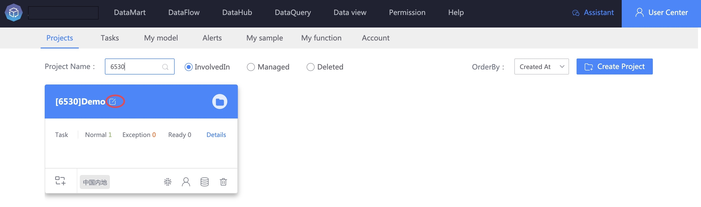

Modify the project name and project description on the system pop-up page, and click Save to complete the editing.

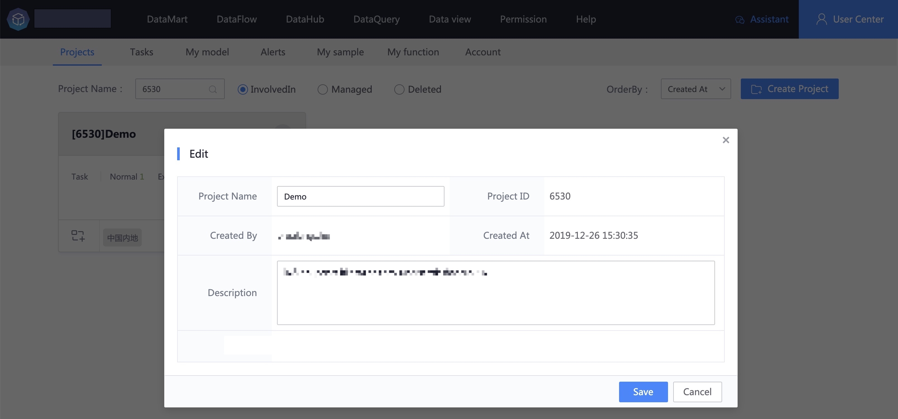

### Create task

You can quickly create **data development tasks** in the current project, click the Create Task button at the bottom left of the project.

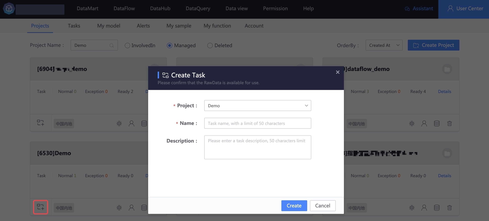

    

### Management model
  
Place the cursor on the Manage Model button in the current project to prompt to manage the model. Click Manage Model and the system will jump to the management model interface.

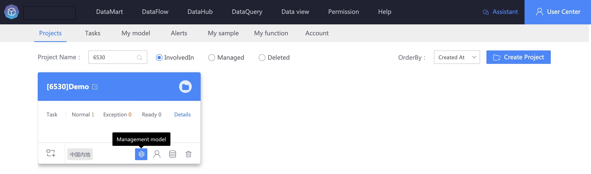

### Member Management
    
Behind the current project management model is the **Member Management** module. Click Member Management to pop up the member management interface.

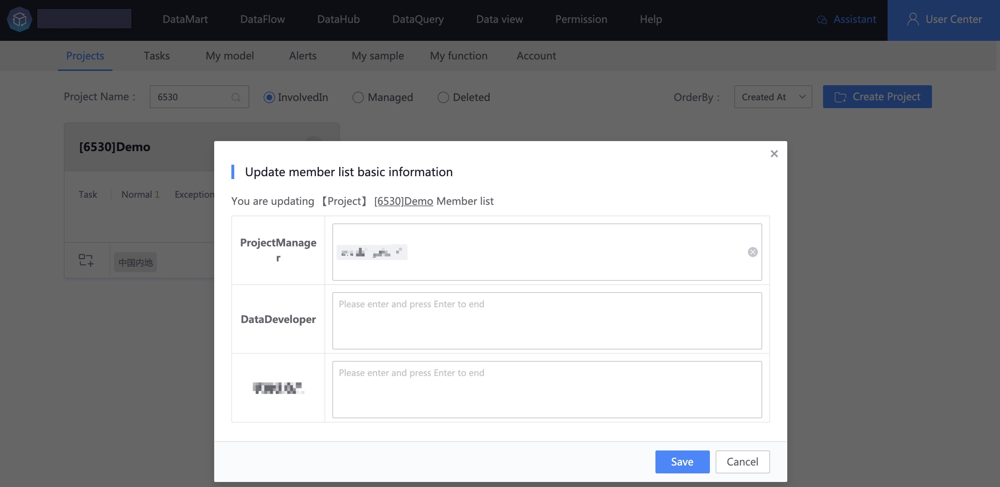

> The current user is the project administrator and can add and remove project members.

> Non-project administrator users can only view project member information and cannot edit project members.

### Business data
  
The business data entrance is behind member management. For business data, you can **apply for the data required for the current project**. Click the business data button, and the system will pop up the business data application interface.

> Business list: Select the business to which the data belongs. The number of business data that has been applied for, is being applied for, and has been rejected in the selected business will be displayed here.

> Data types: real-time data sources, offline data sources, real-time correlated data sources, offline data sources, etc.

> Result data table: The **result data table** that needs to be applied for use supports multiple selections.
               
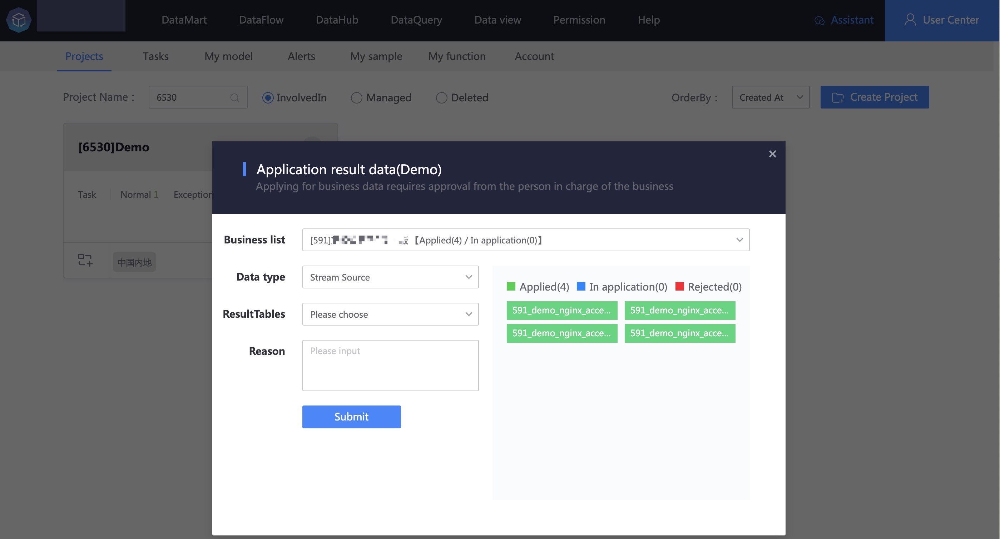
    
## Delete project

> Delete the current project: mark the project as deleted, move it to the deleted project module, and restore it in the deleted project module.

Click the deleted project to enter the deleted project management interface.

Here you can see items that have been marked as deleted. These items can be edited, restored (undeletion), or completely deleted (not available yet, but will be enabled in subsequent versions).

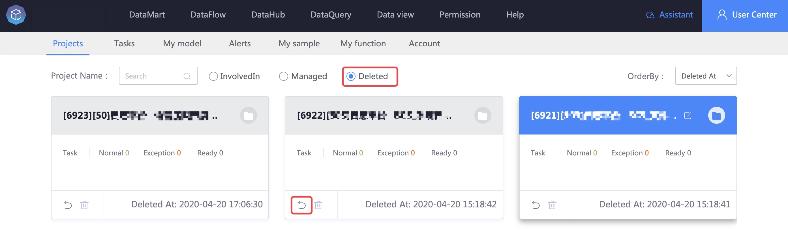